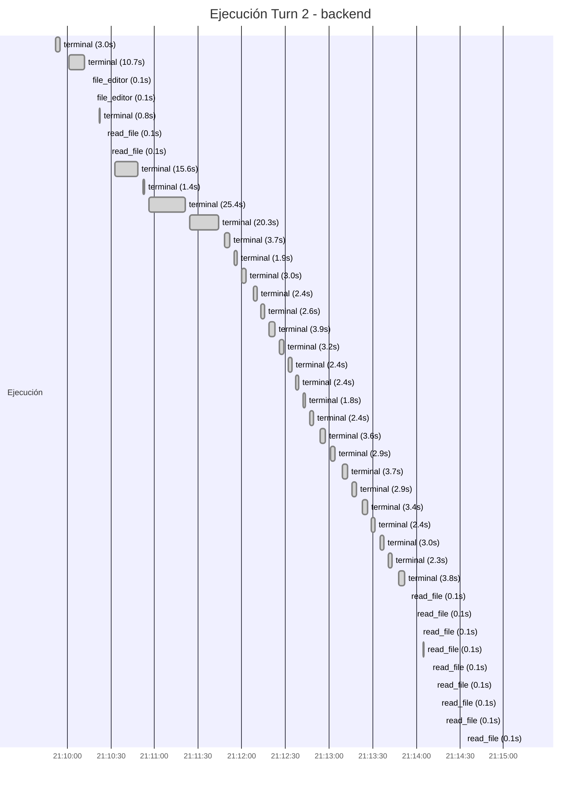

## Turn 2: ## Ponytail Rules (Reglas Comunes)


---

# Ponytail, lazy senior dev mode

You are a lazy senior de...

- **Circuito**: `backend`
- **Conversación OpenHands/OMP**: [`5052e9f2-ef27-44e7-9930-3f8545ae1f36`](http://localhost:3012/conversations/5052e9f2-ef27-44e7-9930-3f8545ae1f36)
- **Workspace**: `/contenedores/conti-backend`
- **Inicio**: 2026-07-05T21:09:11.990043
- **Fin**: 2026-07-05T21:15:34.334277
- **Duración**: 6m 22s
- **Eventos**: 129

## Prompt Completo

```text
## Ponytail Rules (Reglas Comunes)


---

# Ponytail, lazy senior dev mode

You are a lazy senior developer. Lazy means efficient, not careless. The best code is the code never written.

Before writing any code, stop at the first rung that holds:

1. Does this need to be built at all? (YAGNI)
2. Does it already exist in this codebase? Reuse the helper, util, or pattern that's already here, don't re-write it.
3. Does the standard library already do this? Use it.
4. Does a native platform feature 
```

## Timeline (Gantt)



## Tools Ejecutadas (40)

| # | Tool | Inicio | Duración | OK | Args/Result |
|---|------|--------|----------|-----|-------------|
| 1 | `terminal` | 21:09:52 | 3.0s | ✅ | find / -type f -name "*.json" -o -name "*.yaml" -o -name "*.yml" -o -name "*.toml" -o -name "*.conf" 2>/dev/null \| head  |
| 2 | `terminal` | 21:10:01 | 10.7s | ✅ | find / -type f -name "*hermes*" -o -name "*agent*" 2>/dev/null \| grep -v node_modules \| head -50 |
| 3 | `file_editor` | 21:10:15 | 0.1s | ✅ | view |
| 4 | `file_editor` | 21:10:18 | 0.1s | ✅ | view |
| 5 | `terminal` | 21:10:22 | 0.8s | ✅ | ls -la /contenedores/conti-backend/app/hermes_profiles/ |
| 6 | `read_file` | 21:10:25 | 0.1s | ✅ | Read file: /contenedores/conti-backend/app/hermes_profiles/contihome/config.yaml       1  model:      2    default: deep |
| 7 | `read_file` | 21:10:28 | 0.1s | ✅ | Read file: /contenedores/conti-backend/app/hermes_profiles/contihome/SOUL.md       1  # SOUL.md - Who You Are      2     |
| 8 | `terminal` | 21:10:33 | 15.6s | ✅ | find / -type f -name "*.yaml" -o -name "*.yml" -o -name "*.json" 2>/dev/null \| xargs grep -l "hermes" 2>/dev/null \| head |
| 9 | `terminal` | 21:10:52 | 1.4s | ✅ | which hermes-agent hermes hermes-acp 2>/dev/null \|\| echo "No hermes binaries found in PATH" |
| 10 | `terminal` | 21:10:56 | 25.4s | ✅ | hermes-agent --version 2>/dev/null \|\| hermes --version 2>/dev/null |
| 11 | `terminal` | 21:11:24 | 20.3s | ✅ | hermes-agent --help 2>&1 \| head -50 |
| 12 | `terminal` | 21:11:48 | 3.7s | ✅ | hermes --help 2>&1 \| head -100 |
| 13 | `terminal` | 21:11:55 | 1.9s | ✅ | hermes profile --help 2>&1 \| head -50 |
| 14 | `terminal` | 21:12:00 | 3.0s | ✅ | hermes profile list 2>&1 |
| 15 | `terminal` | 21:12:08 | 2.4s | ✅ | hermes profile show default 2>&1 |
| 16 | `terminal` | 21:12:13 | 2.6s | ✅ | hermes profile show catolico 2>&1 |
| 17 | `terminal` | 21:12:19 | 3.9s | ✅ | hermes profile show mendoza 2>&1 |
| 18 | `terminal` | 21:12:26 | 3.2s | ✅ | hermes profile show odoo 2>&1 |
| 19 | `terminal` | 21:12:32 | 2.4s | ✅ | hermes profile show odoo-mendoza 2>&1 |
| 20 | `terminal` | 21:12:37 | 2.4s | ✅ | hermes profile show odoo-nudo 2>&1 |
| 21 | `terminal` | 21:12:42 | 1.8s | ✅ | hermes profile show odoo-resto 2>&1 |
| 22 | `terminal` | 21:12:47 | 2.4s | ✅ | hermes profile show resto 2>&1 |
| 23 | `terminal` | 21:12:54 | 3.6s | ✅ | hermes skills list --profile default 2>&1 \| head -50 |
| 24 | `terminal` | 21:13:01 | 2.9s | ✅ | hermes skills list --profile default 2>&1 \| wc -l |
| 25 | `terminal` | 21:13:09 | 3.7s | ✅ | hermes skills list --profile catolico 2>&1 \| head -50 |
| 26 | `terminal` | 21:13:16 | 2.9s | ✅ | hermes skills list --profile mendoza 2>&1 \| head -50 |
| 27 | `terminal` | 21:13:23 | 3.4s | ✅ | hermes skills list --profile odoo 2>&1 \| head -50 |
| 28 | `terminal` | 21:13:29 | 2.4s | ✅ | hermes skills list --profile odoo-mendoza 2>&1 \| head -50 |
| 29 | `terminal` | 21:13:35 | 3.0s | ✅ | hermes skills list --profile odoo-nudo 2>&1 \| head -50 |
| 30 | `terminal` | 21:13:41 | 2.3s | ✅ | hermes skills list --profile odoo-resto 2>&1 \| head -50 |
| 31 | `terminal` | 21:13:48 | 3.8s | ✅ | hermes skills list --profile resto 2>&1 \| head -50 |
| 32 | `read_file` | 21:13:54 | 0.1s | ✅ | Read file: /contenedores/conti-backend/app/hermes_profiles/contihome/profiles/catolico/config.yaml       1  model:       |
| 33 | `read_file` | 21:13:58 | 0.1s | ✅ | Read file: /contenedores/conti-backend/app/hermes_profiles/contihome/profiles/catolico/SOUL.md       1  # SOUL.md — Asis |
| 34 | `read_file` | 21:14:02 | 0.1s | ✅ | Read file: /contenedores/conti-backend/app/hermes_profiles/contihome/profiles/mendoza/SOUL.md       1  # SOUL.md — Aseso |
| 35 | `read_file` | 21:14:05 | 0.1s | ✅ | Read file: /contenedores/conti-backend/app/hermes_profiles/contihome/profiles/odoo/SOUL.md       1  # SOUL.md — Asistent |
| 36 | `read_file` | 21:14:09 | 0.1s | ✅ | Read file: /contenedores/conti-backend/app/hermes_profiles/contihome/profiles/odoo-mendoza/SOUL.md       1  # SOUL.md —  |
| 37 | `read_file` | 21:14:12 | 0.1s | ✅ | Read file: /contenedores/conti-backend/app/hermes_profiles/contihome/profiles/odoo-nudo/SOUL.md       1  # SOUL.md — Asi |
| 38 | `read_file` | 21:14:15 | 0.1s | ✅ | Read file: /contenedores/conti-backend/app/hermes_profiles/contihome/profiles/odoo-resto/SOUL.md       1  # SOUL.md — As |
| 39 | `read_file` | 21:14:18 | 0.1s | ✅ | Read file: /contenedores/conti-backend/app/hermes_profiles/contihome/profiles/resto/SOUL.md       1  # SOUL.md — Mozo Vi |
| 40 | `read_file` | 21:15:15 | 0.1s | ✅ | Read file: /contenedores/conti-backend/Agentes_hermes_doc.md (showing lines 1-50 of 267) To read more, use: read_file(fi |

## Respuesta del Agente

He completado el análisis de los Agentes Hermes instalados en el contenedor y generado el reporte en `/contenedores/conti-backend/Agentes_hermes_doc.md`.

## Resumen del reporte:

### Infraestructura
- **3 binarios instalados**: hermes-agent, hermes (CLI), hermes-acp
- **8 perfiles configurados** con especializaciones diferentes

### Perfiles identificados:
1. **default** - Perfil principal (SysAdmin de Contamela)
2. **catolico** - Asistente litúrgico y doctrinal
3. **mendoza** - Asesor técnico-comercial OCRL Mendoza
4. **odoo** - Gestión ERP para restaurantes
5. **odoo-mendoza** - ERP interno OCRL Mendoza
6. **odoo-nudo** - Gestión ERP (similar a odoo)
7. **odoo-resto** - Gestión ERP (similar a odoo)
8. **resto** - Mozo virtual para atención a comensales

### Características principales:
- **106 skills** en perfil default, entre 77-94 en los demás
- **Integración MCP** con contibackend (localhost:9001) y odoo_mcp
- **27 herramientas** disponibles (read_file, write_file, terminal, etc.)
- **Modelos LLM**: DeepSeek-v4-flash (default, resto) y Kilocode (mendoza, odoo, etc.)
- **Aislamiento estricto** por tenant_id para operaciones multi-tenant

### Estado:
- ✅ Infraestructura funcional
- ⚠️ Gateway del perfil default detenido
- ⚠️ Algunas herramientas no disponibles por requisitos faltantes

El reporte incluye configuraciones detalladas, skills por categoría, integraciones MCP y recomendaciones de uso.

## Archivos Escritos/Editados

| Path | Método | Tamaño |
|------|--------|--------|
| `/contenedores/conti-backend/Agentes_hermes_doc.md` | write_file | 10877 chars |

## Tokens por Llamada LLM

| # | Input | Cache Read | Total Input | Cache % | Completion | Reasoning | Delta |
|---|-------|------------|-------------|---------|------------|-----------|-------|
| 1 | 504 | 0 | 504 | 0.0% | 1,648 | 1,637 | 2,152 |
| 2 | 12,318 | 2,048 | 12,318 | 16.6% | 1,792 | 1,683 | 11,958 |
| 3 | 25,094 | 13,824 | 25,094 | 55.1% | 1,912 | 1,720 | 12,896 |
| 4 | 39,164 | 26,560 | 39,164 | 67.8% | 2,021 | 1,793 | 14,179 |
| 5 | 56,597 | 40,576 | 56,597 | 71.7% | 2,120 | 1,852 | 17,532 |
| 6 | 74,930 | 57,984 | 74,930 | 77.4% | 2,258 | 1,937 | 18,471 |
| 7 | 93,547 | 76,288 | 93,547 | 81.6% | 2,327 | 1,969 | 18,686 |
| 8 | 118,822 | 94,848 | 118,822 | 79.8% | 2,389 | 1,992 | 25,337 |
| 9 | 144,917 | 120,064 | 144,917 | 82.9% | 2,555 | 2,057 | 26,261 |
| 10 | 171,527 | 146,112 | 171,527 | 85.2% | 2,659 | 2,093 | 26,714 |
| 11 | 198,316 | 172,672 | 198,316 | 87.1% | 2,742 | 2,119 | 26,872 |
| 12 | 226,076 | 199,424 | 226,076 | 88.2% | 2,823 | 2,150 | 27,841 |
| 13 | 254,817 | 227,136 | 254,817 | 89.1% | 2,920 | 2,197 | 28,838 |
| 14 | 284,993 | 255,872 | 284,993 | 89.8% | 3,024 | 2,251 | 30,280 |
| 15 | 315,555 | 286,016 | 315,555 | 90.6% | 3,077 | 2,260 | 30,615 |
| 16 | 346,406 | 316,544 | 346,406 | 91.4% | 3,163 | 2,302 | 30,937 |
| 17 | 377,448 | 347,392 | 377,448 | 92.0% | 3,222 | 2,313 | 31,101 |
| 18 | 408,694 | 378,368 | 408,694 | 92.6% | 3,278 | 2,323 | 31,302 |
| 19 | 440,129 | 409,600 | 440,129 | 93.1% | 3,334 | 2,333 | 31,491 |
| 20 | 471,755 | 441,024 | 471,755 | 93.5% | 3,396 | 2,345 | 31,688 |
| 21 | 503,588 | 472,640 | 503,588 | 93.9% | 3,458 | 2,357 | 31,895 |
| 22 | 535,597 | 504,448 | 535,597 | 94.2% | 3,520 | 2,369 | 32,071 |
| 23 | 567,782 | 536,448 | 567,782 | 94.5% | 3,574 | 2,379 | 32,239 |
| 24 | 600,129 | 568,576 | 600,129 | 94.7% | 3,651 | 2,405 | 32,424 |
| 25 | 633,560 | 600,896 | 633,560 | 94.8% | 3,728 | 2,429 | 33,508 |
| 26 | 667,126 | 634,304 | 667,126 | 95.1% | 3,822 | 2,468 | 33,660 |
| 27 | 701,744 | 667,840 | 701,744 | 95.2% | 3,899 | 2,492 | 34,695 |
| 28 | 737,436 | 702,400 | 737,436 | 95.2% | 3,976 | 2,516 | 35,769 |
| 29 | 774,164 | 738,048 | 774,164 | 95.3% | 4,059 | 2,542 | 36,811 |
| 30 | 811,929 | 774,720 | 811,929 | 95.4% | 4,142 | 2,568 | 37,848 |
| 31 | 850,726 | 812,480 | 850,726 | 95.5% | 4,225 | 2,594 | 38,880 |
| 32 | 890,555 | 851,264 | 890,555 | 95.6% | 4,299 | 2,617 | 39,903 |
| 33 | 931,457 | 891,072 | 931,457 | 95.7% | 4,378 | 2,654 | 40,981 |
| 34 | 978,423 | 931,968 | 978,423 | 95.3% | 4,437 | 2,669 | 47,025 |
| 35 | 1,026,661 | 978,880 | 1,026,661 | 95.3% | 4,494 | 2,683 | 48,295 |
| 36 | 1,077,231 | 1,027,072 | 1,077,231 | 95.3% | 4,552 | 2,697 | 50,628 |
| 37 | 1,129,230 | 1,077,632 | 1,129,230 | 95.4% | 4,614 | 2,713 | 52,061 |
| 38 | 1,183,293 | 1,129,600 | 1,183,293 | 95.5% | 4,676 | 2,729 | 54,125 |
| 39 | 1,238,791 | 1,183,616 | 1,238,791 | 95.5% | 4,738 | 2,745 | 55,560 |
| 40 | 1,295,724 | 1,239,104 | 1,295,724 | 95.6% | 4,794 | 2,758 | 56,989 |
| 41 | 1,356,005 | 1,296,000 | 1,356,005 | 95.6% | 8,192 | 2,795 | 63,679 |
| 42 | 1,419,714 | 1,356,224 | 1,419,714 | 95.5% | 8,273 | 2,830 | 63,790 |
| 43 | 1,484,488 | 1,419,904 | 1,484,488 | 95.6% | 8,751 | 2,850 | 65,252 |
| 44 | 1,536,314 | 1,420,096 | 1,536,314 | 92.4% | 9,041 | 3,118 | 52,116 |

## Reasoning del Agente

### 21:09:52 → `terminal`

> Voy a analizar los agentes Hermes instalados en el contenedor. Primero necesito explorar el sistema para entender qué es "Hermes" en este contexto y dónde están configurados los agentes.

### 21:10:01 → `terminal`

> Necesito buscar específicamente archivos relacionados con "Hermes" o agentes. Vamos a explorar el directorio actual y buscar configuraciones de agentes.

### 21:10:15 → `file_editor`

> Veo que hay archivos "hermes-agent", "hermes", "hermes-acp" en el directorio de caché de uv. Parece que hay agentes Hermes instalados. Vamos a explorar más para entender qué son estos agentes y dónde están configurados. Primero, veamos la estructura del directorio actual.

### 21:10:18 → `file_editor`

> Veo que hay un directorio `app/hermes_profiles/` que parece contener configuraciones de agentes Hermes. También veo archivos como `entrypoint_hermes.sh`. Vamos a explorar el directorio de hermes_profiles y buscar información sobre los agentes Hermes.

### 21:10:22 → `terminal`

> Veo que hay un directorio `contihome` dentro de `hermes_profiles`. Parece ser un perfil de Hermes. Vamos a explorar más para ver si hay otros perfiles. También necesito ver el archivo de configuración `config.yaml` y `SOUL.md` para entender las habilidades. Primero, veamos la estructura del directorio padre para ver si hay otros perfiles.

### 21:10:25 → `read_file`

> Solo hay un perfil llamado `contihome`. Vamos a explorar sus archivos de configuración. Primero, veamos el archivo `config.yaml`.

### 21:10:28 → `read_file`

> Ahora veamos el archivo `SOUL.md` para entender la personalidad y habilidades del agente.

### 21:10:33 → `terminal`

> Ahora necesito ver si hay más perfiles de agentes Hermes en el sistema. También debo buscar en el directorio de caché de uv donde vi los binarios de hermes-agent. Vamos a explorar la estructura de directorios de hermes para ver si hay configuraciones de agentes.

### 21:10:52 → `terminal`

> La búsqueda tardó demasiado. Vamos a buscar de manera más específica. Primero, veamos si hay binarios de hermes-agent instalados y sus configuraciones.

### 21:10:56 → `terminal`

> Genial, hay binarios de hermes instalados. Vamos a ver qué versiones tienen y qué opciones ofrecen.

### 21:11:24 → `terminal`

> El comando `hermes-agent --version` en realidad ejecutó el agente. Necesito usar `--help` para ver las opciones.

### 21:11:48 → `terminal`

> Parece que `hermes-agent` está intentando ejecutar una conversación. Necesito usar `hermes` en su lugar, que probablemente es el CLI. Vamos a ver `hermes --help`.

### 21:11:55 → `terminal`

> Perfecto. Ahora puedo ver que `hermes` es un agente de IA con muchas capacidades. Necesito explorar más para entender qué agentes están instalados. Vamos a usar `hermes profile` para ver los perfiles disponibles.

### 21:12:00 → `terminal`

> Vamos a listar los perfiles disponibles.

### 21:12:08 → `terminal`

> ¡Excelente! Hay múltiples perfiles de Hermes instalados. Vamos a explorar cada uno para entender sus configuraciones y habilidades. Primero, veamos el perfil por defecto.

### 21:12:13 → `terminal`

> Vamos a ver el perfil `catolico`.

### 21:12:19 → `terminal`

> Vamos a ver el perfil `mendoza`.

### 21:12:26 → `terminal`

> Vamos a ver el perfil `odoo`.

### 21:12:32 → `terminal`

> Vamos a ver el perfil `odoo-mendoza`.

### 21:12:37 → `terminal`

> Vamos a ver el perfil `odoo-nudo`.

### 21:12:42 → `terminal`

> Vamos a ver el perfil `odoo-resto`.

### 21:12:47 → `terminal`

> Vamos a ver el perfil `resto`.

### 21:12:54 → `terminal`

> Ahora necesito explorar las habilidades (skills) de cada perfil. Vamos a ver las skills del perfil default.

### 21:13:01 → `terminal`

> Necesito ver más skills. Vamos a usar `wc -l` para contar cuántas hay.

### 21:13:09 → `terminal`

> Hay 108 líneas, incluyendo la cabecera. Vamos a ver las skills de otros perfiles. Primero, veamos las skills del perfil catolico.

### 21:13:16 → `terminal`

> Necesito ver las skills específicas de cada perfil. Vamos a ver las skills del perfil mendoza.

### 21:13:23 → `terminal`

> Necesito ver las skills específicas de cada perfil. Vamos a ver las skills del perfil odoo.

### 21:13:29 → `terminal`

> Necesito ver las skills específicas de cada perfil. Vamos a ver las skills del perfil odoo-mendoza.

### 21:13:35 → `terminal`

> Necesito ver las skills específicas de cada perfil. Vamos a ver las skills del perfil odoo-nudo.

### 21:13:41 → `terminal`

> Necesito ver las skills específicas de cada perfil. Vamos a ver las skills del perfil odoo-resto.

### 21:13:48 → `terminal`

> Necesito ver las skills específicas de cada perfil. Vamos a ver las skills del perfil resto.

### 21:13:54 → `read_file`

> Ahora necesito ver las configuraciones específicas de cada perfil. Vamos a ver el archivo config.yaml de cada perfil. Primero, veamos el perfil catolico.

### 21:13:58 → `read_file`

> Ahora necesito ver el SOUL.md del perfil catolico.

### 21:14:02 → `read_file`

> Ahora necesito ver el SOUL.md del perfil mendoza.

### 21:14:05 → `read_file`

> Ahora necesito ver el SOUL.md del perfil odoo.

### 21:14:09 → `read_file`

> Ahora necesito ver el SOUL.md del perfil odoo-mendoza.

### 21:14:12 → `read_file`

> Ahora necesito ver el SOUL.md del perfil odoo-nudo.

### 21:14:15 → `read_file`

> Ahora necesito ver el SOUL.md del perfil odoo-resto.

### 21:14:18 → `read_file`

> Ahora necesito ver el SOUL.md del perfil resto.

### 21:15:15 → `read_file`

> Perfecto. He creado el reporte de los agentes Hermes instalados. Ahora debo verificar que el archivo se creó correctamente y luego finalizar la tarea.
