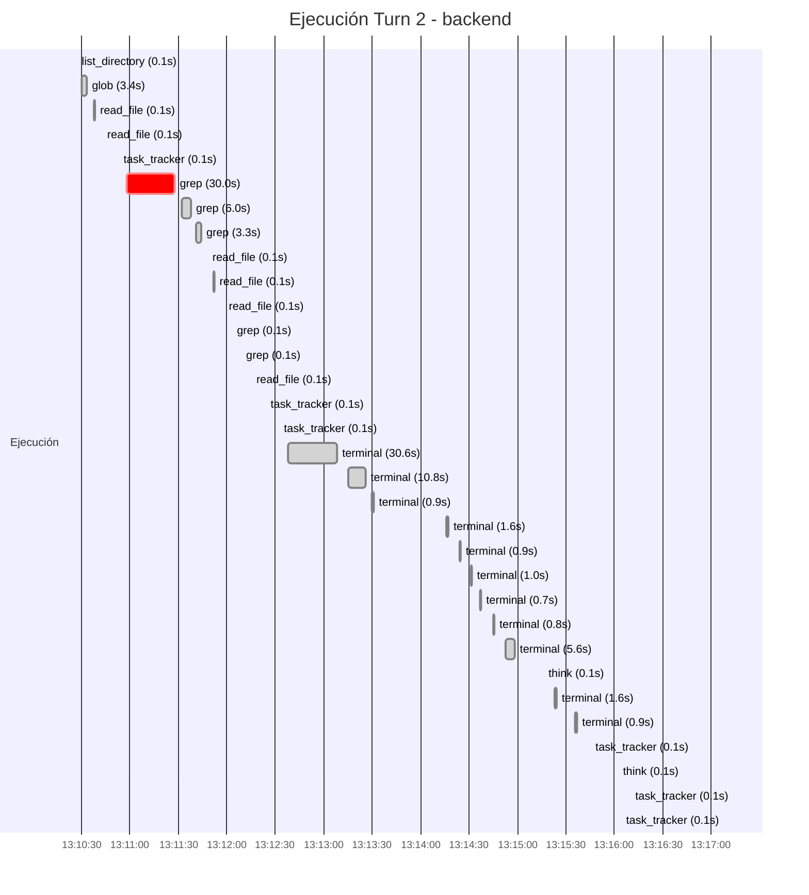

## Turn 2: ## Ponytail Rules (Reglas Comunes)


---

# Ponytail, lazy senior dev mode

You are a lazy senior de...

- **Circuito**: `backend`
- **Conversación OpenHands/OMP**: [`2b2af8cc-0e79-4c3a-9925-92ac58086a76`](http://localhost:3012/conversations/2b2af8cc-0e79-4c3a-9925-92ac58086a76)
- **Workspace**: `/contenedores/conti-backend`
- **Inicio**: 2026-07-06T13:09:46.773274
- **Fin**: 2026-07-06T13:17:32.427214
- **Duración**: 7m 46s
- **Eventos**: 105

## Prompt Completo

```text
## Ponytail Rules (Reglas Comunes)


---

# Ponytail, lazy senior dev mode

You are a lazy senior developer. Lazy means efficient, not careless. The best code is the code never written.

Before writing any code, stop at the first rung that holds:

1. Does this need to be built at all? (YAGNI)
2. Does it already exist in this codebase? Reuse the helper, util, or pattern that's already here, don't re-write it.
3. Does the standard library already do this? Use it.
4. Does a native platform feature 
```

## Timeline (Gantt)



## Tools Ejecutadas (32)

| # | Tool | Inicio | Duración | OK | Args/Result |
|---|------|--------|----------|-----|-------------|
| 1 | `list_directory` | 13:10:27 | 0.1s | ✅ | Listed directory: /contenedores/conti-backend (70 entries) |
| 2 | `glob` | 13:10:30 | 3.4s | ✅ | Found 100 file(s) matching pattern '**/*mcp*' in '/contenedores/conti-backend': /contenedores/conti-backend/docs/mcp_too |
| 3 | `read_file` | 13:10:38 | 0.1s | ✅ | Read file: /contenedores/conti-backend/docs/mcp_tools_doc.MD (showing lines 1-1000 of 1423) To read more, use: read_file |
| 4 | `read_file` | 13:10:43 | 0.1s | ✅ | Read file: /contenedores/conti-backend/docs/mcp_tools_doc.MD    1001  - **Esquema de Entrada**:   1002    ```json   1003 |
| 5 | `task_tracker` | 13:10:53 | 0.1s | ✅ | plan |
| 6 | `grep` | 13:10:58 | 30.0s | ❌ | Command '['grep', '-R', '-I', '-l', '-i', 'get_container_health', '/contenedores/conti-backend']' timed out after 30 sec |
| 7 | `grep` | 13:11:32 | 6.0s | ✅ | /contenedores/conti-backend/app |
| 8 | `grep` | 13:11:41 | 3.3s | ✅ | /contenedores/conti-backend/app |
| 9 | `read_file` | 13:11:48 | 0.1s | ✅ | Read file: /contenedores/conti-backend/app/tools/container_tools.py       1  from __future__ import annotations      2   |
| 10 | `read_file` | 13:11:52 | 0.1s | ✅ | Read file: /contenedores/conti-backend/app/core/categories.py       1  """      2  Categorías MCP del backend conti.     |
| 11 | `read_file` | 13:11:58 | 0.1s | ✅ | Read file: /contenedores/conti-backend/app/services/registry_service.py (showing lines 1-100 of 1738) To read more, use: |
| 12 | `grep` | 13:12:03 | 0.1s | ❌ | /contenedores/conti-backend/app/services/registry_service.py |
| 13 | `grep` | 13:12:09 | 0.1s | ✅ | /contenedores/conti-backend/app/services |
| 14 | `read_file` | 13:12:15 | 0.1s | ✅ | Read file: /contenedores/conti-backend/app/services/registry_service.py (showing lines 701-800 of 1738) To read more, us |
| 15 | `task_tracker` | 13:12:24 | 0.1s | ✅ | plan |
| 16 | `task_tracker` | 13:12:32 | 0.1s | ✅ | plan |
| 17 | `terminal` | 13:12:38 | 30.6s | ✅ | curl -s -X POST http://conti-backend:9001/mcp/call -H "Content-Type: application/json" -d '{"tool": "health_check", "arg |
| 18 | `terminal` | 13:13:15 | 10.8s | ✅ | timeout 10 curl -s -X POST http://localhost:9001/mcp/call -H "Content-Type: application/json" -d '{"tool": "health_check |
| 19 | `terminal` | 13:13:30 | 0.9s | ✅ | netstat -tlnp \| grep :9001 |
| 20 | `terminal` | 13:14:16 | 1.6s | ✅ | cat /etc/hostname && ls /var/run/docker.sock 2>/dev/null && curl -s --unix-socket /var/run/docker.sock http://localhost/ |
| 21 | `terminal` | 13:14:24 | 0.9s | ✅ | curl -s --unix-socket /var/run/docker.sock http://localhost/containers/json \| python3 -c "import sys,json; data=json.loa |
| 22 | `terminal` | 13:14:31 | 1.0s | ✅ | curl -s --unix-socket /var/run/docker.sock http://localhost/containers/conti-backend/logs?stdout=true&stderr=true&tail=5 |
| 23 | `terminal` | 13:14:37 | 0.7s | ✅ | ss -tlnp 2>/dev/null \|\| cat /proc/net/tcp 2>/dev/null \| head -5 |
| 24 | `terminal` | 13:14:45 | 0.8s | ✅ | ps aux \| grep -E "(python\|uvicorn\|gunicorn\|fastapi)" \| head -10 |
| 25 | `terminal` | 13:14:53 | 5.6s | ✅ | python3 -c " import sys sys.path.insert(0, '.') from app.tools.container_tools import get_container_health from app.conf |
| 26 | `think` | 13:15:16 | 0.1s | ✅ | Your thought has been logged. |
| 27 | `terminal` | 13:15:23 | 1.6s | ✅ | curl -s --unix-socket /var/run/docker.sock http://localhost/containers/json \| python3 -c " import sys, json data = json. |
| 28 | `terminal` | 13:15:36 | 0.9s | ✅ | curl -s --unix-socket /var/run/docker.sock http://localhost/containers/json \| python3 -c " import sys, json data = json. |
| 29 | `task_tracker` | 13:15:45 | 0.1s | ✅ | plan |
| 30 | `think` | 13:16:02 | 0.1s | ✅ | Your thought has been logged. |
| 31 | `task_tracker` | 13:16:10 | 0.1s | ✅ | plan |
| 32 | `task_tracker` | 13:17:08 | 0.1s | ✅ | plan |

## Respuesta del Agente

## Informe de Análisis - Endpoints MCP Categoría Stack (Contenedores)

He completado el análisis de los 3 endpoints MCP que trabajan sobre contenedores Docker:

### 🔴 **Hallazgo Crítico: Bug en `_container_image()`**

**Problema**: La función `_container_image()` en `container_tools.py` falla con `docker.errors.ImageNotFound` cuando un contenedor tiene una imagen que fue eliminada del sistema. Esto **rompe completamente** las 3 herramientas de la categoría stack.

**Ubicación**: `/contenedores/conti-backend/app/tools/container_tools.py` líneas 270-274

### 🟡 **Lista de Contenedores Desactualizada**

La lista hardcoded en `_build_environment_summary()` tiene **13 de 21 contenedores que ya no existen** en el entorno real:

**Faltantes en producción**: `evolution-api-server`, `wppconnect-server`, `chatwoot_web`, `chatwoot_worker`, `ollama`  
**Faltantes en desarrollo**: `django-dev`, `odoo_dev`, `n8n_dev`, `chatwoot_web_dev`, `chatwoot_worker_dev`, `cloudflare-tunnel-dev`, `redis_odoo_dev`

**Contenedores reales no listados**: `conti-omp`, `conti-sourcebot`, `chatui`, `flamehaven`

### ✅ **Documentación Correcta**

Los esquemas de entrada en `mcp_tools_doc.MD` coinciden exactamente con la implementación.

### 📄 **Informe Detallado**

He generado un informe completo en:  
`/contenedores/conti-backend/docs/analisis_endpoints_container_stack.md`

### **Próximos Pasos Recomendados**

1. **Corregir bug crítico** (15 min): Agregar try/except en `_container_image()`
2. **Actualizar lista de contenedores** (10 min): Modificar `EXPECTED` en `_build_environment_summary()`

¿Quieres que proceda con las correcciones?

## Archivos Escritos/Editados

| Path | Método | Tamaño |
|------|--------|--------|
| `/contenedores/conti-backend/docs/analisis_endpoints_container_stack.md` | write_file | 7432 chars |

## Errores

| # | Tool | Error |
|---|------|-------|
| 1 | `grep` | Command '['grep', '-R', '-I', '-l', '-i', 'get_container_health', '/contenedores/conti-backend']' timed out after 30 seconds |
| 2 | `grep` | Search path '/contenedores/conti-backend/app/services/registry_service.py' is not a valid directory |

## Tokens por Llamada LLM

| # | Input | Cache Read | Total Input | Cache % | Completion | Reasoning | Delta |
|---|-------|------------|-------------|---------|------------|-----------|-------|
| 1 | 504 | 448 | 504 | 88.9% | 1,291 | 1,281 | 1,795 |
| 2 | 14,931 | 2,496 | 14,931 | 16.7% | 1,419 | 1,368 | 14,555 |
| 3 | 29,513 | 16,896 | 29,513 | 57.2% | 1,480 | 1,403 | 14,643 |
| 4 | 46,997 | 31,424 | 46,997 | 66.9% | 1,573 | 1,449 | 17,577 |
| 5 | 78,713 | 48,896 | 78,713 | 62.1% | 1,692 | 1,496 | 31,835 |
| 6 | 117,970 | 80,576 | 117,970 | 68.3% | 2,087 | 1,645 | 39,652 |
| 7 | 157,644 | 119,808 | 157,644 | 76.0% | 2,158 | 1,681 | 39,745 |
| 8 | 197,446 | 159,424 | 197,446 | 80.7% | 2,220 | 1,694 | 39,864 |
| 9 | 237,389 | 199,168 | 237,389 | 83.9% | 2,287 | 1,712 | 40,010 |
| 10 | 277,478 | 239,104 | 277,478 | 86.2% | 2,332 | 1,724 | 40,134 |
| 11 | 321,850 | 279,168 | 321,850 | 86.7% | 2,403 | 1,763 | 44,443 |
| 12 | 367,044 | 323,520 | 367,044 | 88.1% | 2,471 | 1,786 | 45,262 |
| 13 | 413,398 | 368,704 | 413,398 | 89.2% | 2,536 | 1,808 | 46,419 |
| 14 | 459,858 | 415,040 | 459,858 | 90.3% | 2,597 | 1,820 | 46,521 |
| 15 | 506,421 | 461,440 | 506,421 | 91.1% | 2,662 | 1,829 | 46,628 |
| 16 | 554,372 | 507,968 | 554,372 | 91.6% | 2,943 | 1,865 | 48,232 |
| 17 | 602,626 | 555,904 | 602,626 | 92.2% | 3,223 | 1,900 | 48,534 |
| 18 | 651,182 | 604,096 | 651,182 | 92.8% | 3,342 | 1,931 | 48,675 |
| 19 | 699,943 | 652,608 | 699,943 | 93.2% | 3,459 | 1,956 | 48,878 |
| 20 | 748,879 | 701,312 | 748,879 | 93.6% | 3,550 | 1,983 | 49,027 |
| 21 | 797,969 | 750,208 | 797,969 | 94.0% | 3,702 | 2,000 | 49,242 |
| 22 | 847,313 | 799,232 | 847,313 | 94.3% | 3,884 | 2,064 | 49,526 |
| 23 | 896,967 | 848,512 | 896,967 | 94.6% | 4,031 | 2,127 | 49,801 |
| 24 | 946,883 | 898,112 | 946,883 | 94.8% | 4,128 | 2,155 | 50,013 |
| 25 | 997,470 | 947,968 | 997,470 | 95.0% | 4,270 | 2,229 | 50,729 |
| 26 | 1,048,261 | 998,528 | 1,048,261 | 95.3% | 4,460 | 2,312 | 50,981 |
| 27 | 1,100,184 | 1,049,280 | 1,100,184 | 95.4% | 4,832 | 2,388 | 52,295 |
| 28 | 1,152,496 | 1,101,184 | 1,152,496 | 95.5% | 5,006 | 2,430 | 52,486 |
| 29 | 1,205,209 | 1,153,472 | 1,205,209 | 95.7% | 5,421 | 2,722 | 53,128 |
| 30 | 1,258,557 | 1,206,144 | 1,258,557 | 95.8% | 5,687 | 2,743 | 53,614 |
| 31 | 1,312,193 | 1,259,456 | 1,312,193 | 96.0% | 6,384 | 2,776 | 54,333 |
| 32 | 1,366,543 | 1,313,088 | 1,366,543 | 96.1% | 6,639 | 2,786 | 54,605 |
| 33 | 1,421,170 | 1,367,424 | 1,421,170 | 96.2% | 8,816 | 2,796 | 56,804 |
| 34 | 1,478,005 | 1,422,016 | 1,478,005 | 96.2% | 9,073 | 2,808 | 57,092 |
| 35 | 1,535,119 | 1,478,848 | 1,535,119 | 96.3% | 9,580 | 2,825 | 57,621 |
| 36 | 1,580,834 | 1,479,360 | 1,580,834 | 93.6% | 9,872 | 3,095 | 46,007 |

## Reasoning del Agente

### 13:10:27 → `list_directory`

> Voy a analizar los endpoints del servidor MCP que trabajan sobre estatus, logs y errores de contenedores. Primero necesito entender el entorno y la estructura del código. Comenzaré explorando el repositorio para encontrar los endpoints MCP relevantes.

Primero, voy a revisar la estructura del proyecto y buscar archivos relacionados con MCP, contenedores, health, logs, etc.

### 13:10:30 → `glob`

> Necesito ver más detalles. Voy a explorar la estructura del proyecto. Primero, buscaré archivos que contengan "mcp" o "endpoint".

### 13:10:38 → `read_file`

> Necesito buscar específicamente los endpoints MCP relacionados con contenedores, estatus, logs y errores. Primero, revisaré el archivo de documentación de MCP tools para entender qué herramientas están disponibles.

### 13:10:43 → `read_file`

> Necesito ver más del archivo para encontrar las herramientas de la categoría "stack" que se mencionan en la documentación como "Estado y logs de contenedores Docker". Continuaré leyendo el archivo.

### 13:10:53 → `task_tracker`

> Perfecto. Encontré las herramientas de la categoría "stack" que son las que trabajan con contenedores:

1. `get_container_health` - Resume estado y salud de contenedores Docker accesibles desde el backend
2. `get_container_logs` - Lee logs de un contenedor Docker local con filtros por tiempo, nivel y cantidad de líneas
3. `get_vps_status` - Da una vista consolidada del estado Docker local y del repo Git principal montado

Ahora necesito verificar si estas herramientas están actualizadas con el e

### 13:10:58 → `grep`

> Ahora necesito buscar la implementación de estas herramientas en el código. Primero, buscaré archivos que contengan "get_container_health" o "get_container_logs".

### 13:11:32 → `grep`

> Let me use the more efficient grep tool instead of the terminal.

### 13:11:41 → `grep`

> Ahora voy a buscar también "get_container_logs" y "get_vps_status".

### 13:11:48 → `read_file`

> Now let me look at the actual implementation of these tools.

### 13:11:52 → `read_file`

> Ahora tengo la implementación completa de las herramientas de contenedores. También necesito ver cómo están registradas y categorizadas. Voy a revisar el archivo de categorías.

### 13:11:58 → `read_file`

> Ahora necesito ver el registro de estas herramientas en el registry_service.py para entender cómo están expuestas.

### 13:12:03 → `grep`

> I need to find the specific registration of the container tools. Let me search for container tools in the registry.

### 13:12:09 → `grep`

> Let me search more specifically in the registry_service.py file:

### 13:12:15 → `read_file`

> Let me check the registry file more carefully:

### 13:12:24 → `task_tracker`

> Perfecto. Ahora tengo la información completa sobre los endpoints MCP de contenedores. Voy a actualizar el task tracker y probar las herramientas en el entorno real.

### 13:12:32 → `task_tracker`

> Ahora voy a probar los endpoints MCP en el entorno real. Primero voy a hacer una prueba de health_check para verificar que el servidor MCP está funcionando.

### 13:12:38 → `terminal`

> Voy a probar los endpoints MCP. Primero, verificaré la salud del servidor y luego probaré las herramientas de contenedores.

### 13:13:15 → `terminal`

> El curl está tomando mucho tiempo. Voy a probar con un timeout más corto y usar el endpoint interno.

### 13:13:30 → `terminal`

> El servidor MCP no está respondiendo. Voy a verificar si el contenedor está corriendo y si el puerto está accesible.

### 13:14:16 → `terminal`

> Let me check if I'm inside the conti-backend container and verify Docker connectivity.

### 13:14:24 → `terminal`

> Perfecto. Estoy dentro del contenedor `conti-backend` y tengo acceso al socket de Docker. Ahora voy a probar directamente las herramientas MCP usando Python o curl directo. Primero, voy a revisar si el servidor MCP está corriendo en el puerto 9001.

### 13:14:31 → `terminal`

> El contenedor conti-backend está corriendo pero no parece estar exponiendo el puerto 9001. Voy a verificar qué puertos están expuestos y si el servidor MCP está realmente ejecutándose. Primero, voy a ver los logs del contenedor para entender qué está pasando.

### 13:14:37 → `terminal`

> Let me try a different approach. Since I'm inside the conti-backend container, let me check if the MCP server is running locally.

### 13:14:45 → `terminal`

> Necesito entender mejor qué puertos están activos. El puerto 0BB8 en hexadecimal es 3000 (0x0BB8 = 3000). Voy a verificar el proceso que está escuchando en el puerto 9001. Primero, déjame ver si hay algún proceso corriendo.

### 13:14:53 → `terminal`

> El servidor MCP no está corriendo en el puerto 9001 dentro de este contenedor. Probablemente el servidor MCP está corriendo en el contenedor `conti-backend` pero en un proceso separado. Voy a verificar si puedo acceder al MCP desde localhost en el contenedor. Primero, voy a probar directamente las herramientas usando el código Python que ya tengo.

### 13:15:16 → `think`

> ¡Encontré un bug! Hay un error en la función `_container_image()` que intenta obtener la imagen de un contenedor, pero la imagen no existe (ha sido eliminada o no está disponible). Esto causa un error `docker.errors.ImageNotFound`.

Voy a analizar el código más detenidamente y ver cómo se está manejando este error.

### 13:15:23 → `terminal`

> Ahora voy a verificar el entorno real y ver qué contenedores están corriendo, y comparar con la documentación. Primero, voy a ver la lista completa de contenedores.

### 13:15:36 → `terminal`

> Ahora voy a comparar con la documentación. En el código de `_build_environment_summary` hay una lista de contenedores esperados:

**Producción:**
- django-api, odoo18, evolution-api-server, wppconnect-server, n8n, chatwoot_web, chatwoot_worker, portainer, cloudflared-tunnel, ollama, compose-db-1, redis_odoo

**Desarrollo:**
- django-dev, odoo_dev, n8n_dev, chatwoot_web_dev, chatwoot_worker_dev, cloudflare-tunnel-dev, db_dev, redis_odoo_dev, conti-backend

Pero los contenedores reales que están c

### 13:15:45 → `task_tracker`

> Ahora tengo una visión clara. Voy a actualizar el task tracker y generar el informe.

### 13:16:02 → `think`

> Ahora voy a comparar la documentación con la implementación real. Primero, revisaré si hay diferencias en los esquemas de entrada.

### 13:16:10 → `task_tracker`

> Ahora voy a generar el informe final.

### 13:17:08 → `task_tracker`

> Ahora voy a actualizar el task tracker y finalizar.
