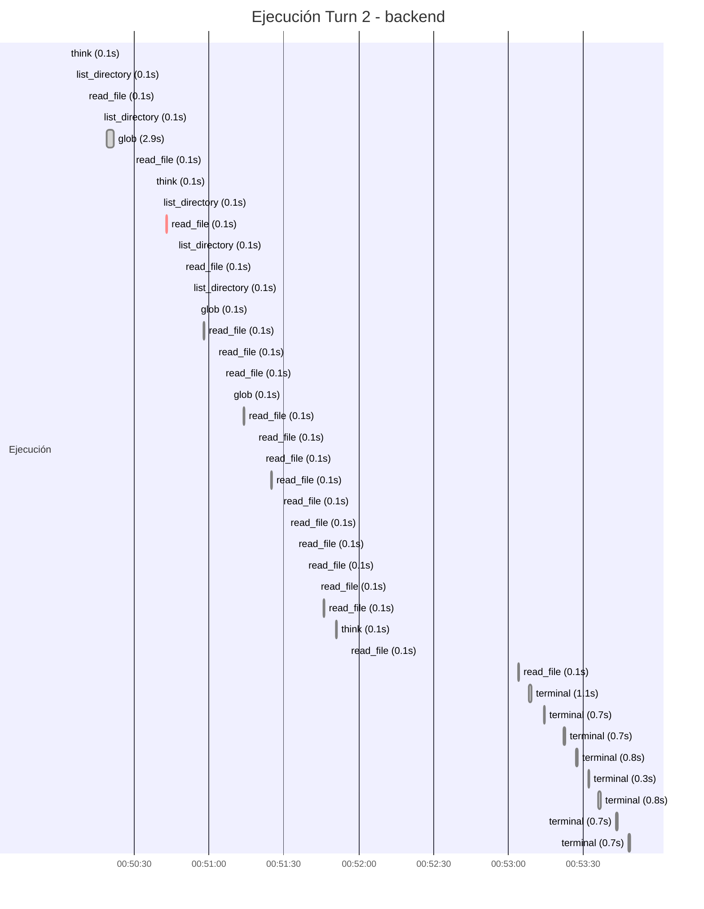

## Turn 2: ## Ponytail Rules (Reglas Comunes)


---

# Ponytail, lazy senior dev mode

You are a lazy senior de...

- **Circuito**: `backend`
- **Conversación OpenHands/OMP**: [`75d13450-6506-4fcb-8a82-315eec488e81`](http://localhost:3012/conversations/75d13450-6506-4fcb-8a82-315eec488e81)
- **Workspace**: `/contenedores/conti-backend`
- **Inicio**: 2026-07-06T00:49:29.926834
- **Fin**: 2026-07-06T00:54:19.261077
- **Duración**: 4m 49s
- **Eventos**: 123

## Prompt Completo

```text
## Ponytail Rules (Reglas Comunes)


---

# Ponytail, lazy senior dev mode

You are a lazy senior developer. Lazy means efficient, not careless. The best code is the code never written.

Before writing any code, stop at the first rung that holds:

1. Does this need to be built at all? (YAGNI)
2. Does it already exist in this codebase? Reuse the helper, util, or pattern that's already here, don't re-write it.
3. Does the standard library already do this? Use it.
4. Does a native platform feature 
```

## Timeline (Gantt)



## Tools Ejecutadas (38)

| # | Tool | Inicio | Duración | OK | Args/Result |
|---|------|--------|----------|-----|-------------|
| 1 | `think` | 00:50:03 | 0.1s | ✅ | Your thought has been logged. |
| 2 | `list_directory` | 00:50:05 | 0.1s | ✅ | Listed directory: /contenedores/conti-backend (69 entries) |
| 3 | `read_file` | 00:50:10 | 0.1s | ❌ | Error: Path is a directory, not a file: /contenedores/conti-backend |
| 4 | `list_directory` | 00:50:16 | 0.1s | ✅ | Listed directory: /contenedores/conti-backend (276 entries) |
| 5 | `glob` | 00:50:19 | 2.9s | ✅ | /contenedores/conti-backend |
| 6 | `read_file` | 00:50:29 | 0.1s | ✅ | Read file: /contenedores/conti-backend/Agentes_hermes_doc_BACK.md       1  # Reporte de Agentes Hermes Instalados      2 |
| 7 | `think` | 00:50:37 | 0.1s | ✅ | Your thought has been logged. |
| 8 | `list_directory` | 00:50:40 | 0.1s | ✅ | Listed directory: /contenedores/conti-backend/app/hermes_profiles/contihome (45 entries) |
| 9 | `read_file` | 00:50:43 | 0.1s | ❌ | Error: Path is a directory, not a file: /contenedores/conti-backend/app/hermes_profiles/contihome |
| 10 | `list_directory` | 00:50:46 | 0.1s | ✅ | Listed directory: /contenedores/conti-backend/app/hermes_profiles/contihome/profiles (12 entries) |
| 11 | `read_file` | 00:50:49 | 0.1s | ❌ | Error: Path is a directory, not a file: /contenedores/conti-backend/app/hermes_profiles/contihome/profiles |
| 12 | `list_directory` | 00:50:52 | 0.1s | ✅ | Listed directory: /contenedores/conti-backend/app/hermes_profiles/contihome (45 entries) |
| 13 | `glob` | 00:50:55 | 0.1s | ✅ | /contenedores/conti-backend/app/hermes_profiles |
| 14 | `read_file` | 00:50:58 | 0.1s | ✅ | Read file: /contenedores/conti-backend/app/hermes_profiles/contihome/config.yaml       1  model:      2    default: deep |
| 15 | `read_file` | 00:51:02 | 0.1s | ✅ | Read file: /contenedores/conti-backend/app/hermes_profiles/contihome/profiles/resto/config.yaml       1  model:      2   |
| 16 | `read_file` | 00:51:05 | 0.1s | ❌ | Error: File not found: /contenedores/conti-backend/app/hermes_profiles/contihome/profiles/resto/profile.yaml |
| 17 | `glob` | 00:51:08 | 0.1s | ✅ | /contenedores/conti-backend/app/hermes_profiles |
| 18 | `read_file` | 00:51:14 | 0.1s | ✅ | Read file: /contenedores/conti-backend/app/hermes_profiles/contihome/profiles/mendoza/profile.yaml       1  name: mendoz |
| 19 | `read_file` | 00:51:18 | 0.1s | ✅ | Read file: /contenedores/conti-backend/app/hermes_profiles/contihome/gateway.yaml       1  # Hermes Gateway: contihome — |
| 20 | `read_file` | 00:51:21 | 0.1s | ✅ | Read file: /contenedores/conti-backend/entrypoint_hermes.sh       1  #!/bin/bash      2  set -e      3        4  # ===== |
| 21 | `read_file` | 00:51:25 | 0.1s | ✅ | Read file: /contenedores/conti-backend/app/hermes_profiles/contihome/profiles/catolico/config.yaml (showing lines 1-50 o |
| 22 | `read_file` | 00:51:28 | 0.1s | ✅ | Read file: /contenedores/conti-backend/app/hermes_profiles/contihome/profiles/odoo/config.yaml (showing lines 1-50 of 43 |
| 23 | `read_file` | 00:51:31 | 0.1s | ✅ | Read file: /contenedores/conti-backend/app/hermes_profiles/contihome/profiles/mendoza/config.yaml (showing lines 1-50 of |
| 24 | `read_file` | 00:51:34 | 0.1s | ✅ | Read file: /contenedores/conti-backend/app/hermes_profiles/contihome/profiles/odoo-mendoza/config.yaml (showing lines 1- |
| 25 | `read_file` | 00:51:38 | 0.1s | ✅ | Read file: /contenedores/conti-backend/app/hermes_profiles/contihome/profiles/odoo-nudo/config.yaml (showing lines 1-50  |
| 26 | `read_file` | 00:51:43 | 0.1s | ✅ | Read file: /contenedores/conti-backend/app/hermes_profiles/contihome/profiles/odoo-resto/config.yaml (showing lines 1-50 |
| 27 | `read_file` | 00:51:46 | 0.1s | ✅ | Read file: /contenedores/conti-backend/docs/hermes-mcp-diagnostico.md (showing lines 1-1000 of 2044) To read more, use:  |
| 28 | `think` | 00:51:51 | 0.1s | ✅ | Your thought has been logged. |
| 29 | `read_file` | 00:51:55 | 0.1s | ✅ | Read file: /contenedores/conti-backend/app/hermes_profiles/contihome/profiles/odoo-mendoza/config.yaml       1  model:   |
| 30 | `read_file` | 00:53:04 | 0.1s | ✅ | Read file: /contenedores/conti-backend/Agentes_hermes_doc.md (showing lines 1-50 of 351) To read more, use: read_file(fi |
| 31 | `terminal` | 00:53:08 | 1.1s | ✅ | wc -l /contenedores/conti-backend/Agentes_hermes_doc.md |
| 32 | `terminal` | 00:53:14 | 0.7s | ✅ | diff /contenedores/conti-backend/Agentes_hermes_doc_BACK.md /contenedores/conti-backend/Agentes_hermes_doc.md \| head -50 |
| 33 | `terminal` | 00:53:22 | 0.7s | ✅ | grep -n "^#" /contenedores/conti-backend/Agentes_hermes_doc.md \| head -20 |
| 34 | `terminal` | 00:53:27 | 0.8s | ✅ | grep -n "\|" /contenedores/conti-backend/Agentes_hermes_doc.md \| head -30 |
| 35 | `terminal` | 00:53:32 | 0.3s | ✅ | head -200 /contenedores/conti-backend/Agentes_hermes_doc.md \| grep -E "^#{1,6} " \| wc -l |
| 36 | `terminal` | 00:53:36 | 0.8s | ✅ | tail -50 /contenedores/conti-backend/Agentes_hermes_doc.md |
| 37 | `terminal` | 00:53:43 | 0.7s | ✅ | python3 -c " import re with open('/contenedores/conti-backend/Agentes_hermes_doc.md', 'r') as f:     content = f.read()  |
| 38 | `terminal` | 00:53:48 | 0.7s | ✅ | ls -la /contenedores/conti-backend/Agentes_hermes_doc.md |

## Respuesta del Agente

He analizado los Agentes Hermes instalados en el contenedor y generado un reporte completo en `/contenedores/conti-backend/Agentes_hermes_doc.md`.

## Resumen del reporte:

### **Infraestructura Hermes**
- **Binarios**: hermes-agent, hermes, hermes-acp
- **Directorios**: `/app/hermes_profiles/contihome/` (base), perfiles específicos en `/profiles/`

### **8 Perfiles Configurados**
1. **default** - Perfil principal (SysAdmin), modelo deepseek-v4-flash, gateway detenido
2. **catolico** - Asistente católico, modelo stepfun/step-3.7-flash:free, puerto 8766
3. **mendoza** - Asesor OCRL Mendoza, modelo kilo-auto/free, puerto 8770
4. **odoo** - ERP restaurante, modelo kilo-auto/free, puerto 8768
5. **odoo-mendoza** - ERP franquicia Mendoza, modelo kilo-auto/free, puerto 8769
6. **odoo-nudo** - ERP restaurante (nudo), modelo kilo-auto/free, puerto 8770
7. **odoo-resto** - ERP restaurante (resto), modelo kilo-auto/free, puerto 8771
8. **resto** (activo) - Mozo Virtual, modelo deepseek-v4-flash, puerto 8767

### **Configuraciones Clave**
- **MCP Servers**: contibackend (localhost:9001), odoo_mcp (odoo18:8072)
- **Plataformas**: Telegram, WhatsApp (vía wppconnect)
- **Skills**: ~100 por perfil (18 locales, 85 builtin)
- **Seguridad**: URLs privadas bloqueadas, secretos redactados, Tirith habilitado

### **Flujos de Trabajo Documentados**
- Mozo Virtual (resto): QR → ChatUI → n8n → Hermes → MCP Odoo
- Asesor OCRL (mendoza): WhatsApp/Telegram → Hermes → MCP Odoo
- ERP Interno (odoo-*): Telegram → Hermes → MCP Odoo

El reporte incluye configuración detallada de cada perfil, integraciones MCP, herramientas disponibles, y recomendaciones operativas.

## Archivos Escritos/Editados

| Path | Método | Tamaño |
|------|--------|--------|
| `/contenedores/conti-backend/Agentes_hermes_doc.md` | write_file | 14310 chars |

## Errores

| # | Tool | Error |
|---|------|-------|
| 1 | `read_file` | Error: Path is a directory, not a file: /contenedores/conti-backend |
| 2 | `read_file` | Error: Path is a directory, not a file: /contenedores/conti-backend/app/hermes_profiles/contihome |
| 3 | `read_file` | Error: Path is a directory, not a file: /contenedores/conti-backend/app/hermes_profiles/contihome/profiles |
| 4 | `read_file` | Error: File not found: /contenedores/conti-backend/app/hermes_profiles/contihome/profiles/resto/profile.yaml |

## Tokens por Llamada LLM

| # | Input | Cache Read | Total Input | Cache % | Completion | Reasoning | Delta |
|---|-------|------------|-------------|---------|------------|-----------|-------|
| 1 | 504 | 448 | 504 | 88.9% | 1,134 | 1,124 | 1,638 |
| 2 | 13,980 | 2,496 | 13,980 | 17.9% | 1,306 | 1,188 | 13,648 |
| 3 | 27,645 | 15,936 | 27,645 | 57.6% | 1,365 | 1,202 | 13,724 |
| 4 | 41,396 | 29,568 | 41,396 | 71.4% | 1,423 | 1,218 | 13,809 |
| 5 | 55,243 | 43,264 | 55,243 | 78.3% | 1,494 | 1,236 | 13,918 |
| 6 | 69,189 | 57,088 | 69,189 | 82.5% | 1,572 | 1,260 | 14,024 |
| 7 | 84,224 | 70,976 | 84,224 | 84.3% | 1,715 | 1,349 | 15,178 |
| 8 | 105,180 | 85,952 | 105,180 | 81.7% | 1,940 | 1,484 | 21,181 |
| 9 | 126,378 | 106,880 | 126,378 | 84.6% | 2,016 | 1,509 | 21,274 |
| 10 | 147,686 | 128,064 | 147,686 | 86.7% | 2,082 | 1,524 | 21,374 |
| 11 | 169,105 | 149,312 | 169,105 | 88.3% | 2,148 | 1,538 | 21,485 |
| 12 | 190,626 | 170,688 | 190,626 | 89.5% | 2,218 | 1,557 | 21,591 |
| 13 | 212,264 | 192,192 | 212,264 | 90.5% | 2,291 | 1,581 | 21,711 |
| 14 | 234,009 | 213,824 | 234,009 | 91.4% | 2,373 | 1,606 | 21,827 |
| 15 | 257,028 | 235,520 | 257,028 | 91.6% | 2,453 | 1,635 | 23,099 |
| 16 | 286,716 | 258,496 | 286,716 | 90.2% | 2,538 | 1,665 | 29,773 |
| 17 | 323,358 | 288,128 | 323,358 | 89.1% | 2,613 | 1,685 | 36,717 |
| 18 | 360,121 | 324,736 | 360,121 | 90.2% | 2,680 | 1,697 | 36,830 |
| 19 | 397,033 | 361,472 | 397,033 | 91.0% | 2,754 | 1,714 | 36,986 |
| 20 | 434,275 | 398,208 | 434,275 | 91.7% | 2,823 | 1,732 | 37,311 |
| 21 | 471,801 | 435,392 | 471,801 | 92.3% | 2,892 | 1,752 | 37,595 |
| 22 | 513,494 | 472,896 | 513,494 | 92.1% | 3,004 | 1,796 | 41,805 |
| 23 | 556,197 | 514,560 | 556,197 | 92.5% | 3,081 | 1,806 | 42,780 |
| 24 | 599,874 | 557,248 | 599,874 | 92.9% | 3,157 | 1,816 | 43,753 |
| 25 | 644,431 | 600,896 | 644,431 | 93.2% | 3,240 | 1,828 | 44,640 |
| 26 | 689,926 | 645,440 | 689,926 | 93.6% | 3,323 | 1,840 | 45,578 |
| 27 | 736,405 | 690,880 | 736,405 | 93.8% | 3,406 | 1,852 | 46,562 |
| 28 | 783,868 | 737,344 | 783,868 | 94.1% | 3,475 | 1,867 | 47,532 |
| 29 | 846,974 | 784,768 | 846,974 | 92.7% | 3,614 | 1,908 | 63,245 |
| 30 | 910,236 | 847,808 | 910,236 | 93.1% | 3,704 | 1,936 | 63,352 |
| 31 | 974,480 | 911,040 | 974,480 | 93.5% | 8,432 | 1,970 | 68,972 |
| 32 | 1,043,482 | 975,232 | 1,043,482 | 93.5% | 8,517 | 1,992 | 69,087 |
| 33 | 1,113,576 | 1,044,224 | 1,113,576 | 93.8% | 8,605 | 2,026 | 70,182 |
| 34 | 1,183,831 | 1,114,304 | 1,183,831 | 94.1% | 8,716 | 2,063 | 70,366 |
| 35 | 1,254,864 | 1,184,512 | 1,254,864 | 94.4% | 8,888 | 2,174 | 71,205 |
| 36 | 1,326,407 | 1,255,488 | 1,326,407 | 94.7% | 8,973 | 2,198 | 71,628 |
| 37 | 1,398,619 | 1,326,976 | 1,398,619 | 94.9% | 9,077 | 2,227 | 72,316 |
| 38 | 1,470,992 | 1,399,168 | 1,470,992 | 95.1% | 9,182 | 2,277 | 72,478 |
| 39 | 1,544,124 | 1,471,488 | 1,544,124 | 95.3% | 9,460 | 2,314 | 73,410 |
| 40 | 1,617,836 | 1,544,576 | 1,617,836 | 95.5% | 9,591 | 2,391 | 73,843 |
| 41 | 1,691,777 | 1,618,240 | 1,691,777 | 95.7% | 10,203 | 2,437 | 74,553 |
| 42 | 1,752,716 | 1,618,752 | 1,752,716 | 92.4% | 10,546 | 2,758 | 61,282 |

## Reasoning del Agente

### 00:50:03 → `think`

> Voy a analizar los Agentes Hermes instalados en el contenedor y generar un reporte. Primero necesito explorar el entorno para ver qué hay instalado. Empezaré revisando el directorio actual y luego buscaré agentes o configuraciones relacionadas con "Hermes".

### 00:50:05 → `list_directory`

> Voy a explorar el directorio actual para ver qué hay.

### 00:50:10 → `read_file`

> Voy a ver el contenido del directorio actual para entender la estructura.

### 00:50:16 → `list_directory`

> Voy a usar list_directory con recursión para ver más detalles de la estructura.

### 00:50:19 → `glob`

> Voy a buscar archivos que contengan "Hermes" o "hermes" en el nombre o contenido.

### 00:50:29 → `read_file`

> Perfecto, hay muchos archivos relacionados con Hermes. Veo que hay un archivo `Agentes_hermes_doc_BACK.md` que probablemente sea un documento existente. También hay configuraciones de perfiles en `app/hermes_profiles`. Voy a explorar estos archivos para entender la estructura de los agentes Hermes.

Primero, voy a ver el archivo existente de documentación para entender qué ya se ha documentado.

### 00:50:37 → `think`

> Excelente! Ya existe un reporte detallado. Pero el usuario me pide que "Analiza los Agentes Hermes Instalados en este contenedor y genera un reporte de sus configuraciones y habilidades en un archivo /contenedores/conti-backend/Agentes_hermes_doc.md". El archivo ya existe, pero tiene un nombre ligeramente diferente (`Agentes_hermes_doc_BACK.md`). Debo crear el archivo solicitado `Agentes_hermes_doc.md`.

Sin embargo, primero debo verificar si la información está actualizada. Voy a explorar la es

### 00:50:40 → `list_directory`

> Voy a explorar la estructura de perfiles actual. Primero veamos el directorio base de perfiles.

### 00:50:43 → `read_file`

> Voy a ver el contenido del directorio para entender la estructura.

### 00:50:46 → `list_directory`

> Voy a explorar el directorio de perfiles específicos.

### 00:50:49 → `read_file`

> Voy a ver los perfiles disponibles. Primero necesito entender qué perfiles hay.

### 00:50:52 → `list_directory`

> Voy a explorar algunos perfiles específicos para ver su configuración actual. Primero el perfil "default".

### 00:50:55 → `glob`

> Voy a buscar archivos de configuración específicos. Primero, veamos si hay un archivo de configuración principal.

### 00:50:58 → `read_file`

> Perfecto. Ahora voy a verificar algunos archivos de configuración clave para ver la información actual. Primero el archivo de configuración principal.

### 00:51:02 → `read_file`

> Ahora voy a verificar algunos perfiles específicos para ver su configuración actual. Primero el perfil "resto" que está activo.

### 00:51:05 → `read_file`

> Ahora voy a verificar el archivo de perfil (profile.yaml) para ver la información del perfil.

### 00:51:08 → `glob`

> Voy a buscar archivos de perfil en el directorio.

### 00:51:14 → `read_file`

> Voy a verificar el archivo de perfil de mendoza para ver la estructura.

### 00:51:18 → `read_file`

> Ahora voy a verificar el archivo de gateway para ver qué perfiles están activos.

### 00:51:21 → `read_file`

> Ahora voy a verificar el archivo de entrada de Hermes para ver qué perfiles están instalados.

### 00:51:25 → `read_file`

> Ahora tengo una buena comprensión de los agentes Hermes instalados. Voy a verificar algunos archivos de configuración de perfiles específicos para ver si hay diferencias. Primero el perfil catolico.

### 00:51:28 → `read_file`

> Ahora voy a verificar el perfil odoo.

### 00:51:31 → `read_file`

> Ahora voy a verificar el perfil mendoza.

### 00:51:34 → `read_file`

> Ahora voy a verificar el perfil odoo-mendoza.

### 00:51:38 → `read_file`

> Ahora voy a verificar el perfil odoo-nudo.

### 00:51:43 → `read_file`

> Ahora voy a verificar el perfil odoo-resto.

### 00:51:46 → `read_file`

> Ahora voy a verificar el archivo de diagnóstico de Hermes MCP.

### 00:51:51 → `think`

> Ahora tengo suficiente información para crear un reporte actualizado. Voy a crear el archivo `Agentes_hermes_doc.md` con la información actualizada basada en lo que he encontrado.

### 00:51:55 → `read_file`

> Voy a crear el archivo de reporte. Primero necesito verificar si hay algún cambio en la configuración de los perfiles.

### 00:53:04 → `read_file`

> Perfecto, he creado el archivo de reporte. Ahora voy a verificar que se creó correctamente.

### 00:53:08 → `terminal`

> Perfecto. El archivo se creó correctamente. Ahora voy a verificar que no haya errores de sintaxis en el archivo y que la información sea coherente.

### 00:53:14 → `terminal`

> El archivo tiene 350 líneas, lo cual es un reporte completo. Ahora voy a verificar que la información sea correcta comparando con el archivo de backup.

### 00:53:22 → `terminal`

> El reporte que he creado es más actualizado y detallado que el backup. Incluye:
1. Puertos específicos para cada gateway
2. Información de plataformas (Telegram, WhatsApp) para cada perfil
3. MCP Servers específicos para el perfil resto
4. Restricciones específicas por perfil
5. Configuración actualizada de max turns y gateway timeout
6. Información de integraciones MCP por perfil

Ahora voy a verificar que no haya errores de formato en el archivo.

### 00:53:27 → `terminal`

> El formato del archivo es correcto. Ahora voy a verificar que las tablas estén bien formateadas.

### 00:53:32 → `terminal`

> Perfecto. Las tablas están bien formateadas. Ahora voy a verificar que no haya errores de sintaxis en el archivo markdown.

### 00:53:36 → `terminal`

> El archivo tiene 27 encabezados en las primeras 200 líneas, lo cual es normal para un documento de este tipo. Ahora voy a verificar que el archivo sea legible y que no haya errores de formato.

### 00:53:43 → `terminal`

> Perfecto. El archivo está completo y bien formateado. Ahora voy a verificar que no haya errores de sintaxis en el archivo markdown usando un verificador de sintaxis.

### 00:53:48 → `terminal`

> El archivo está bien estructurado con:
- 51 encabezados
- 150 elementos de lista
- 28 líneas de tabla
- 0 enlaces (lo cual es correcto, ya que no hay enlaces en el documento)

Ahora voy a verificar que el archivo sea accesible y que tenga los permisos correctos.
