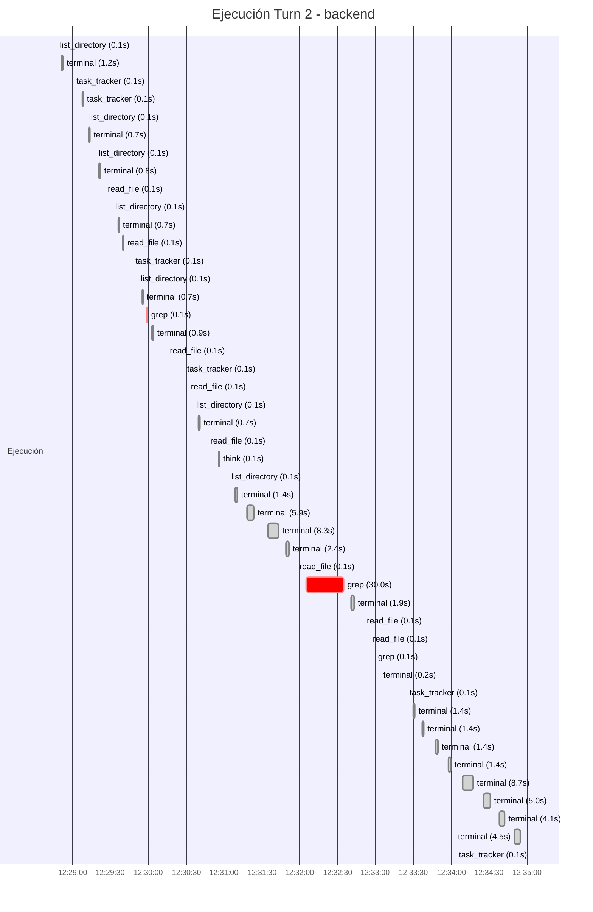

## Turn 2: ## Ponytail Rules (Reglas Comunes)


---

# Ponytail, lazy senior dev mode

You are a lazy senior de...

- **Circuito**: `backend`
- **Conversación OpenHands/OMP**: [`b361dc17-ca54-4b11-a28d-faa9c69814f3`](http://localhost:3012/conversations/b361dc17-ca54-4b11-a28d-faa9c69814f3)
- **Workspace**: `/contenedores/conti-backend`
- **Inicio**: 2026-07-06T12:28:17.572002
- **Fin**: 2026-07-06T12:36:23.337657
- **Duración**: 8m 6s
- **Eventos**: 143

## Prompt Completo

```text
## Ponytail Rules (Reglas Comunes)


---

# Ponytail, lazy senior dev mode

You are a lazy senior developer. Lazy means efficient, not careless. The best code is the code never written.

Before writing any code, stop at the first rung that holds:

1. Does this need to be built at all? (YAGNI)
2. Does it already exist in this codebase? Reuse the helper, util, or pattern that's already here, don't re-write it.
3. Does the standard library already do this? Use it.
4. Does a native platform feature 
```

## Timeline (Gantt)



## Tools Ejecutadas (46)

| # | Tool | Inicio | Duración | OK | Args/Result |
|---|------|--------|----------|-----|-------------|
| 1 | `list_directory` | 12:28:47 | 0.1s | ✅ | Listed directory: /contenedores/conti-backend (70 entries) |
| 2 | `terminal` | 12:28:51 | 1.2s | ✅ | ls -la /contenedores/conti-backend |
| 3 | `task_tracker` | 12:29:00 | 0.1s | ✅ | plan |
| 4 | `task_tracker` | 12:29:08 | 0.1s | ✅ | plan |
| 5 | `list_directory` | 12:29:10 | 0.1s | ✅ | Listed directory: /contenedores/conti-backend/app (19 entries) |
| 6 | `terminal` | 12:29:13 | 0.7s | ✅ | ls -la /contenedores/conti-backend/app |
| 7 | `list_directory` | 12:29:18 | 0.1s | ✅ | Listed directory: /contenedores/conti-backend/app/mcp (4 entries) |
| 8 | `terminal` | 12:29:21 | 0.8s | ✅ | ls -la /contenedores/conti-backend/app/mcp |
| 9 | `read_file` | 12:29:25 | 0.1s | ✅ | Read file: /contenedores/conti-backend/app/mcp/router.py       1  from __future__ import annotations      2        3  im |
| 10 | `list_directory` | 12:29:31 | 0.1s | ✅ | Listed directory: /contenedores/conti-backend/app/tools (18 entries) |
| 11 | `terminal` | 12:29:36 | 0.7s | ✅ | ls -la /contenedores/conti-backend/app/tools |
| 12 | `read_file` | 12:29:40 | 0.1s | ✅ | Read file: /contenedores/conti-backend/app/tools/container_tools.py       1  from __future__ import annotations      2   |
| 13 | `task_tracker` | 12:29:47 | 0.1s | ✅ | plan |
| 14 | `list_directory` | 12:29:51 | 0.1s | ✅ | Listed directory: /contenedores/conti-backend/app/services (22 entries) |
| 15 | `terminal` | 12:29:55 | 0.7s | ✅ | ls -la /contenedores/conti-backend/app/services |
| 16 | `grep` | 12:29:59 | 0.1s | ❌ | /contenedores/conti-backend/app/services/registry_service.py |
| 17 | `terminal` | 12:30:03 | 0.9s | ✅ | grep -n "container" /contenedores/conti-backend/app/services/registry_service.py |
| 18 | `read_file` | 12:30:14 | 0.1s | ✅ | Read file: /contenedores/conti-backend/app/services/registry_service.py (showing lines 731-830 of 1738) To read more, us |
| 19 | `task_tracker` | 12:30:28 | 0.1s | ✅ | plan |
| 20 | `read_file` | 12:30:31 | 0.1s | ✅ | Read file: /contenedores/conti-backend/config.json       1  {      2  "agents": {      3      "defaults": {      4       |
| 21 | `list_directory` | 12:30:35 | 0.1s | ✅ | Listed directory: /contenedores/conti-backend/app/config (4 entries) |
| 22 | `terminal` | 12:30:40 | 0.7s | ✅ | ls -la /contenedores/conti-backend/app/config |
| 23 | `read_file` | 12:30:46 | 0.1s | ✅ | Read file: /contenedores/conti-backend/app/config/models.py       1  from __future__ import annotations      2        3  |
| 24 | `think` | 12:30:56 | 0.1s | ✅ |  |
| 25 | `list_directory` | 12:31:03 | 0.1s | ✅ | Listed directory: /contenedores/conti-backend/docs (21 entries) |
| 26 | `terminal` | 12:31:09 | 1.4s | ✅ | ls -la /contenedores/conti-backend/docs && echo "---" && docker ps --format "table {{.Names}}\t{{.Status}}\t{{.Image}}"  |
| 27 | `terminal` | 12:31:18 | 5.9s | ✅ | python3 -c " import docker client = docker.DockerClient(base_url='unix:///var/run/docker.sock') containers = client.cont |
| 28 | `terminal` | 12:31:35 | 8.3s | ✅ | python3 -c " import docker client = docker.DockerClient(base_url='unix:///var/run/docker.sock') containers = client.cont |
| 29 | `terminal` | 12:31:49 | 2.4s | ✅ | python3 -c " import docker client = docker.DockerClient(base_url='unix:///var/run/docker.sock') containers = client.cont |
| 30 | `read_file` | 12:31:57 | 0.1s | ✅ | Read file: /contenedores/conti-backend/docker-compose.conti.yml (showing lines 1-100 of 276) To read more, use: read_fil |
| 31 | `grep` | 12:32:05 | 30.0s | ❌ | /contenedores/conti-backend |
| 32 | `terminal` | 12:32:41 | 1.9s | ✅ | python3 -c " import docker client = docker.DockerClient(base_url='unix:///var/run/docker.sock') containers = client.cont |
| 33 | `read_file` | 12:32:50 | 0.1s | ✅ | Read file: /contenedores/conti-backend/docker-compose.conti.yml     101        # Persistencia de conversaciones y sesion |
| 34 | `read_file` | 12:32:55 | 0.1s | ✅ | Read file: /contenedores/conti-backend/docs/mcp_tools_doc.MD (showing lines 2-101 of 1423) To read more, use: read_file( |
| 35 | `grep` | 12:32:59 | 0.1s | ❌ | /contenedores/conti-backend/docs/mcp_tools_doc.MD |
| 36 | `terminal` | 12:33:03 | 0.2s | ✅ | grep -n -A 30 "get_container\\|get_vps" /contenedores/conti-backend/docs/mcp_tools_doc.MD 2>&1 |
| 37 | `task_tracker` | 12:33:24 | 0.1s | ✅ | plan |
| 38 | `terminal` | 12:33:30 | 1.4s | ✅ | python3 -c " import docker client = docker.DockerClient(base_url='unix:///var/run/docker.sock')  # Test get_container_lo |
| 39 | `terminal` | 12:33:37 | 1.4s | ✅ | python3 -c " import docker client = docker.DockerClient(base_url='unix:///var/run/docker.sock')  # Test since with integ |
| 40 | `terminal` | 12:33:48 | 1.4s | ✅ | python3 -c " import docker client = docker.DockerClient(base_url='unix:///var/run/docker.sock') container_ref = client.c |
| 41 | `terminal` | 12:33:58 | 1.4s | ✅ | python3 -c " import docker client = docker.DockerClient(base_url='unix:///var/run/docker.sock') container_ref = client.c |
| 42 | `terminal` | 12:34:09 | 8.7s | ✅ | python3 -c " import docker client = docker.DockerClient(base_url='unix:///var/run/docker.sock')  # Find the container th |
| 43 | `terminal` | 12:34:26 | 5.0s | ✅ | python3 -c " import sys sys.path.insert(0, '/contenedores/conti-backend') from app.tools.container_tools import get_cont |
| 44 | `terminal` | 12:34:38 | 4.1s | ✅ | python3 -c " import sys sys.path.insert(0, '/contenedores/conti-backend') from app.tools.container_tools import get_cont |
| 45 | `terminal` | 12:34:50 | 4.5s | ✅ | python3 -c " import sys sys.path.insert(0, '/contenedores/conti-backend') from app.tools.container_tools import get_vps_ |
| 46 | `task_tracker` | 12:35:03 | 0.1s | ✅ | plan |

## Respuesta del Agente

---

# Informe: Endpoints MCP para Contenedores — Análisis vs Entorno Real

## 1. Tools Registrados (Categoría `stack`)

| Tool | Descripción | Endpoint | Tags |
|------|-------------|----------|------|
| `get_container_health` | Estado y salud de contenedores Docker | `/mcp/call` | docker, containers, read-only |
| `get_container_logs` | Logs de un contenedor con filtros (tiempo, nivel, líneas) | `/mcp/call` | docker, logs, read-only |
| `get_vps_status` | Vista consolidada Docker + Git | `/mcp/call` | docker, git, status, read-only |

**Documentación** (`docs/mcp_tools_doc.MD`): Los 3 tools están documentados y el schema de entrada coincide con la implementación.

---

## 2. 🔴 BUG CRÍTICO: Los 3 endpoints están 100% rotos en producción

**Causa raíz**: La función `_container_image()` en `container_tools.py:270-274` accede a `container.image.tags`, que lanza `ImageNotFound` si la imagen Docker fue eliminada del host.

**Contenedores con imagen faltante** (detonan el crash):

| Contenedor | Estado | Red | Imagen ID (faltante) |
|------------|--------|-----|---------------------|
| `chatui` | running | compose_odoo-network | `sha256:94ca66a...` |
| `odoo_dev` | exited | desarrollo_odoo-network-dev | `sha256:71d92f3...` |
| `django-dev` | exited | desarrollo_odoo-network-dev | `sha256:539768c...` |

**Impacto**: Al iterar `client.containers.list(all=True)` y tocar el primer contenedor con imagen faltante, **todos** los 3 tools crashean. Ni siquiera `get_container_logs` (que solo pide logs de un contenedor específico) funciona, porque `_build_environment_summary()` (llamado internamente para el campo `environment`) también itera todos los contenedores.

**Verificado con test real**:
```python
# get_container_health → ImageNotFound
# get_container_logs("conti-backend") → ImageNotFound
# get_vps_status → ImageNotFound
```

---

## 3. Discrepancia: EXPECTED vs Entorno Real

### Producción (`compose_odoo-network`)

| Contenedor | En código EXPECTED | Estado real |
|------------|-------------------|-------------|
| `django-api` | ✅ Sí | running |
| `odoo18` | ✅ Sí | running |
| `n8n` | ✅ Sí | running |
| `portainer` | ✅ Sí | running |
| `cloudflared-tunnel` | ✅ Sí | running |
| `compose-db-1` | ✅ Sí | running |
| `redis_odoo` | ✅ Sí | running |
| `evolution-api-server` | ✅ Sí | **❌ NO EXISTE** |
| `wppconnect-server` | ✅ Sí | **exited** |
| `ollama` | ✅ Sí | **❌ NO EXISTE** |
| `chatwoot_web` | ✅ Sí | **exited** |
| `chatwoot_worker` | ✅ Sí | **exited** |
| `conti-backend` | ❌ No listado | running |
| `conti-omp` | ❌ No listado | running |
| `conti-sourcebot` | ❌ No listado | running |
| `chatui` | ❌ No listado | running (imagen faltante) |
| `flamehaven` | ❌ No listado | running |

### Desarrollo (`desarrollo_odoo-network-dev`)

| Contenedor | En código EXPECTED | Estado real |
|------------|-------------------|-------------|
| `db_dev` | ✅ Sí | running |
| `conti-backend` | ✅ Sí | running |
| `django-dev` | ✅ Sí | **exited** (imagen faltante) |
| `odoo_dev` | ✅ Sí | **exited** (imagen faltante) |
| `n8n_dev` | ✅ Sí | **exited** |
| `cloudflare-tunnel-dev` | ✅ Sí | **exited** |
| `chatwoot_web_dev` | ✅ Sí | **exited** |
| `chatwoot_worker_dev` | ✅ Sí | **exited** |
| `redis_odoo_dev` | ✅ Sí | **exited** |
| `flamehaven` | ❌ No listado | running |
| `conti-sourcebot` | ❌ No listado | running |
| `monitor_netdata` | — | created (host net) |

---

## 4. Otros bugs menores

| Bug | Línea | Descripción |
|-----|-------|-------------|
| **Código muerto** | `container_tools.py:305` | `return None` duplicado después de `return int(...)` en `_since_to_datetime` |
| **Doc vs código** | Registro vs docs | `get_container_logs` doc dice tags `["docker", "containers", "logs", "read-only"]` pero en registro real es `["docker", "logs", "read-only"]` (sin `containers`) |

---

## 5. Resumen de severidad

| Hallazgo | Severidad | Estado |
|----------|-----------|--------|
| `_container_image()` crashea con imagen faltante → 3 tools 100% rotos | 🔴 CRÍTICO | Rompe `get_container_health`, `get_container_logs`, `get_vps_status` |
| EXPECTED desactualizado (faltan 5 contenedores reales, hay 2+2 que no existen) | 🟡 MEDIO | Muestra "missing" en `_build_environment_summary` para contenedores que ya no son parte del stack |
| Código muerto en `_since_to_datetime` | 🟢 BAJO | `return None` inalcanzable |

---

## 6. Fix recomendado (mínimo cambio necesario)

El fix para el bug crítico es una línea en `_container_image()`: envolver el acceso a `container.image` en un try/except, leyendo la imagen directamente de `attrs` si falla:

```python
# container_tools.py ~línea 270
def _container_image(container) -> str:
    try:
        tags = getattr(container.image, "tags", None) or []
        if tags:
            return tags[0]
        return getattr(container.image, "short_id", "")
    except Exception:
        return container.attrs.get("Config", {}).get("Image", "") or ""
```

Esto es resiliente a imágenes eliminadas y usa el `Image` del config como fallback (que siempre está en los attrs del contenedor).

¿Querés que aplique el fix?

## Errores

| # | Tool | Error |
|---|------|-------|
| 1 | `agent_error` | Error validating tool 'think': 1 validation error for ThinkAction dir_path   Extra inputs are not permitted [type=extra_forbidden, input_value='/conte |
| 2 | `grep` | Search path '/contenedores/conti-backend/app/services/registry_service.py' is not a valid directory |
| 3 | `grep` | Command '['grep', '-R', '-I', '-l', '-i', 'container_name', '/contenedores/conti-backend']' timed out after 30 seconds |
| 4 | `grep` | Search path '/contenedores/conti-backend/docs/mcp_tools_doc.MD' is not a valid directory |

## Tokens por Llamada LLM

| # | Input | Cache Read | Total Input | Cache % | Completion | Reasoning | Delta |
|---|-------|------------|-------------|---------|------------|-----------|-------|
| 1 | 504 | 0 | 504 | 0.0% | 1,030 | 1,020 | 1,534 |
| 2 | 13,978 | 1,024 | 13,978 | 7.3% | 1,119 | 1,068 | 13,563 |
| 3 | 27,568 | 14,464 | 27,568 | 52.5% | 1,187 | 1,079 | 13,658 |
| 4 | 43,822 | 28,032 | 43,822 | 64.0% | 1,442 | 1,118 | 16,509 |
| 5 | 60,353 | 44,224 | 60,353 | 73.3% | 1,674 | 1,141 | 16,763 |
| 6 | 77,138 | 60,736 | 77,138 | 78.7% | 1,730 | 1,156 | 16,841 |
| 7 | 94,007 | 77,504 | 94,007 | 82.4% | 1,800 | 1,170 | 16,939 |
| 8 | 111,653 | 94,336 | 111,653 | 84.5% | 1,879 | 1,206 | 17,725 |
| 9 | 129,407 | 111,936 | 129,407 | 86.5% | 1,950 | 1,218 | 17,825 |
| 10 | 147,479 | 129,664 | 147,479 | 87.9% | 2,040 | 1,263 | 18,162 |
| 11 | 169,648 | 147,712 | 169,648 | 87.1% | 2,127 | 1,309 | 22,256 |
| 12 | 191,933 | 169,856 | 191,933 | 88.5% | 2,198 | 1,323 | 22,356 |
| 13 | 215,007 | 192,128 | 215,007 | 89.4% | 2,276 | 1,356 | 23,152 |
| 14 | 242,397 | 215,168 | 242,397 | 88.8% | 2,531 | 1,402 | 27,645 |
| 15 | 270,064 | 242,496 | 270,064 | 89.8% | 2,610 | 1,440 | 27,746 |
| 16 | 297,839 | 270,144 | 297,839 | 90.7% | 2,678 | 1,451 | 27,843 |
| 17 | 326,552 | 297,856 | 326,552 | 91.2% | 2,764 | 1,482 | 28,799 |
| 18 | 355,392 | 326,528 | 355,392 | 91.9% | 2,842 | 1,493 | 28,918 |
| 19 | 384,503 | 355,328 | 384,503 | 92.4% | 2,952 | 1,533 | 29,221 |
| 20 | 415,071 | 384,384 | 415,071 | 92.6% | 3,224 | 1,596 | 30,840 |
| 21 | 445,933 | 414,912 | 445,933 | 93.0% | 3,299 | 1,629 | 30,937 |
| 22 | 477,852 | 445,760 | 477,852 | 93.3% | 3,386 | 1,675 | 32,006 |
| 23 | 509,886 | 477,632 | 509,886 | 93.7% | 3,454 | 1,686 | 32,102 |
| 24 | 542,231 | 509,632 | 542,231 | 94.0% | 3,515 | 1,704 | 32,406 |
| 25 | 577,023 | 541,952 | 577,023 | 93.9% | 3,822 | 1,770 | 35,099 |
| 26 | 612,211 | 576,704 | 612,211 | 94.2% | 3,869 | 1,777 | 35,235 |
| 27 | 647,474 | 611,840 | 647,474 | 94.5% | 3,971 | 1,803 | 35,365 |
| 28 | 683,784 | 647,040 | 683,784 | 94.6% | 4,115 | 1,832 | 36,454 |
| 29 | 721,050 | 683,328 | 721,050 | 94.8% | 4,365 | 1,881 | 37,516 |
| 30 | 759,431 | 720,576 | 759,431 | 94.9% | 4,558 | 1,907 | 38,574 |
| 31 | 798,609 | 758,912 | 798,609 | 95.0% | 4,676 | 1,947 | 39,296 |
| 32 | 840,436 | 798,080 | 840,436 | 95.0% | 4,757 | 1,967 | 41,908 |
| 33 | 882,400 | 839,872 | 882,400 | 95.2% | 4,930 | 1,975 | 42,137 |
| 34 | 924,860 | 881,792 | 924,860 | 95.3% | 5,067 | 2,016 | 42,597 |
| 35 | 970,607 | 924,224 | 970,607 | 95.2% | 5,184 | 2,036 | 45,864 |
| 36 | 1,017,883 | 969,920 | 1,017,883 | 95.3% | 5,255 | 2,046 | 47,347 |
| 37 | 1,065,272 | 1,017,152 | 1,065,272 | 95.5% | 5,333 | 2,053 | 47,467 |
| 38 | 1,113,622 | 1,064,512 | 1,113,622 | 95.6% | 6,199 | 2,710 | 49,216 |
| 39 | 1,162,861 | 1,112,832 | 1,162,861 | 95.7% | 6,359 | 2,730 | 49,399 |
| 40 | 1,212,640 | 1,162,048 | 1,212,640 | 95.8% | 6,577 | 2,758 | 49,997 |
| 41 | 1,262,866 | 1,211,776 | 1,262,866 | 96.0% | 6,951 | 2,812 | 50,600 |
| 42 | 1,314,015 | 1,261,952 | 1,314,015 | 96.0% | 7,221 | 2,881 | 51,419 |
| 43 | 1,365,706 | 1,313,088 | 1,365,706 | 96.1% | 7,502 | 3,006 | 51,972 |
| 44 | 1,418,536 | 1,364,736 | 1,418,536 | 96.2% | 7,755 | 3,073 | 53,083 |
| 45 | 1,472,651 | 1,417,536 | 1,472,651 | 96.3% | 8,005 | 3,143 | 54,365 |
| 46 | 1,528,038 | 1,471,616 | 1,528,038 | 96.3% | 8,138 | 3,170 | 55,520 |
| 47 | 1,584,575 | 1,526,976 | 1,584,575 | 96.4% | 8,393 | 3,218 | 56,792 |
| 48 | 1,641,389 | 1,583,488 | 1,641,389 | 96.5% | 9,979 | 3,231 | 58,400 |
| 49 | 1,687,390 | 1,583,680 | 1,687,390 | 93.9% | 11,505 | 4,732 | 47,527 |

## Reasoning del Agente

### 12:28:47 → `list_directory`

> Voy a analizar los endpoints del servidor MCP relacionados con contenedores. Primero necesito entender la estructura del proyecto. Empezaré explorando el directorio raíz y luego buscaré archivos relevantes.

### 12:28:51 → `terminal`

> Voy a ver el contenido completo del directorio.

### 12:29:00 → `task_tracker`

> Ahora necesito explorar la estructura del proyecto para encontrar los endpoints MCP. Probablemente estén en el directorio `app`. Voy a explorar la estructura del proyecto.

### 12:29:08 → `task_tracker`

> Voy a explorar la estructura del proyecto. Primero, veré el directorio `app/`.

### 12:29:10 → `list_directory`

> Voy a explorar la estructura del directorio `app/`.

### 12:29:13 → `terminal`

> Voy a listar el contenido del directorio app con más detalle.

### 12:29:18 → `list_directory`

> Necesito buscar endpoints MCP relacionados con contenedores. Probablemente estén en el directorio `mcp/`. Voy a explorar ese directorio.

### 12:29:21 → `terminal`

> Voy a ver el contenido del directorio mcp.

### 12:29:25 → `read_file`

> Voy a examinar el archivo router.py para ver los endpoints MCP disponibles. También necesito buscar en otros directorios como `tools/` y `integrations/`. Primero, veré el archivo router.py.

### 12:29:31 → `list_directory`

> Ahora necesito buscar los endpoints específicos relacionados con contenedores. Probablemente estén en el directorio `tools/` o `integrations/`. Voy a explorar el directorio `tools/`.

### 12:29:36 → `terminal`

> Voy a listar el contenido del directorio tools con más detalle.

### 12:29:40 → `read_file`

> ¡Perfecto! Encontré el archivo `container_tools.py`. Ese probablemente contiene los endpoints relacionados con contenedores. Voy a leerlo.

### 12:29:47 → `task_tracker`

> Excelente. Ahora tengo el archivo `container_tools.py` que contiene las herramientas MCP para contenedores. Voy a actualizar mi progreso y luego buscar dónde se registran estas herramientas en el registro MCP.

### 12:29:51 → `list_directory`

> Ahora necesito encontrar dónde se registran estas herramientas. Probablemente hay un archivo de registro de herramientas. Voy a buscar en el directorio `app/services/`.

### 12:29:55 → `terminal`

> Voy a listar el contenido del directorio services.

### 12:29:59 → `grep`

> El archivo `registry_service.py` probablemente contiene el registro de herramientas. Voy a buscar específicamente las herramientas de contenedor en ese archivo.

### 12:30:03 → `terminal`

> Necesito usar el comando grep en terminal.

### 12:30:14 → `read_file`

> Perfecto. Ahora necesito ver la sección de registro de herramientas para entender cómo se registran. Voy a leer el archivo registry_service.py alrededor de esas líneas.

### 12:30:28 → `task_tracker`

> Ahora necesito ver qué herramientas están realmente disponibles en el entorno actual. Probablemente puedo obtener la lista de herramientas del servidor MCP. También necesito verificar si hay alguna diferencia entre la implementación y el entorno real. Primero, voy a ver si puedo acceder al servidor MCP.

### 12:30:31 → `read_file`

> Ahora necesito verificar el entorno real. Voy a revisar la configuración del servidor MCP. Primero, veamos el archivo de configuración principal.

### 12:30:35 → `list_directory`

> Este parece ser el archivo de configuración de Nanobot, no del backend. Necesito buscar el archivo de configuración del backend. Probablemente está en `app/config/`. Voy a explorar ese directorio.

### 12:30:40 → `terminal`

> Voy a listar el contenido del directorio config.

### 12:30:46 → `read_file`

> Voy a leer el archivo `models.py` para ver la configuración del backend.

### 12:30:56 → `think`

> Ahora necesito verificar el entorno real. Primero, voy a ver si puedo ejecutar los endpoints MCP para probarlos. Necesito saber si el servidor está corriendo. También necesito revisar la documentación para ver qué endpoints están documentados. Voy a buscar en los archivos de documentación.

### 12:31:03 → `list_directory`

> Let me fix the tool call.

### 12:31:09 → `terminal`

> Let me list docs directory and check the docker-compose file, and also try to call the MCP tools to see the real environment.

### 12:31:18 → `terminal`

> The Docker client version is too old. Let me check if there's a newer docker client available, or use the docker SDK directly via Python.

### 12:31:35 → `terminal`

> I can see some containers running but there's an error with a missing image. Let me get more details. Also, I noticed the `conti-backend` itself is running in a container. Let me check the full list and the environment summary.

### 12:31:49 → `terminal`

> There's a container with a missing image that's causing errors. Let me handle that gracefully and also get the health check info.

### 12:31:57 → `read_file`

> Now I can see the actual state of containers. Let me also get the health check info and logs for a few containers. Let me also look at the docker-compose file to see what's expected.

### 12:32:05 → `grep`

> Now let me check the docker-compose for production and development to see the full expected list of containers.

### 12:32:41 → `terminal`

> Let me check the production compose file.

### 12:32:50 → `read_file`

> Now I have a comprehensive picture. Let me also check what the EXPECTED containers list says vs what actually exists. Let me also look at the `get_container_logs` function to check for any issues.

### 12:32:55 → `read_file`

> Now let me also check the production and development docker-compose files to understand the full expected container list.

### 12:32:59 → `grep`

> Let me search for the container-related tools documentation.

### 12:33:03 → `terminal`

> Let me use terminal grep instead.

### 12:33:24 → `task_tracker`

> Now I have all the information I need to create the report. Let me compile the analysis.

Here's what I found:

**Three MCP tools for containers:**
1. `get_container_health` - Returns container status and health
2. `get_container_logs` - Gets container logs with filtering
3. `get_vps_status` - Consolidated view of Docker + Git status

**Issues/Discrepancies found:**

1. **EXPECTED list in code is outdated:**
   - Production expected: `django-api`, `odoo18`, `evolution-api-server`, `wppconnect-se

### 12:33:30 → `terminal`

> Let me also verify the `get_container_logs` by actually calling it to see how it behaves.

### 12:33:37 → `terminal`

> Now I have all the information I need. Let me also verify a potential issue with the `since` parameter being an integer vs datetime:

### 12:33:48 → `terminal`

> Interesting - the integer `since` parameter returned 0 lines, while the `None` parameter returned lines. This suggests the `since` parameter with integer timestamps might not be working correctly with this Docker API version. Let me test with a string format that Docker expects.

### 12:33:58 → `terminal`

> The Docker SDK requires `since` to be either a datetime or a positive int/float (Unix timestamp). The implementation uses int, which should work. But the `since` parameter returning 0 lines might mean the container was just started less than 1 hour ago (or the logs are very recent).

Let me check the start time:

### 12:34:09 → `terminal`

> OK, so the `since` parameter works with integer timestamps, but the container was started at `2026-07-06T03:20:59.957795533Z`, which is only about 11 hours ago. So `since=1h` would work (returns logs from the last hour), and `since=48h` returns logs from the last 48 hours. This is correct.

Now let me also check if there's a bug with the `_container_image` function that crashes when an image is missing:

### 12:34:26 → `terminal`

> Now I have a comprehensive picture. The `_container_image` function will crash when it tries to access `c.image.tags` for containers with missing images (chatui, odoo_dev, django-dev). This means `get_container_health` will crash when listing all containers.

Let me verify this by actually running the tool's code:

### 12:34:38 → `terminal`

> This confirms the bug. The `_container_image()` function crashes when a container has a missing image. This means `get_container_health` is currently **broken** in the real environment because there are 3 containers (chatui, odoo_dev, django-dev) whose images are no longer available.

Now let me also test `get_container_logs`:

### 12:34:50 → `terminal`

> Now I have confirmed that ALL THREE container tools are currently broken due to missing images. Let me also test `get_vps_status`:

### 12:35:03 → `task_tracker`

> Now I have a complete picture. All three container MCP tools are **completely broken** due to a bug in `_container_image()` that crashes when a container's image has been removed from Docker.

Let me compile the full report now.
