## Turn 1: PRIMERO Respuesta del agente -  NO DEBE SER truncada . VA COMPLETA ( OBVIO SIN TOOL CALLS NII RASONI...[truncated]

- **Circuito**: `backend`
- **Conversación OpenHands**: [`52135448-3eec-44bc-bc79-365cdf20a5e4`](http://localhost:3012/conversations/52135448-3eec-44bc-bc79-365cdf20a5e4)
- **Workspace**: `/contenedores/conti-backend`
- **Inicio**: 2026-07-08T23:55:42.779088-03:00
- **Fin**: 2026-07-08T23:55:43.160425-03:00
- **Duración**: 0.381s
- **Eventos**: 10

## Timeline (Gantt)

```mermaid
gantt
    title Ejecución - backend
    dateFormat  HH:mm:ss
    axisFormat  %H:%M:%S

    section Setup
    start           :23:55:42, 1s

    section Ejecución

    section Dead Time
```



## Tools Ejecutadas

| # | Tool | Inicio | Duración | OK | Args/Result |
|---|------|--------|----------|-----|-------------|

## Reasoning del Agente

## Prompt Inyectado (governance + reglas + user)

```text
PRIMERO Respuesta del agente -  NO DEBE SER truncada . VA COMPLETA ( OBVIO SIN TOOL CALLS NII RASONING PERO LA RESPUESTA VA COMPELTA . SEGUNDO EL PROCESO DEBE PODER SER LLAMADO COMO UNA TOOL DEL MCP DEL BACKEND PARA QUE SI LE PIDO POR CHAT AL AGENTE PUEDA EJECUTARLA. TERCERO EL PLAN TIENE QUE TENER DOS ETAPAS UNA DESARROLLAR EL GENERADO DE RESUMENES , GENERAS UN RESUME.PARA LOS CIRCUITOS 12 Y 3 Y ME LO INFORMAS PARA MI APROBACION UNA VEZ APROBADO CONTINUA CON EL RESTO DEL PLAN, SIN INCLUIR EJECUCIONES NI BORRADO DE DATOS CUANDO ESTE LISTO ME AVISAS PARA QUE YO LO PRUEBE
<environment_details>
Current time: 2026-07-08T23:55:42-03:00
Open tabs:
  q-dev-chat-2026-05-12.md
  app/chat/router.py
  app/web/router.py
  PLAN_2_LLM.md
  ponytail.md
  app/services/registry_service.py
  llm_apis.md
</environment_details>
```
