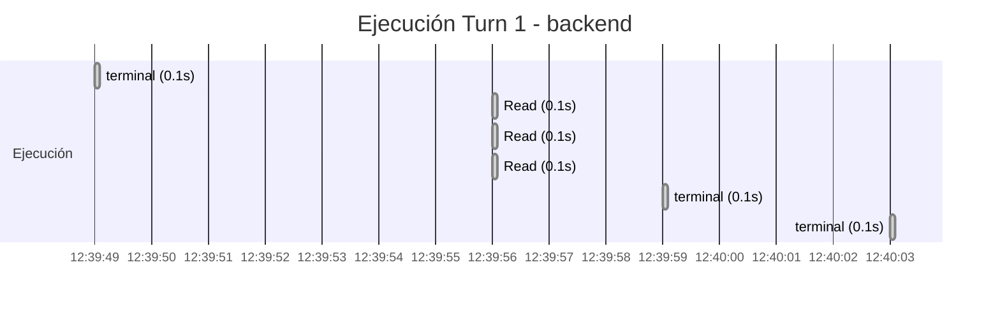

## Turn 1: Leé /contenedores/conti-backend/app/openhands_agent/session_store.py y decime: 1. Dónde guarda sessi...

- **Circuito**: `backend`
- **Conversación OpenHands/OMP**: [`ab4b0fcf-4887-41bc-aca4-9e5eb3eeedaf`](http://localhost:3012/conversations/ab4b0fcf-4887-41bc-aca4-9e5eb3eeedaf)
- **Workspace**: `/contenedores/conti-backend`
- **Inicio**: 2026-07-09T12:39:49.397787
- **Fin**: 2026-07-09T12:40:20.789209
- **Duración**: 31.4s
- **Eventos**: 15

## Prompt Inyectado (Layer 0 governance + user prompt)

### Governance Layer 0

```text
# Layer 0 — Governance Backend (~150 líneas)
# Inyectado SIEMPRE en el primer prompt. On-demand via MCP: get_onboarding(circuit="backend"), get_rules(circuit="backend")

# Ponytail, lazy senior dev mode

You are a lazy senior developer. Lazy means efficient, not careless. The best code is the code never written.

Before writing any code, stop at the first rung that holds:

1. Does this need to be built at all? (YAGNI)
2. Does it already exist in this codebase? Reuse.
3. Does the standard library already do this? Use it.
4. Can this be one line? Make it one line.
5. Only then: write the minimum code that works.

# Rules

- No abstractions that weren't explicitly requested.
- No new dependency if it can be avoided.
- Deletion over addition. Boring over clever. Fewest files possible.
- Bug fix = root cause, not symptom.
- Mark intentional simplifications with `ponytail:` comment.

# No seas lazy sobre

- Entender el problema primero (read fully, trace flow, then pick a rung)
- Input validation en trust boundaries
- Error handling que previene pérdida de datos
- Security, accessibility

# Delivery

- Nunca yield sin que el deliverable esté completo
- Nunca fabricar outputs
- Verification antes de ceder

# Runtime — Circuito: backend

- **Workspace**: `/contenedores/conti-backend`
- **Branch**: `main`
- **Repo**: orquestador-contamela
- **Idioma**: Español siempre
- **Tools nativas**: read, write, edit, grep, glob, ast_grep, lsp, bash, eval, task, job, irc

# Git flow (backend)

- `run_salvar(summary="...")` → commit + push directo a `main`
- `run_promover` NO aplica (no hay develop)
- `run_hotfix_sync` NO aplica
- **Nunca** `git commit` / `git push` directo
- **Code editing OBLIGATORIO pre-commit**:
  1. `validate_python_syntax(paths=[...])` → debe pasar
  2. `run_pytest(circuit="backend")` → debe pasar
  3. Si cualquiera falla → NO commitear, arreglar primero

# MCP Backend

- **Server**: `http://conti-backend:9001`
- **Endpoint**: `POST /mcp/call {"tool": "<name>", "arguments": {...}}`
- **84 tools** en 12 categorías (filesystem, bootstrap, odoo, gitops, stack, documents, rag, catolico, sheets, code_edit, codebase_memory, observability)
- **codebase-memory-mcp**: 14 tools para knowledge graph
  - `search_graph(name_pattern=".*router.*", project="contenedores-conti-backend")`
  - `get_architecture(project="contenedores-conti-backend")`
  - `trace_path(function_name="run_task", direction="both")`
  - `get_code_snippet(qualified_name="...")`
- Para más detalle: `get_onboarding(circuit="backend")`

# Skills

8 skills cargadas automáticamente por omp

# Para más contexto (on-demand)

Cuando necesites reglas completas: `get_rules(circuit="backend")` via MCP
Cuando necesites onboarding completo: `get_onboarding(circuit="backend")` via MCP
Cuando necesites el layout del repo: `get_architecture(project="contenedores-conti-backend")` via MCP

```

### User Task

```text
Leé /contenedores/conti-backend/app/openhands_agent/session_store.py y decime: 1. Dónde guarda sessions.json 2. Cuántas sesiones hay 3. Si el TraceUpdater puede procesarlas
```

## Timeline (Gantt)



## Tools Ejecutadas (6)

| # | Tool | Inicio | Duración | OK | Args/Result |
|---|------|--------|----------|-----|-------------|
| 1 | `terminal` | 12:39:49 | 0.1s | ✅ | find /contenedores/conti-backend -path "*/workspace/sessions/sessions.json" 2>/dev/null; find /contenedores/conti-backen |
| 2 | `Read` | 12:39:56 | 0.1s | ✅ | [trace_updater.py#10E2] 117:def _auto_generate_trace_path( … 123:    """Auto-genera trace_path para sesiones que no lo t |
| 3 | `Read` | 12:39:56 | 0.1s | ✅ | [trace_updater.py#10E2] 1:# app/openhands_agent/trace_updater.py 2:""" 3:TraceUpdater — Background thread que detecta nu |
| 4 | `Read` | 12:39:56 | 0.1s | ✅ | [trace_updater.py#10E2] 325:class TraceUpdater: 326:    """Background thread que vigila sesiones activas y actualiza tra |
| 5 | `terminal` | 12:39:59 | 0.1s | ✅ | ls -la /contenedores/conti-backend/app/workspace/ 2>/dev/null \|\| echo "app/workspace/ no existe" |
| 6 | `terminal` | 12:40:03 | 0.1s | ✅ | ls -la /contenedores/conti-backend/app/workspace/sessions/ && cat /contenedores/conti-backend/app/workspace/sessions/ses |

## Respuesta del Agente

Resumen:

## 1. ¿Dónde guarda sessions.json?

**Path por defecto**: `/app/workspace/sessions/sessions.json` ( línea 8 y 24 )

Configurable via env vars:
- `CONTI_SESSIONS_DIR` → directorio base (default: `/app/workspace/sessions`)
- `CONTI_SESSIONS_FILE` → path completo del archivo (default: `sessions.json` dentro del directorio)

**En disco real** (dentro del repo): `/contenedores/conti-backend/app/workspace/sessions/` existe como directorio vacío — `sessions.json` **no existe todavía**. Se crea on-demand al primer `SessionStore.create()` (el método `_save()` hace `mkdir(parents=True)` en línea 77).

Formato del JSON en disco:
```json
{
  "version": 1,
  "sessions": {
    "<session_id>": {
      "conversation_id": "...",
      "circuit_id": "...",
      "created_at": 1234567890.0,
      "last_active": 1234567890.0,
      "last_event_num": -1,
      "turn_count": 0,
      "trace_path": ""
    }
  }
}
```

## 2. ¿Cuántas sesiones hay?

**Cero.** El directorio `sessions/` está vacío — no hay `sessions.json` y `conversations/` también está vacío. El store arranca con `self._sessions = {}` (línea 73).

## 3. ¿Puede el TraceUpdater procesarlas?

**Sí, está diseñado para eso**, pero no tiene nada que procesar ahora:

| Aspecto | Estado |
|---|---|
| **Dependencia** | `_tick()` importa `SessionStore` y accede a `store._sessions` directamente (línea 382-384) — funciona |
| **Iteración** | Recorre todas las sesiones, filtra las que tienen `conversation_id`, llama `_update_trace_for_session()` por cada una (línea 387-408) |
| **Guardado** | Actualiza `last_event_num`, `turn_count`, `trace_path` en la sesión y persiste con `store._save()` (línea 394-406) |
| **Concurrencia** | Usa `store._file_lock` para leer y escribir — thread-safe con SessionStore |
| **Condiciones de guard** | Necesita: `conversation_id` no vacío, `trace_path` auto-generable o existente, y eventos nuevos en disco (`current_count > last_event_num + 1`) |
| **Reinicio** | Se detiene tras 5 errores consecutivos (línea 371-376) |

**Resumen**: TraceUpdater está cableado a SessionStore y puede procesar las sesiones, pero ahora mismo no hay sesiones ni eventos en disco. Funcionará cuando se creen sesiones reales vía `SessionStore.create()` y se generen eventos en `conversations/`.

## Tokens por Llamada LLM

| # | Input | Cache Read | Total Input | Cache % | Completion | Reasoning | Delta |
|---|-------|------------|-------------|---------|------------|-----------|-------|
| 1 | 17,204 | 235,648 | 252,852 | 93.2% | 1,993 | 0 | 19,197 |
