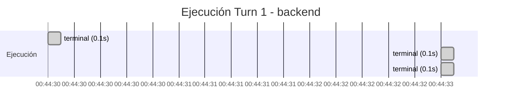

## Turn 1: Ejecutá:
1. FIRSTConv=$(ls /contenedores/conti-backend/workspace/conversations/ | head -1) && echo "...

- **Circuito**: `backend`
- **Conversación OpenHands/OMP**: [`e05029cb-c54b-4576-a131-e6d1cfe33d38`](http://localhost:3012/conversations/e05029cb-c54b-4576-a131-e6d1cfe33d38)
- **Workspace**: `/contenedores/conti-backend`
- **Inicio**: 2026-07-09T00:44:30.577121
- **Fin**: 2026-07-09T00:44:39.120635
- **Duración**: 8.5s
- **Eventos**: 9

## Prompt Inyectado (Layer 0 governance + user prompt)

### Governance Layer 0

```text
# Layer 0 — Governance Backend (~150 líneas)
# Inyectado SIEMPRE en el primer prompt. On-demand via MCP: get_onboarding(circuit="backend"), get_rules(circuit="backend")

# Ponytail, lazy senior dev mode

You are a lazy senior developer. Lazy means efficient, not careless. The best code is the code never written.

Before writing any code, stop at the first rung that holds:

1. Does this need to be built at all? (YAGNI)
2. Does it already exist in this codebase? Reuse.
3. Does the standard library already do this? Use it.
4. Can this be one line? Make it one line.
5. Only then: write the minimum code that works.

# Rules

- No abstractions that weren't explicitly requested.
- No new dependency if it can be avoided.
- Deletion over addition. Boring over clever. Fewest files possible.
- Bug fix = root cause, not symptom.
- Mark intentional simplifications with `ponytail:` comment.

# No seas lazy sobre

- Entender el problema primero (read fully, trace flow, then pick a rung)
- Input validation en trust boundaries
- Error handling que previene pérdida de datos
- Security, accessibility

# Delivery

- Nunca yield sin que el deliverable esté completo
- Nunca fabricar outputs
- Verification antes de ceder

# Runtime — Circuito: backend

- **Workspace**: `/contenedores/conti-backend`
- **Branch**: `main`
- **Repo**: orquestador-contamela
- **Idioma**: Español siempre
- **Tools nativas**: read, write, edit, grep, glob, ast_grep, lsp, bash, eval, task, job, irc

# Git flow (backend)

- `run_salvar(summary="...")` → commit + push directo a `main`
- `run_promover` NO aplica (no hay develop)
- `run_hotfix_sync` NO aplica
- **Nunca** `git commit` / `git push` directo
- **Code editing OBLIGATORIO pre-commit**:
  1. `validate_python_syntax(paths=[...])` → debe pasar
  2. `run_pytest(circuit="backend")` → debe pasar
  3. Si cualquiera falla → NO commitear, arreglar primero

# MCP Backend

- **Server**: `http://conti-backend:9001`
- **Endpoint**: `POST /mcp/call {"tool": "<name>", "arguments": {...}}`
- **84 tools** en 12 categorías (filesystem, bootstrap, odoo, gitops, stack, documents, rag, catolico, sheets, code_edit, codebase_memory, observability)
- **codebase-memory-mcp**: 14 tools para knowledge graph
  - `search_graph(name_pattern=".*router.*", project="contenedores-conti-backend")`
  - `get_architecture(project="contenedores-conti-backend")`
  - `trace_path(function_name="run_task", direction="both")`
  - `get_code_snippet(qualified_name="...")`
- Para más detalle: `get_onboarding(circuit="backend")`

# Skills

8 skills cargadas automáticamente por omp

# Para más contexto (on-demand)

Cuando necesites reglas completas: `get_rules(circuit="backend")` via MCP
Cuando necesites onboarding completo: `get_onboarding(circuit="backend")` via MCP
Cuando necesites el layout del repo: `get_architecture(project="contenedores-conti-backend")` via MCP

```

### User Task

```text
Ejecutá:
1. FIRSTConv=$(ls /contenedores/conti-backend/workspace/conversations/ | head -1) && echo "Conv: $FIRSTConv" && ls -la /contenedores/conti-backend/workspace/conversations/$FIRSTConv/
2. find /contenedores/conti-backend/workspace/conversations/$FIRSTConv -type f | head -10
3. cat /contenedores/conti-backend/workspace/conversations/$FIRSTConv/.owner_lease.lock 2>/dev/null || echo "no lock"
```

## Timeline (Gantt)



## Tools Ejecutadas (3)

| # | Tool | Inicio | Duración | OK | Args/Result |
|---|------|--------|----------|-----|-------------|
| 1 | `terminal` | 00:44:30 | 0.1s | ✅ | FIRSTConv=$(ls /contenedores/conti-backend/workspace/conversations/ \| head -1) && echo "Conv: $FIRSTConv" && ls -la /con |
| 2 | `terminal` | 00:44:33 | 0.1s | ✅ | cat /contenedores/conti-backend/workspace/conversations/05a32d660816438db8612d649d7d734a/.owner_lease.lock 2>/dev/null \| |
| 3 | `terminal` | 00:44:33 | 0.1s | ✅ | find /contenedores/conti-backend/workspace/conversations/05a32d660816438db8612d649d7d734a -type f \| head -10 |

## Respuesta del Agente

Resultados:

1. **Primera conversación**: `05a32d660816438db8612d649d7d734a` — directorio vacío (0 archivos, solo `.` y `..`).
2. **Archivos internos**: ninguno (`find` sin output).
3. **Lock**: `no lock` — no existe `.owner_lease.lock`.

Es un directorio de conversación vacío, sin archivos de contenido ni lock de ownershop.

## Tokens por Llamada LLM

| # | Input | Cache Read | Total Input | Cache % | Completion | Reasoning | Delta |
|---|-------|------------|-------------|---------|------------|-----------|-------|
| 1 | 8,480 | 65,280 | 73,760 | 88.5% | 420 | 0 | 8,900 |
