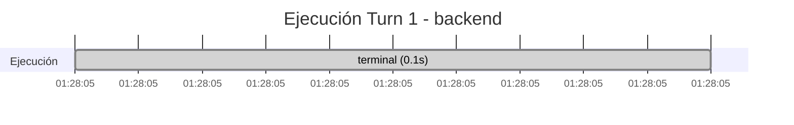
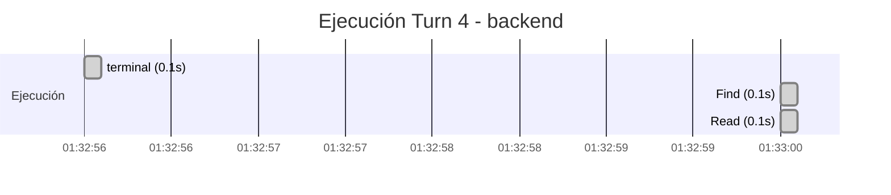
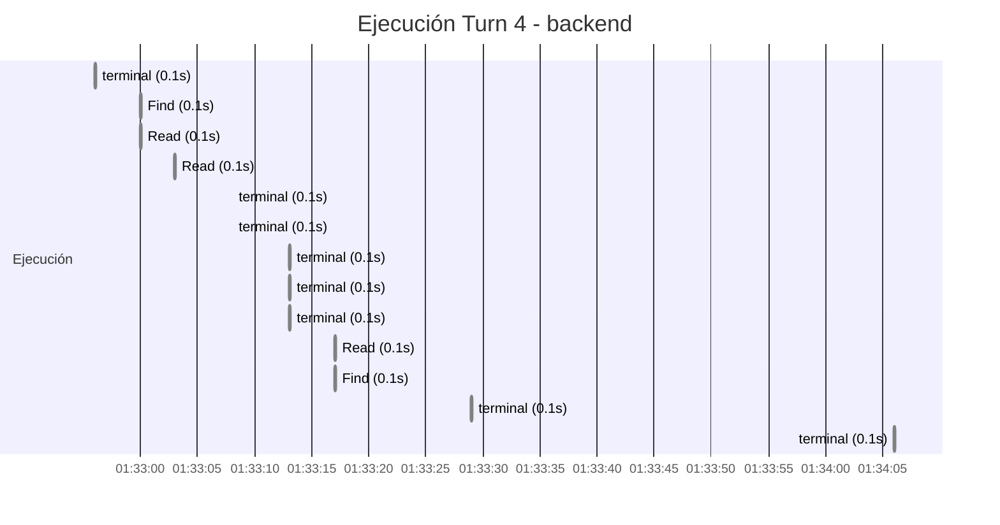
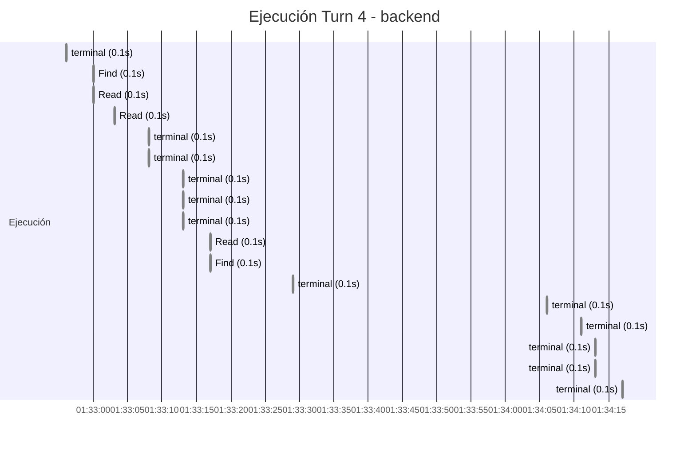

## Turn 1: Ejecutá: python3 /contenedores/conti-backend/trace_regen.py --dry-run 2>&1

- **Circuito**: `backend`
- **Conversación OpenHands/OMP**: [`c0c316b8-72f1-4d7a-8db1-bc71c727cd30`](http://localhost:3012/conversations/c0c316b8-72f1-4d7a-8db1-bc71c727cd30)
- **Workspace**: `/contenedores/conti-backend`
- **Inicio**: 2026-07-09T01:27:54.565440
- **Fin**: 2026-07-09T01:28:11.792135
- **Duración**: 17.2s
- **Eventos**: 6

## Prompt Inyectado (Layer 0 governance + user prompt)

### Governance Layer 0

```text
# Layer 0 — Governance Backend (~150 líneas)
# Inyectado SIEMPRE en el primer prompt. On-demand via MCP: get_onboarding(circuit="backend"), get_rules(circuit="backend")

# Ponytail, lazy senior dev mode

You are a lazy senior developer. Lazy means efficient, not careless. The best code is the code never written.

Before writing any code, stop at the first rung that holds:

1. Does this need to be built at all? (YAGNI)
2. Does it already exist in this codebase? Reuse.
3. Does the standard library already do this? Use it.
4. Can this be one line? Make it one line.
5. Only then: write the minimum code that works.

# Rules

- No abstractions that weren't explicitly requested.
- No new dependency if it can be avoided.
- Deletion over addition. Boring over clever. Fewest files possible.
- Bug fix = root cause, not symptom.
- Mark intentional simplifications with `ponytail:` comment.

# No seas lazy sobre

- Entender el problema primero (read fully, trace flow, then pick a rung)
- Input validation en trust boundaries
- Error handling que previene pérdida de datos
- Security, accessibility

# Delivery

- Nunca yield sin que el deliverable esté completo
- Nunca fabricar outputs
- Verification antes de ceder

# Runtime — Circuito: backend

- **Workspace**: `/contenedores/conti-backend`
- **Branch**: `main`
- **Repo**: orquestador-contamela
- **Idioma**: Español siempre
- **Tools nativas**: read, write, edit, grep, glob, ast_grep, lsp, bash, eval, task, job, irc

# Git flow (backend)

- `run_salvar(summary="...")` → commit + push directo a `main`
- `run_promover` NO aplica (no hay develop)
- `run_hotfix_sync` NO aplica
- **Nunca** `git commit` / `git push` directo
- **Code editing OBLIGATORIO pre-commit**:
  1. `validate_python_syntax(paths=[...])` → debe pasar
  2. `run_pytest(circuit="backend")` → debe pasar
  3. Si cualquiera falla → NO commitear, arreglar primero

# MCP Backend

- **Server**: `http://conti-backend:9001`
- **Endpoint**: `POST /mcp/call {"tool": "<name>", "arguments": {...}}`
- **84 tools** en 12 categorías (filesystem, bootstrap, odoo, gitops, stack, documents, rag, catolico, sheets, code_edit, codebase_memory, observability)
- **codebase-memory-mcp**: 14 tools para knowledge graph
  - `search_graph(name_pattern=".*router.*", project="contenedores-conti-backend")`
  - `get_architecture(project="contenedores-conti-backend")`
  - `trace_path(function_name="run_task", direction="both")`
  - `get_code_snippet(qualified_name="...")`
- Para más detalle: `get_onboarding(circuit="backend")`

# Skills

8 skills cargadas automáticamente por omp

# Para más contexto (on-demand)

Cuando necesites reglas completas: `get_rules(circuit="backend")` via MCP
Cuando necesites onboarding completo: `get_onboarding(circuit="backend")` via MCP
Cuando necesites el layout del repo: `get_architecture(project="contenedores-conti-backend")` via MCP

```

### User Task

```text
Ejecutá: python3 /contenedores/conti-backend/trace_regen.py --dry-run 2>&1
```

## Timeline (Gantt)



## Tools Ejecutadas (1)

| # | Tool | Inicio | Duración | OK | Args/Result |
|---|------|--------|----------|-----|-------------|
| 1 | `terminal` | 01:28:05 | 0.1s | ✅ | python3 /contenedores/conti-backend/trace_regen.py --dry-run 2>&1 |

## Respuesta del Agente

Script ejecutado. Resultado:

- **API Agent Server** no disponible (`Connection refused` en `localhost` puerto de la API).
- **0 conversaciones** encontradas — el script no pudo conectar al endpoint `/api/conversations?limit=500`.
- **Resumen**: 0 generadas, 0 sin eventos, 0 errores.

El `--dry-run` funcionó correctamente (no mutó nada). La limitación es que el servicio API no está levantado en este entorno.

## Tokens por Llamada LLM

| # | Input | Cache Read | Total Input | Cache % | Completion | Reasoning | Delta |
|---|-------|------------|-------------|---------|------------|-----------|-------|
| 1 | 4,042 | 44,672 | 48,714 | 91.7% | 247 | 0 | 4,289 |


---

## Turn 3: Ejecutá: python3 /contenedores/conti-backend/trace_regen.py --dry-run 2>&1

- **Circuito**: `backend`
- **Conversación OpenHands/OMP**: [`c0c316b8-72f1-4d7a-8db1-bc71c727cd30`](http://localhost:3012/conversations/c0c316b8-72f1-4d7a-8db1-bc71c727cd30)
- **Workspace**: `/contenedores/conti-backend`
- **Inicio**: 2026-07-09T01:32:52.758481
- **Fin**: 2026-07-09T01:32:52.788400
- **Duración**: 0.0s
- **Eventos**: 1

## Prompt Completo

```text
Ejecutá: python3 /contenedores/conti-backend/trace_regen.py --dry-run 2>&1
```

## Timeline (Gantt)

```mermaid
gantt
    title Ejecución Turn 3 - backend
    dateFormat  HH:mm:ss
    axisFormat  %H:%M:%S

    section Ejecución
```

## Tools Ejecutadas (0)

| # | Tool | Inicio | Duración | OK | Args/Result |
|---|------|--------|----------|-----|-------------|

## Respuesta del Agente

Script ejecutado. Resultado:

- **API Agent Server** no disponible (`Connection refused` en `localhost` puerto de la API).
- **0 conversaciones** encontradas — el script no pudo conectar al endpoint `/api/conversations?limit=500`.
- **Resumen**: 0 generadas, 0 sin eventos, 0 errores.

El `--dry-run` funcionó correctamente (no mutó nada). La limitación es que el servicio API no está levantado en este entorno.


---

## Turn 4: Ejecutá: python3 /contenedores/conti-backend/trace_regen.py --dry-run 2>&1

- **Circuito**: `backend`
- **Conversación OpenHands/OMP**: [`c0c316b8-72f1-4d7a-8db1-bc71c727cd30`](http://localhost:3012/conversations/c0c316b8-72f1-4d7a-8db1-bc71c727cd30)
- **Workspace**: `/contenedores/conti-backend`
- **Inicio**: 2026-07-09T01:32:52.788400
- **Fin**: 2026-07-09T01:33:00.843123
- **Duración**: 8.1s
- **Eventos**: 7

## Prompt Completo

```text
Ejecutá: python3 /contenedores/conti-backend/trace_regen.py --dry-run 2>&1
```

## Timeline (Gantt)



## Tools Ejecutadas (3)

| # | Tool | Inicio | Duración | OK | Args/Result |
|---|------|--------|----------|-----|-------------|
| 1 | `terminal` | 01:32:56 | 0.1s | ✅ | python3 /contenedores/conti-backend/trace_regen.py --dry-run 2>&1 |
| 2 | `Find` | 01:33:00 | 0.1s | ✅ | [trace_regen.py#BC15]  59:    """Lista todas las conversaciones del Agent Server.""" *60:    data = _api_get("/api/conve |
| 3 | `Read` | 01:33:00 | 0.1s | ✅ | [trace_regen.py#BC15] 1:#!/usr/bin/env python3 2:""" … 12:""" 13: 14:from __future__ import annotations … 24:from typing |


---

## Turn 4: Ejecutá: python3 /contenedores/conti-backend/trace_regen.py --dry-run 2>&1

- **Circuito**: `backend`
- **Conversación OpenHands/OMP**: [`c0c316b8-72f1-4d7a-8db1-bc71c727cd30`](http://localhost:3012/conversations/c0c316b8-72f1-4d7a-8db1-bc71c727cd30)
- **Workspace**: `/contenedores/conti-backend`
- **Inicio**: 2026-07-09T01:32:52.788400
- **Fin**: 2026-07-09T01:34:06.610552
- **Duración**: 1m 14s
- **Eventos**: 27

## Prompt Completo

```text
Ejecutá: python3 /contenedores/conti-backend/trace_regen.py --dry-run 2>&1
```

## Timeline (Gantt)



## Tools Ejecutadas (13)

| # | Tool | Inicio | Duración | OK | Args/Result |
|---|------|--------|----------|-----|-------------|
| 1 | `terminal` | 01:32:56 | 0.1s | ✅ | python3 /contenedores/conti-backend/trace_regen.py --dry-run 2>&1 |
| 2 | `Find` | 01:33:00 | 0.1s | ✅ | [trace_regen.py#BC15]  59:    """Lista todas las conversaciones del Agent Server.""" *60:    data = _api_get("/api/conve |
| 3 | `Read` | 01:33:00 | 0.1s | ✅ | [trace_regen.py#BC15] 1:#!/usr/bin/env python3 2:""" … 12:""" 13: 14:from __future__ import annotations … 24:from typing |
| 4 | `Read` | 01:33:03 | 0.1s | ✅ | [trace_regen.py#BC15] 43: 44:# ── API helpers ─────────────────────────────────────────────────────── 45: 46:def _api_ge |
| 5 | `terminal` | 01:33:08 | 0.1s | ✅ | curl -s -X GET "http://172.18.0.4:3000/api/conversations?limit=500" 2>&1 \| head -c 500 |
| 6 | `terminal` | 01:33:08 | 0.1s | ✅ | curl -s -o /dev/null -w "%{http_code}" http://172.18.0.4:3000/api/conversations && echo "" && curl -s http://172.18.0.4: |
| 7 | `terminal` | 01:33:13 | 0.1s | ✅ | curl -s "http://172.18.0.4:3000/api/conversations?ids=" 2>&1 \| head -c 500 |
| 8 | `terminal` | 01:33:13 | 0.1s | ✅ | curl -s "http://172.18.0.4:3000/api/conversations?ids=*" 2>&1 \| head -c 500 |
| 9 | `terminal` | 01:33:13 | 0.1s | ✅ | curl -s "http://172.18.0.4:3000/api/conversations?ids=*.*" 2>&1 \| head -c 500 |
| 10 | `Read` | 01:33:17 | 0.1s | ✅ | [trace_regen.py#BC15] 25: 26:# ── Config ──────────────────────────────────────────────────────────── 27: 28:AGENT_SERVE |
| 11 | `Find` | 01:33:17 | 0.1s | ✅ | # .ponytail/traces/ ## 2026-07-09_auto_recovered_591d41109a3e/ backend_591d41109a3e.md ## 2026-07-09_ejecut___python3__c |
| 12 | `terminal` | 01:33:29 | 0.1s | ✅ | find /app -name "conversations" -type d 2>/dev/null \| head -5 |
| 13 | `terminal` | 01:34:06 | 0.1s | ✅ | find /home -name "conversations" -type d 2>/dev/null \| head -5 |


---

## Turn 4: Ejecutá: python3 /contenedores/conti-backend/trace_regen.py --dry-run 2>&1

- **Circuito**: `backend`
- **Conversación OpenHands/OMP**: [`c0c316b8-72f1-4d7a-8db1-bc71c727cd30`](http://localhost:3012/conversations/c0c316b8-72f1-4d7a-8db1-bc71c727cd30)
- **Workspace**: `/contenedores/conti-backend`
- **Inicio**: 2026-07-09T01:32:52.788400
- **Fin**: 2026-07-09T01:34:28.335570
- **Duración**: 1m 36s
- **Eventos**: 38

## Prompt Completo

```text
Ejecutá: python3 /contenedores/conti-backend/trace_regen.py --dry-run 2>&1
```

## Timeline (Gantt)



## Tools Ejecutadas (17)

| # | Tool | Inicio | Duración | OK | Args/Result |
|---|------|--------|----------|-----|-------------|
| 1 | `terminal` | 01:32:56 | 0.1s | ✅ | python3 /contenedores/conti-backend/trace_regen.py --dry-run 2>&1 |
| 2 | `Find` | 01:33:00 | 0.1s | ✅ | [trace_regen.py#BC15]  59:    """Lista todas las conversaciones del Agent Server.""" *60:    data = _api_get("/api/conve |
| 3 | `Read` | 01:33:00 | 0.1s | ✅ | [trace_regen.py#BC15] 1:#!/usr/bin/env python3 2:""" … 12:""" 13: 14:from __future__ import annotations … 24:from typing |
| 4 | `Read` | 01:33:03 | 0.1s | ✅ | [trace_regen.py#BC15] 43: 44:# ── API helpers ─────────────────────────────────────────────────────── 45: 46:def _api_ge |
| 5 | `terminal` | 01:33:08 | 0.1s | ✅ | curl -s -X GET "http://172.18.0.4:3000/api/conversations?limit=500" 2>&1 \| head -c 500 |
| 6 | `terminal` | 01:33:08 | 0.1s | ✅ | curl -s -o /dev/null -w "%{http_code}" http://172.18.0.4:3000/api/conversations && echo "" && curl -s http://172.18.0.4: |
| 7 | `terminal` | 01:33:13 | 0.1s | ✅ | curl -s "http://172.18.0.4:3000/api/conversations?ids=" 2>&1 \| head -c 500 |
| 8 | `terminal` | 01:33:13 | 0.1s | ✅ | curl -s "http://172.18.0.4:3000/api/conversations?ids=*" 2>&1 \| head -c 500 |
| 9 | `terminal` | 01:33:13 | 0.1s | ✅ | curl -s "http://172.18.0.4:3000/api/conversations?ids=*.*" 2>&1 \| head -c 500 |
| 10 | `Read` | 01:33:17 | 0.1s | ✅ | [trace_regen.py#BC15] 25: 26:# ── Config ──────────────────────────────────────────────────────────── 27: 28:AGENT_SERVE |
| 11 | `Find` | 01:33:17 | 0.1s | ✅ | # .ponytail/traces/ ## 2026-07-09_auto_recovered_591d41109a3e/ backend_591d41109a3e.md ## 2026-07-09_ejecut___python3__c |
| 12 | `terminal` | 01:33:29 | 0.1s | ✅ | find /app -name "conversations" -type d 2>/dev/null \| head -5 |
| 13 | `terminal` | 01:34:06 | 0.1s | ✅ | find /home -name "conversations" -type d 2>/dev/null \| head -5 |
| 14 | `terminal` | 01:34:11 | 0.1s | ✅ | ls "/app/app/workspace/ conversations/" 2>/dev/null \|\| ls "/app/app/workspace/conversations/" 2>/dev/null \|\| echo "no co |
| 15 | `terminal` | 01:34:13 | 0.1s | ✅ | find /app/app/workspace -maxdepth 3 -name "*.json" 2>/dev/null \| head -10 |
| 16 | `terminal` | 01:34:13 | 0.1s | ✅ | ls -la "/app/app/workspace/" 2>/dev/null |
| 17 | `terminal` | 01:34:17 | 0.1s | ✅ | ls -la "/app/app/workspace/conversations/" && echo "---" && ls -la "/app/app/workspace/sessions/" |

## Respuesta del Agente

Ahora la API responde pero con **422 Unprocessable Entity** — el endpoint no acepta los parámetros que envía. Veamos qué está mandando el script:El 422 indica que la API no acepta `limit=500` como query parameter. Probemos qué endpoints soporta:La API requiere un query param `ids`. Probemos:La API solo acepta UUIDs específicos — no hay "list all". Veamos si hay trazas existentes o un listado local:<tool_call>
<function=bash>
<parameter=command>ls /app/workspace/conversations/ 2>/dev/null || echo "not found" && find /app -name "conversations" -type d 2>/dev/null | head -5</parameter>
<parameter=conversation dirs</parameter>
<parameter=i>Find conversation storage on disk</parameter>
</function>
</tool_call>Directorios vacíos. La API de Agent Server no tiene "list all" — solo acepta UUIDs específicos y no hay conversaciones almacenadas.

**Resumen del dry-run:**
- El script se ejecuta correctamente (`--dry-run` sin errores de sintaxis).
- La llamada a la API falla con 422 porque el endpoint `/api/conversations` requiere un parámetro `ids` con UUIDs específicos, no soporta `limit=500`.
- No hay conversaciones en el Agent Server (directorios vacíos).

**Opciones:**
1. **Fix el script** — cambiar `list_conversations()` para usar el formato correcto de la API (si la API soporta listado de alguna forma).
2. **Agregar modo local** — que el script lea UUIDs de trazas existentes en vez de la API.
3. **Aceptar el resultado** — el dry-run pasó, no hay nada que regenerar.

¿Qué hacés?

## Tokens por Llamada LLM

| # | Input | Cache Read | Total Input | Cache % | Completion | Reasoning | Delta |
|---|-------|------------|-------------|---------|------------|-----------|-------|
| 1 | 20,199 | 406,528 | 426,727 | 95.3% | 2,536 | 0 | 18,446 |
