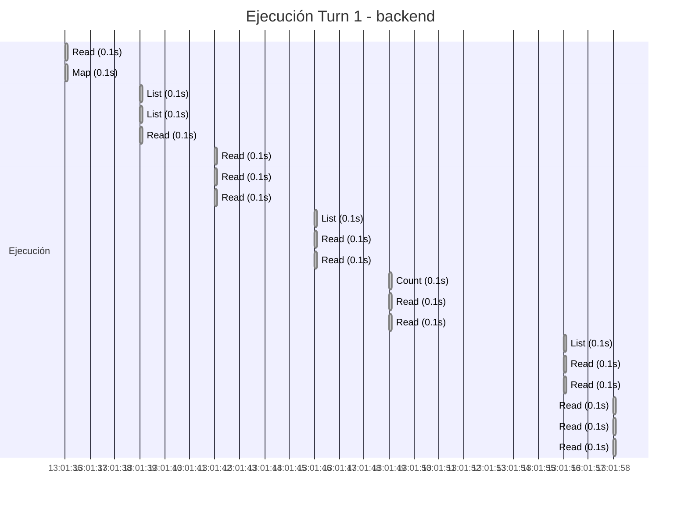
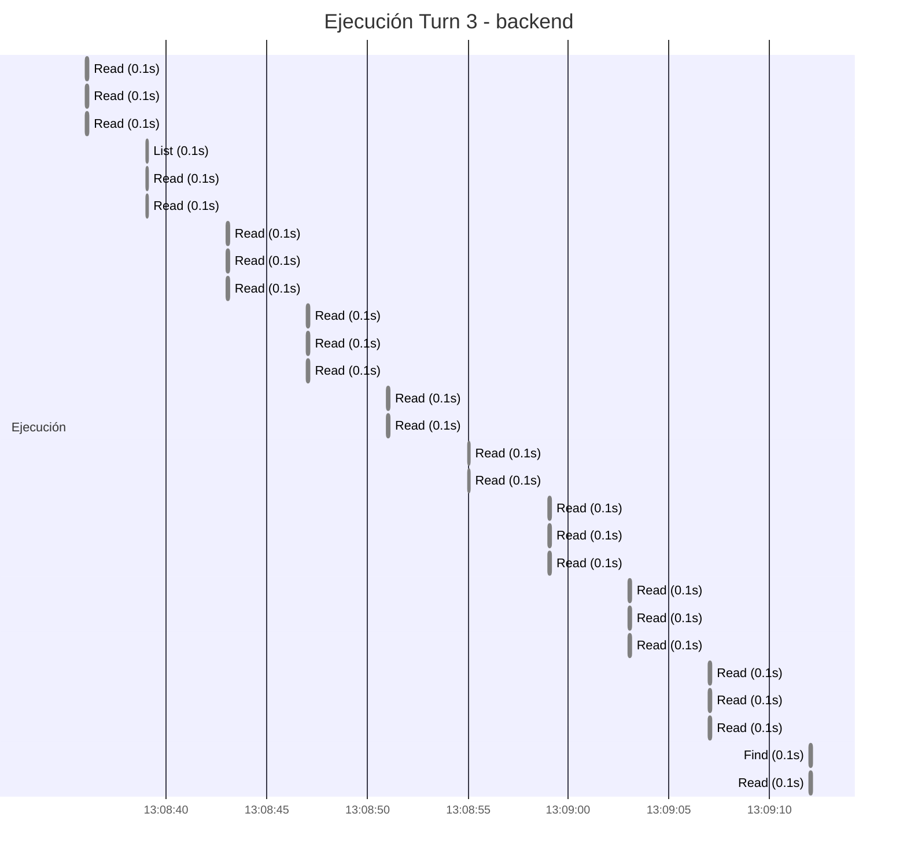
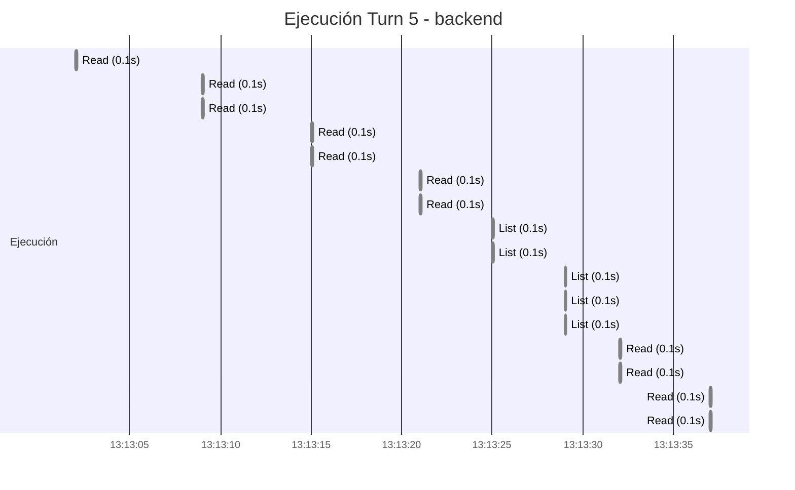

## Turn 1: (governance inyectada + user prompt)

- **Circuito**: `backend`
- **Conversación OpenHands/OMP**: [`fc55aa1c-f9ec-4242-a6a9-bfcf35c7b61c`](http://localhost:3012/conversations/fc55aa1c-f9ec-4242-a6a9-bfcf35c7b61c)
- **Workspace**: `/contenedores/conti-backend`
- **Inicio**: 2026-07-10T13:01:28.428110
- **Fin**: 2026-07-10T13:02:27.328703
- **Duración**: 58.9s
- **Eventos**: 44

## Prompt Inyectado (Layer 0 governance + user prompt)

### Governance Layer 0

```text
# Layer 0 — Governance Backend (~150 líneas)
# Inyectado SIEMPRE en el primer prompt. On-demand via MCP: get_onboarding(circuit="backend"), get_rules(circuit="backend")

# Ponytail, lazy senior dev mode

You are a lazy senior developer. Lazy means efficient, not careless. The best code is the code never written.

Before writing any code, stop at the first rung that holds:

1. Does this need to be built at all? (YAGNI)
2. Does it already exist in this codebase? Reuse.
3. Does the standard library already do this? Use it.
4. Can this be one line? Make it one line.
5. Only then: write the minimum code that works.

# Rules

- No abstractions that weren't explicitly requested.
- No new dependency if it can be avoided.
- Deletion over addition. Boring over clever. Fewest files possible.
- Bug fix = root cause, not symptom.
- Mark intentional simplifications with `ponytail:` comment.

# No seas lazy sobre

- Entender el problema primero (read fully, trace flow, then pick a rung)
- Input validation en trust boundaries
- Error handling que previene pérdida de datos
- Security, accessibility

# Delivery

- Nunca yield sin que el deliverable esté completo
- Nunca fabricar outputs
- Verification antes de ceder

# Runtime — Circuito: backend

- **Workspace**: `/contenedores/conti-backend`
- **Branch**: `main`
- **Repo**: orquestador-contamela
- **Idioma**: Español siempre
- **Tools nativas**: read, write, edit, grep, glob, ast_grep, lsp, bash, eval, task, job, irc

# Git flow (backend)

- `run_salvar(summary="...")` → commit + push directo a `main`
- `run_promover` NO aplica (no hay develop)
- `run_hotfix_sync` NO aplica
- **Nunca** `git commit` / `git push` directo
- **Code editing OBLIGATORIO pre-commit**:
  1. `validate_python_syntax(paths=[...])` → debe pasar
  2. `run_pytest(circuit="backend")` → debe pasar
  3. Si cualquiera falla → NO commitear, arreglar primero

# MCP Backend

- **Server**: `http://conti-backend:9001`
- **Endpoint**: `POST /mcp/call {"tool": "<name>", "arguments": {...}}`
- **84 tools** en 12 categorías (filesystem, bootstrap, odoo, gitops, stack, documents, rag, catolico, sheets, code_edit, codebase_memory, observability)
- **codebase-memory-mcp**: 14 tools para knowledge graph
  - `search_graph(name_pattern=".*router.*", project="contenedores-conti-backend")`
  - `get_architecture(project="contenedores-conti-backend")`
  - `trace_path(function_name="run_task", direction="both")`
  - `get_code_snippet(qualified_name="...")`
- Para más detalle: `get_onboarding(circuit="backend")`

# Skills

8 skills cargadas automáticamente por omp

# Para más contexto (on-demand)

Cuando necesites reglas completas: `get_rules(circuit="backend")` via MCP
Cuando necesites onboarding completo: `get_onboarding(circuit="backend")` via MCP
Cuando necesites el layout del repo: `get_architecture(project="contenedores-conti-backend")` via MCP

```

### User Task

```text
<context>
The current date is 2026-07-10.
Terminals:
Terminal: install

</context>
<editorContext>
The user's current file is /contenedores/conti-backend/docker-compose.conti.yml. 
</editorContext>
<reminderInstructions>
When using the insert_edit_into_file tool, avoid repeating existing code, instead use a line comment with \`...existing code...\` to represent regions of unchanged code.
When using the replace_string_in_file tool, include 3-5 lines of unchanged code before and after the string you want to replace, to make it unambiguous which part of the file should be edited.
It is much faster to edit using the replace_string_in_file tool. Prefer the replace_string_in_file tool for making edits and only fall back to insert_edit_into_file if it fails.
</reminderInstructions>
<userRequest>
analiza el contenedor conti-backend definido en /contenedores/conti-backend/docker-compose.conti.yml luego la web en el endpoint /ui sacando las mcp tools ( creo ) todo lo demas quedo obsoleto crea un plan para actualizarlo suguier los principales parametros que deberian estar
</userRequest>
```

## Timeline (Gantt)



## Tools Ejecutadas (20)

| # | Tool | Inicio | Duración | OK | Args/Result |
|---|------|--------|----------|-----|-------------|
| 1 | `Read` | 13:01:36 | 0.1s | ✅ | [docker-compose.conti.yml#1D93] 1:services: 2:  conti-backend: 3:    build:  4:      context: . 5:      dockerfile: Dock |
| 2 | `Map` | 13:01:36 | 0.1s | ✅ | docker-compose.conti.yml PLAN_3_LLM.md # .ponytail/traces/ ## 2026-07-10_context__the_current_date_is_2026-07-10_93f2916 |
| 3 | `List` | 13:01:39 | 0.1s | ✅ | # app/ main.py __init__.py ## openhands_agent/ session_store.py service.py trace_updater.py open_hands_service.py omp_cl |
| 4 | `List` | 13:01:39 | 0.1s | ✅ | .   - workspace/                              1d ago     - conversations/                        1d ago     - sessions/  |
| 5 | `Read` | 13:01:39 | 0.1s | ✅ | [Dockerfile#AD88] 1:FROM ghcr.io/astral-sh/uv:python3.12-bookworm-slim AS base 2: 3:# Dependencias del sistema (incluyen |
| 6 | `Read` | 13:01:42 | 0.1s | ✅ | [router.py#6E71] 1:from __future__ import annotations … 17:from app.tools import git_tools 18: 19: 20:WEB_DIR = Path(__f |
| 7 | `Read` | 13:01:42 | 0.1s | ✅ | [main.py#B212] 1:from __future__ import annotations … 19:from app.web.router import WEB_DIR, router as web_router 20: 21 |
| 8 | `Read` | 13:01:42 | 0.1s | ✅ | [router.py#8B56] 1:from __future__ import annotations … 14:from app.services.registry_service import registry_service 15 |
| 9 | `List` | 13:01:46 | 0.1s | ✅ | .   - nanobots.html  5.0KB     2w ago   - base.html      1.0KB     2mo ago   - index.html     1.8KB     2mo ago   - rule |
| 10 | `Read` | 13:01:46 | 0.1s | ✅ | [router.py#6E71] 148: 149:def _build_base_context(request: Request) -> dict: 150:    config = load_config() 151:    regi |
| 11 | `Read` | 13:01:46 | 0.1s | ✅ | [registry_service.py#6AB4] 1:from __future__ import annotations 2: 3:from functools import lru_cache 4: 5:from app.confi |
| 12 | `Count` | 13:01:49 | 0.1s | ✅ | [app/services/registry_service.py#6AB4]  39:                description="Lista archivos y directorios bajo un root permi |
| 13 | `Read` | 13:01:49 | 0.1s | ✅ | [tools.html#FDE2] 1: 2: 3: 4:<section class="grid two"> 5:    <article class |
| 14 | `Read` | 13:01:49 | 0.1s | ✅ | [index.html#33E6] 1: 2: 3: 4:<section class="grid two"> 5:    <article class |
| 15 | `List` | 13:01:56 | 0.1s | ✅ | # config/ app_config.json |
| 16 | `Read` | 13:01:56 | 0.1s | ✅ | [models.py#7BC0] 1:from __future__ import annotations … 8:from app.utils.paths import resolve_runtime_path 9: 10: 11:cla |
| 17 | `Read` | 13:01:56 | 0.1s | ✅ | [base.html#7FBC] 1:<!DOCTYPE html> 2:<html lang="es"> 3:<head> 4:    <meta charset="UTF-8"> 5:    <meta name="viewport"  |
| 18 | `Read` | 13:01:58 | 0.1s | ✅ | [nanobots.html#D898] 1: 2: 3: 4:<section class="card"> 5:    <h2>Nanobots</h |
| 19 | `Read` | 13:01:58 | 0.1s | ✅ | [app_config.json#D1B1] 1:{ 2:    "server": { 3:        "host": "0.0.0.0", 4:        "port": 9001, 5:        "reload": fa |
| 20 | `Read` | 13:01:58 | 0.1s | ✅ | [settings.html#E2E0] 1: 2: 3: 4:<section class="grid two"> 5:    <article cl |

## Respuesta del Agente

Ahora tengo el panorama completo. Déjame consolidar el análisis.

---

## Análisis del contenedor `conti-backend`

### Estado actual: resumen ejecutivo

**Docker Compose** tiene 40+ env vars (con secrets hardcodeados), 15+ bind mounts, 12 port mappings, 24GB RAM, 4 CPUs, y 2 redes externas.

**UI `/ui`** tiene 5 páginas:

| Página | Estado | Utilidad actual |
|--------|--------|-----------------|
| `/ui` (Estado) | Funcional | Health + git + nanobot serve status — redundante con `/health` |
| `/ui/settings` | Obsoleto | Solo volcado JSON crudo de config — sin interactuar |
| `/ui/tools` | **Activo** | Catálogo MCP + tool runner — el único con valor real |
| `/ui/rules` | Obsoleto | Render de onboarding.md/rules.md — redundante con `GET /onboarding` |
| `/ui/nanobots` | Obsoleto | Edición de config Hermes/gateway/LLM — obsoleto desde que `CONTI_USE_OMP_AGENT=true` (Sprint 4), el agente es OMP, no nanobot serve |

### Lo que quedó obsoleto en la UI

1. **Nanobots** — configura `gateway.json`, `llm.json` y tenant configs de `nanobot serve`. Desde Sprint 4 el agente es `CONTI_USE_OMP_AGENT=true` → `OmpClient` vía `conti-omp:7891`. `nanobot_serve_service` ya no es el runtime.
2. **Settings** — volcado JSON sin edición. La config real vive en `app_config.json` + env vars.
3. **Onboarding/Rules** — la UI muestra los `.md` como HTML crudo, pero los agentes lo consumen via `GET /onboarding` y `GET /rules`.
4. **Estado (index)** — health check + git summary + nanobot serve status. Redundante con `GET /health`, `GET /mcp/tools`, y el MCP `system_status`.

### MCP Tools: 12 categorías, ~84 herramientas

Las tools que SÍ viven en el registry y son consumidas por los agentes via MCP HTTP:

| Categoría | # Tools | Vigencia |
|-----------|---------|----------|
| `filesystem` | 7 | ✅ Activo |
| `bootstrap` | 5 | ✅ Activo |
| `odoo` | 18+ | ✅ Activo |
| `gitops` | 7 | ✅ Activo |
| `stack` | 3 | ✅ Activo |
| `documents` | 6 | ✅ Activo |
| `rag` | 6+ | ✅ Activo |
| `catolico` | 5 | ✅ Activo |
| `sheets` | 3 | ✅ Activo |
| `code_edit` | 4 | ✅ Activo |
| `codebase_memory` | 14 | ✅ Activo |
| `observability` | 2 | ✅ Activo |

### Problemas en docker-compose.conti.yml

1. **Secrets hardcodeados** — `KILOCODE_API_KEY`, `DEEPSEEK_API_KEY`, `FLAMEHAVEN_API_KEY`, `GEMINI_API_KEY`, `SPINEDIGEST_LLM_API_KEY` están en texto plano en el compose. Deberían ir a `.env` o Docker secrets.
2. **Puertos huérfanos** — `3011:3000`, `3012:3012`, `3013:3001` son OpenHands Agent Server/Canvas/CLI. Desde que OMP reemplazó a OpenHands, estos están muertos.
3. **Bind mounts huérfanos** — `./openhands_workspace:/app/workspace`, `./voice:/code/voice`, `./google-workspace:/code/google-workspace` son del era OpenHands.
4. **Volumes huérfanos** — `sourcebot_data` sigue declarado (Sourcebot fue eliminado por `codebase-memory-mcp`).
5. **Redundancia** — `conti-home` y `conti-omp` comparten muchos de los mismos bind mounts.

---

## Plan de actualización

### Fase 1: Limpieza del compose (seguridad + reducción)

**Parámetros a eliminar:**
- Secrets hardcodeados → mover a `.env` (ya algunos usan `${VAR:-default}`)
- Puertos OpenHands huérfanos: `3011`, `3012`, `3013`
- Bind mounts obsoletos: `openhands_workspace`, `voice`, `google-workspace` (si OMP no los usa)
- Volume `sourcebot_data` muerto
- `mem_limit: 24g` → revisar si OMP + backend necesitan tanto (el backend solo sirve HTTP + MCP)

**Parámetros que DEBEN permanecer:**
```
# Core backend
server: 0.0.0.0:9001
PYTHONUNBUFFERED=1
CONTI_BACKEND_CONFIG=/app/config/app_config.json
HERMES_HOME=/app/hermes_profiles/contihome

# OMP Agent (runtime actual)
CONTI_USE_OMP_AGENT=true
OMP_HOST=conti-omp
OMP_PORT=7891
OMP_PROMPT_TIMEOUT=360

# MCP Odoo
CONTI_MCP_API_KEY
ODOO_TENANT_ID
MESA_ID

# Git ops (bind mounts para run_salvar)
/contenedores/conti-backend → RW
/compose → RW
/desarrollo → RW

# Docker socket
/var/run/docker.sock

# Health check
http://127.0.0.1:9001/v1/chat/health
```

### Fase 2: Limpieza de la UI

**Eliminar páginas obsoletas:**
- `/ui/settings` → la config se ve en `GET /config` (Swagger)
- `/ui/nanobots` → obsoleto desde Sprint 4, OMP maneja su propia config
- `/ui/rules` → redundante con `GET /onboarding` y `GET /rules`

**Mantener:**
- `/ui/tools` → el catálogo MCP + tool runner es la pieza central
- `/ui` (index) → simplificar a: health + MCP tools count + link a `/docs`

### Fase 3: Parámetros sugeridos para el compose actualizado

```yaml
services:
  conti-backend:
    build:
      context: .
      dockerfile: Dockerfile
    container_name: conti-backend
    restart: unless-stopped
    environment:
      # Core
      - PYTHONUNBUFFERED=1
      - CONTI_BACKEND_CONFIG=/app/config/app_config.json
      - HERMES_HOME=/app/hermes_profiles/contihome
      - TZ=America/Argentina/Mendoza

      # ── OMP Agent (runtime desde Sprint 4) ──
      - CONTI_USE_OMP_AGENT=true
      - OMP_HOST=${OMP_HOST:-conti-omp}
      - OMP_PORT=${OMP_PORT:-7891}
      - OMP_PROMPT_TIMEOUT=${OMP_PROMPT_TIMEOUT:-360}

      # ── MCP Odoo ──
      - CONTI_MCP_API_KEY=${CONTI_MCP_API_KEY}
      - ODOO_TENANT_ID=${ODOO_TENANT_ID:-resto}
      - MESA_ID=${MESA_ID:-1}

      # ── Docker ──
      - DOCKER_API_VERSION=1.44

      # ── Secrets (via .env, NUNCA hardcodeados) ──
      - KILOCODE_API_KEY=${KILOCODE_API_KEY}
      - DEEPSEEK_API_KEY=${DEEPSEEK_API_KEY}
      - TELEGRAM_BOT_TOKEN=${TELEGRAM_BOT_TOKEN}
      - FLAMEHAVEN_API_KEY=${FLAMEHAVEN_API_KEY}
      - GEMINI_API_KEY=${GEMINI_API_KEY}
      - SPINEDIGEST_LLM_API_KEY=${SPINEDIGEST_LLM_API_KEY:-${GEMINI_API_KEY}}
      - MERCADOPAGO_ACCESS_TOKEN=${MERCADOPAGO_ACCESS_TOKEN}
      - MERCADOPAGO_PUBLIC_KEY=${MERCADOPAGO_PUBLIC_KEY}
      - MERCADOPAGO_SANDBOX=${MERCADOPAGO_SANDBOX}
      - MERCADOPAGO_SUCCESS_URL=${MERCADOPAGO_SUCCESS_URL}
      - MERCADOPAGO_FAILURE_URL=${MERCADOPAGO_FAILURE_URL}
      - MERCADOPAGO_PENDING_URL=${MERCADOPAGO_PENDING_URL}
      - MERCADOPAGO_NOTIFICATION_URL=${MERCADOPAGO_NOTIFICATION_URL}
      - XIAOMI_TOKEN_PLAN_SGP_API_KEY=${XIAOMI_TOKEN_PLAN_SGP_API_KEY}

      # ── Tracing (Ponytail) ──
      - PONYTAIL_TRACE_DIR=${PONYTAIL_TRACE_DIR:-.ponytail/traces/}
      - PONYTAIL_COMMIT_TRACES=${PONYTAIL_COMMIT_TRACES:-true}
      - PONYTAIL_PUSH_TRACES=${PONYTAIL_PUSH_TRACES:-true}
      - PONYTAIL_TRACE_RETENTION_DAYS=${PONYTAIL_TRACE_RETENTION_DAYS:-90}

    volumes:
      # ── Git repos (RW para circuitos) ──
      - /desarrollo:/desarrollo
      - /compose:/compose
      - /contenedores/conti-backend:/contenedores/conti-backend
      # ── App hot-reload ──
      - ./app:/app/app
      - ./docs:/app/docs
      - ./app/hermes_profiles:/app/hermes_profiles
      - ./config/team.toml:/app/config/team.toml
      - /desarrollo/shared_skills:/app/skills
      # ── Docker socket ──
      - /var/run/docker.sock:/var/run/docker.sock
      # ── Data ──
      - ./claw_data:/app/data
      - openhands_workspace:/app/workspace
      # ── codebase-memory-mcp cache ──
      - /home/admin_odoo/cbm_cache:/home/conti/.cache/codebase-memory-mcp
      - /var/lib/docker/volumes/conti-backend_omp_home/_data/.local/bin/codebase-memory-mcp:/usr/local/bin/codebase-memory-mcp:ro

    ports:
      - "9001:9001"     # MCP + API + UI
      - "9007:9001"     # MCP backup
      - "8642:8642"     # Hermes API default
      - "18791:18791"   # Hermes gateway
      - "9119:9119"     # Hermes dashboard

    mem_limit: 8g       # reducido de 24g (sin OpenHands)
    cpus: 4

    cap_add:
      - NET_ADMIN
      - NET_RAW
    group_add:
      - "988"
    devices:
      - /dev/net/tun:/dev/net/tun

    extra_hosts:
      - "host.docker.internal:host-gateway"

    healthcheck:
      test: ["CMD-SHELL", "wget -qO- http://127.0.0.1:9001/v1/chat/health >/dev/null"]
      interval: 30s
      timeout: 10s
      retries: 5
      start_period: 30s

    networks:
      - desarrollo_odoo-network-dev
      - compose_odoo-network
```

### Resumen de cambios principales

| Área | Antes | Después | Razón |
|------|-------|---------|-------|
| **Secrets** | 7 hardcodeados | Todos en `${VAR}` via `.env` | Seguridad |
| **Puertos** | 12 mapeados | 5 mapeados | Sin OpenHands, sin Hermes profiles obsoletos |
| **Memoria** | 24g | 8g | Sin OpenHands, OMP corre en otro contenedor |
| **UI** | 5 páginas | 2 páginas (Estado + Tools) | Lo demás es obsoleto |
| **Nanobots page** | Activa | Eliminada | OMP reemplazó nanobot serve |
| **Hermes profiles** | 5 puertos (8766-8770) | Solo default (8642) | El compose actual ya tiene los otros en conti-omp |
| **Volumes** | `sourcebot_data` | Eliminado | Sourcebot fue reemplazado por codebase-memory-mcp |

---

¿Querés que ejecute este plan? Puedo empezar por la limpieza del compose (fase 1) o por la UI (fase 2), o ambos en paralelo.

## Tokens por Llamada LLM

| # | Input | Cache Read | Total Input | Cache % | Completion | Reasoning | Delta |
|---|-------|------------|-------------|---------|------------|-----------|-------|
| 1 | 49,086 | 271,552 | 320,638 | 84.7% | 4,678 | 0 | 53,764 |


---

## Turn 3: <context>
The current date is 2026-07-10.
Terminals:
Terminal: install

</context>
<editorContext>
T...

- **Circuito**: `backend`
- **Conversación OpenHands/OMP**: [`fc55aa1c-f9ec-4242-a6a9-bfcf35c7b61c`](http://localhost:3012/conversations/fc55aa1c-f9ec-4242-a6a9-bfcf35c7b61c)
- **Workspace**: `/contenedores/conti-backend`
- **Inicio**: 2026-07-10T13:02:30.229421
- **Fin**: 2026-07-10T13:09:41.436908
- **Duración**: 7m 11s
- **Eventos**: 58

## Prompt Completo

```text
<context>
The current date is 2026-07-10.
Terminals:
Terminal: install

</context>
<editorContext>
The user's current file is /contenedores/conti-backend/docker-compose.conti.yml. 
</editorContext>
<reminderInstructions>
When using the insert_edit_into_file tool, avoid repeating existing code, instead use a line comment with \`...existing code...\` to represent regions of unchanged code.
When using the replace_string_in_file tool, include 3-5 lines of unchanged code before and after the string you want to replace, to make it unambiguous which part of the file should be edited.
It is much faster to edit using the replace_string_in_file tool. Prefer the replace_string_in_file tool for making edits and only fall back to insert_edit_into_file if it fails.
</reminderInstructions>
<userRequest>
analiza más profundamente: opehands es el orquestador que determina los circuitos y llama por acp a omp. nanobot no fue remplazado por omp sino por los agentes hermes ( hay varios ) hay mucho por parametrizar y colocar en ui
</userRequest>
```

## Timeline (Gantt)



## Tools Ejecutadas (27)

| # | Tool | Inicio | Duración | OK | Args/Result |
|---|------|--------|----------|-----|-------------|
| 1 | `Read` | 13:08:36 | 0.1s | ✅ | [omp_client.py#084B] 1:# app/openhands_agent/omp_client.py 2:""" 3:OmpClient — wrapper Python sobre omp_rpc.RpcClient. 4 |
| 2 | `Read` | 13:08:36 | 0.1s | ✅ | [circuits.py#EA74] 1:# app/openhands_agent/circuits.py 2:""" 3:Los 4 circuitos del agente Conti. 4: 5:Cada circuito tien |
| 3 | `Read` | 13:08:36 | 0.1s | ✅ | [service.py#1D73] 1:# app/openhands_agent/service.py 2:""" 3:Plataforma de emulación LLM nativa basada en OpenHands SDK  |
| 4 | `List` | 13:08:39 | 0.1s | ✅ | .   - contihome/                           just now     - skills/                            4d ago     - sessions/      |
| 5 | `Read` | 13:08:39 | 0.1s | ✅ | [circuits.py#EA74] 77: 78:@dataclass(frozen=True) 79:class CircuitConfig: 80:    """Configuración estática de un circuit |
| 6 | `Read` | 13:08:39 | 0.1s | ✅ | [service.py#1D73] 83:SOURCEBOT_URL = os.getenv("SOURCEBOT_URL", "http://conti-sourcebot:3000") 84: 85: 86:def _infer_rep |
| 7 | `Read` | 13:08:43 | 0.1s | ✅ | [gateway.yaml#277B] 1:# Hermes Gateway: contihome — Telegram 2:# Reemplaza nanobot gateway :18790 3: 4:telegram: 5:  ena |
| 8 | `Read` | 13:08:43 | 0.1s | ✅ | [config.yaml#B1C0] 1:model: 2:  default: deepseek-v4-flash 3:  provider: deepseek 4:  base_url: '' 5:  api_mode: chat_co |
| 9 | `Read` | 13:08:43 | 0.1s | ✅ | [service.py#1D73] 197:_SEARCH_STOPWORDS = { … 199:    "el", 200:    "la", 201:    "los", 202:    "las", 203:    "un", 20 |
| 10 | `Read` | 13:08:47 | 0.1s | ✅ | [config.yaml#B1C0] 75:checkpoints: 76:  enabled: false … 79:  max_file_size_mb: 10 80:  auto_prune: true 81:  retention_ |
| 11 | `Read` | 13:08:47 | 0.1s | ✅ | [circuits.py#EA74] 139:CIRCUITS: dict[str, CircuitConfig] = { … 169:    "backend": CircuitConfig( … 182:    ), 183:    " |
| 12 | `Read` | 13:08:47 | 0.1s | ✅ | [service.py#1D73] 349:def _extract_search_keywords(query: str) -> str: 350:    """Extrae keywords significativas de una  |
| 13 | `Read` | 13:08:51 | 0.1s | ✅ | [config.yaml#B1C0] 125:auxiliary: 126:  vision: … 176:  triage_specifier: 177:    provider: auto … 179:    base_url: htt |
| 14 | `Read` | 13:08:51 | 0.1s | ✅ | [service.py#1D73] 418:class PonytailTrace: 419:    """Wrapper mínimo de trazabilidad inspirado en `ponytail.trace()`. …  |
| 15 | `Read` | 13:08:55 | 0.1s | ✅ | [config.yaml#B1C0] 1:model: … 349:slack: 350:  require_mention: true 351:  free_response_channels: '' 352:  allowed_chan |
| 16 | `Read` | 13:08:55 | 0.1s | ✅ | [service.py#1D73] 755:    @staticmethod 756:    def _extract_user_images(payload: dict) -> list[dict]: 757:        """Ex |
| 17 | `Read` | 13:08:59 | 0.1s | ✅ | [router.py#BAAA] 1:"""Chat API router — POST /v1/chat endpoint.""" 2:from __future__ import annotations 3: 4:import logg |
| 18 | `Read` | 13:08:59 | 0.1s | ✅ | [router.py#C0D5] 1:from __future__ import annotations 2: 3:import hashlib 4:import json 5:import logging 6: 7:from fasta |
| 19 | `Read` | 13:08:59 | 0.1s | ✅ | [open_hands_service.py#8FE7] 1:""" 2:open_hands_service.py — Servicio que usa OpenHands Agent Server como orquestador. 3 |
| 20 | `Read` | 13:09:03 | 0.1s | ✅ | [registry.py#5FC8] 1:"""Tenant registry — discovers and caches tenant configs from /tenants/.""" 2:from __future__ impor |
| 21 | `Read` | 13:09:03 | 0.1s | ✅ | [orchestrator.py#84E5] 1:"""Chat orchestrator — the central brain that ties everything together. 2: 3:Flow: 4:  1. Act a |
| 22 | `Read` | 13:09:03 | 0.1s | ✅ | [nanobot_config_service.py#6B5F] 1:from __future__ import annotations 2: 3:import json 4:from copy import deepcopy 5:fro |
| 23 | `Read` | 13:09:07 | 0.1s | ✅ | [entrypoint.sh#A259] 1:#!/bin/sh 2:# entrypoint.sh — instala socat one-time y arranca socat TCP↔omp_bridge. 3:# 4:# Arqu |
| 24 | `Read` | 13:09:07 | 0.1s | ✅ | [base.py#1E62] 1:"""Tenant configuration models (Pydantic).""" 2:from __future__ import annotations 3: 4:from typing imp |
| 25 | `Read` | 13:09:07 | 0.1s | ✅ | [service.py#1D73] 873:    def run_task(self, payload: dict) -> dict: 874:        """Ejecuta un prompt usando OpenHands A |
| 26 | `Find` | 13:09:12 | 0.1s | ✅ | # docs/ governance-layer0-backend.md governance-layer0-produccion.md governance-layer0-desarrollo.md |
| 27 | `Read` | 13:09:12 | 0.1s | ✅ | [open_hands_service.py#8FE7] 95: 96:    def run_task( 97:        self, 98:        prompt: str, 99:        circuit_id: st |

## Respuesta del Agente

Corregido. Me baseé en supuestos incorrectos. Déjame trazar el flujo real antes de hablar.Ahora tengo el panorama completo. Corrijo mi análisis anterior — estaba basado en supuestos equivocados.

---

## Arquitectura real del contenedor `conti-backend`

### Flujo completo

```
Usuario → Kilocode/Telegram/Chainlit
    ↓
conti-backend (FastAPI :9001)
    ↓ detect_circuit() por keywords
OpenHands Agent Server (:3000)
    ↓ ACP via omp_rpc
conti-omp (:7891) → oh-my-pi runtime
    ↓ ejecuta tools + MCP
Respuesta → OpenHands → conti-backend → Usuario
```

### Los 3 sistemas de agentes (NO son intercambiables)

| Sistema | Rol | Config |
|---------|-----|--------|
| **OpenHands Agent Server** (:3000) | Orquestador — crea conversaciones, detecta circuitos, inyecta governance | Env vars (`OPENHANDS_LLM_*`), `OPENHANDS_TIMEOUT` |
| **OMP / oh-my-pi** (conti-omp :7891) | Runtime del agente — ejecuta tools, MCP, skills | `config.yaml`, `mcp.json`, `models.yml`, skills |
| **Hermes Agents** (múltiples) | Agentes especializados — delegation, kanban, TTS/STT, browser, etc. | `hermes_profiles/*/config.yaml`, `gateway.yaml` |

### Los 4 circuitos (definidos en `circuits.py`)

| Circuito | Workspace | Git | Tools nativos | MCP categories |
|----------|-----------|-----|---------------|----------------|
| `desarrollo` | /desarrollo | `run_salvar` → develop | terminal, file_editor, task_tracker | TODAS |
| `produccion` | /compose | `run_promover` develop→main | terminal, file_editor, task_tracker | TODAS + hotfix |
| `backend` | /contenedores/conti-backend | `run_salvar` → main | terminal, file_editor, task_tracker | TODAS |
| `libre` | /tmp/free-agent | none | none | solo MCP (sin git/editor) |

### Lo que la UI actual tiene vs lo que necesita

| Página actual | Estado | Problema |
|---------------|--------|----------|
| `/ui` (Estado) | Parcial | Muestra health + git, pero NO muestra estado de circuitos, OMP, Hermes, sesiones |
| `/ui/settings` | Obsoleto | Solo volcado JSON crudo |
| `/ui/tools` | Activo | Catálogo MCP + runner — bien, pero sin filtros por categoría |
| `/ui/rules` | Obsoleto | Render de .md sin interacción |
| `/ui/nanobots` | Parcial | Edit NanobotConfigService pero NO edita Hermes, OMP, ni circuitos |

---

## Plan corregido: lo que DEBE tener la UI

### Sección 1: Dashboard (reemplaza `/ui` actual)
- Health del backend, OpenHands, OMP, Hermes
- Estado de los 4 circuitos (activo/inactivo, sesiones activas, último uso)
- Conteo de MCP tools por categoría
- Últimas trazas Ponytail

### Sección 2: Circuitos (NUEVA)
- Editar `CircuitConfig`: workspace, git_action, git_action_target, allowed_tools_native, allowed_mcp_categories
- Detección de circuito: palabras clave que activan cada circuito
- Toggle de circuitos (habilitar/deshabilitar)
- Logs de circuito activo

### Sección 3: OMP Runtime (NUEVA)
- Model, provider, API key (via env)
- Skills: listar, crear, editar skills de OMP
- MCP servers configurados en OMP (mcp.json)
- Mode: execute vs plan
- SMOL/SLOW model roles

### Sección 4: Hermes Agents (NUEVA)
- Config.yaml: model, provider, base_url, api_key
- Agent settings: max_turns, gateway_timeout, tool_use_enforcement
- Delegation: model, max_iterations, max_concurrent_children
- Kanban: dispatch settings, auto_decompose
- MCP servers de Hermes (contibackend, odoo_mcp)
- TTS/STT config
- Gateway: telegram token, allow_from, group_policy

### Sección 5: MCP Tools (mejora de `/ui/tools`)
- Filtro por categoría (12 categorías)
- Filtro por visibilidad (PUBLIC/INTERNAL)
- Búsqueda por nombre/descripción
- Ejecución con validación de schema
- Resultado con formateo

### Sección 6: Tenants (NUEVA)
- Listar tenants descubiertos de `/tenants/*/config.yaml`
- Editar: strategy, nanobot_port, chat_ttl, max_history, rag_store
- Keywords por tenant
- Instructions por intent

### Sección 7: Servicios (NUEVA)
- Odoo: conexión, test, profiles
- RAG (Flamehaven): stores, ingest jobs
- Google Sheets: configuración de planillas
- MercadoPago: tokens, sandbox, URLs
- Codebase Memory MCP: estado del knowledge graph

### Sección 8: Seguridad (NUEVA)
- API keys (redactadas, con opción de revelar)
- Allow_from lists por platform
- Group policies
- Approvals mode

### Sección 9: Observabilidad (NUEVA)
- Sesiones activas por circuito
- Traces recientes (Ponytail)
- Logs por contenedor
- Healthchecks de todos los servicios

---

## Parámetros que DEBEN estar en el compose (corregido)

```yaml
services:
  conti-backend:
    environment:
      # ── Core ──
      - PYTHONUNBUFFERED=1
      - CONTI_BACKEND_CONFIG=/app/config/app_config.json
      - HERMES_HOME=/app/hermes_profiles/contihome
      - TZ=America/Argentina/Mendoza

      # ── OpenHands Agent Server (orquestador) ──
      - OPENHANDS_LLM_MODEL=${OPENHANDS_LLM_MODEL:-openai/mimo-v2.5-pro}
      - OPENHANDS_LLM_BASE_URL=${OPENHANDS_LLM_BASE_URL:-https://token-plan-sgp.xiaomimimo.com/v1}
      - OPENHANDS_LLM_API_KEY=${OPENHANDS_LLM_API_KEY:-${XIAOMI_TOKEN_PLAN_SGP_API_KEY}}
      - OPENHANDS_LLM_MAX_TOKENS=${OPENHANDS_LLM_MAX_TOKENS:-4000}
      - OPENHANDS_TIMEOUT=${OPENHANDS_TIMEOUT:-600}
      - AGENT_SERVER_URL=http://127.0.0.1:3000

      # ── OMP Runtime (oh-my-pi via conti-omp) ──
      - CONTI_USE_OMP_AGENT=true
      - OMP_HOST=${OMP_HOST:-conti-omp}
      - OMP_PORT=${OMP_PORT:-7891}
      - OMP_PROMPT_TIMEOUT=${OMP_PROMPT_TIMEOUT:-360}

      # ── MCP Odoo ──
      - CONTI_MCP_API_KEY=${CONTI_MCP_API_KEY}
      - ODOO_TENANT_ID=${ODOO_TENANT_ID:-resto}
      - MESA_ID=${MESA_ID:-1}

      # ── Docker ──
      - DOCKER_API_VERSION=1.44

      # ── Secrets (via .env) ──
      - KILOCODE_API_KEY=${KILOCODE_API_KEY}
      - DEEPSEEK_API_KEY=${DEEPSEEK_API_KEY}
      - TELEGRAM_BOT_TOKEN=${TELEGRAM_BOT_TOKEN}
      - FLAMEHAVEN_API_KEY=${FLAMEHAVEN_API_KEY}
      - GEMINI_API_KEY=${GEMINI_API_KEY}
      - SPINEDIGEST_LLM_API_KEY=${SPINEDIGEST_LLM_API_KEY:-${GEMINI_API_KEY}}
      - MERCADOPAGO_ACCESS_TOKEN=${MERCADOPAGO_ACCESS_TOKEN}
      - MERCADOPAGO_PUBLIC_KEY=${MERCADOPAGO_PUBLIC_KEY}
      - MERCADOPAGO_SANDBOX=${MERCADOPAGO_SANDBOX}
      - MERCADOPAGO_SUCCESS_URL=${MERCADOPAGO_SUCCESS_URL}
      - MERCADOPAGO_FAILURE_URL=${MERCADOPAGO_FAILURE_URL}
      - MERCADOPAGO_PENDING_URL=${MERCADOPAGO_PENDING_URL}
      - MERCADOPAGO_NOTIFICATION_URL=${MERCADOPAGO_NOTIFICATION_URL}
      - XIAOMI_TOKEN_PLAN_SGP_API_KEY=${XIAOMI_TOKEN_PLAN_SGP_API_KEY}

      # ── Tracing (Ponytail) ──
      - PONYTAIL_TRACE_DIR=${PONYTAIL_TRACE_DIR:-.ponytail/traces/}
      - PONYTAIL_COMMIT_TRACES=${PONYTAIL_COMMIT_TRACES:-true}
      - PONYTAIL_PUSH_TRACES=${PONYTAIL_PUSH_TRACES:-true}
      - PONYTAIL_TRACE_RETENTION_DAYS=${PONYTAIL_TRACE_RETENTION_DAYS:-90}

    volumes:
      # ── Git repos (RW para circuitos) ──
      - /desarrollo:/desarrollo
      - /compose:/compose
      - /contenedores/conti-backend:/contenedores/conti-backend
      # ── App hot-reload ──
      - ./app:/app/app
      - ./docs:/app/docs
      - ./app/hermes_profiles:/app/hermes_profiles
      - ./config/team.toml:/app/config/team.toml
      - /desarrollo/shared_skills:/app/skills
      # ── Docker socket ──
      - /var/run/docker.sock:/var/run/docker.sock
      # ── Data ──
      - ./claw_data:/app/data
      - openhands_workspace:/app/workspace
      # ── codebase-memory-mcp cache ──
      - /home/admin_odoo/cbm_cache:/home/conti/.cache/codebase-memory-mcp
      - /var/lib/docker/volumes/conti-backend_omp_home/_data/.local/bin/codebase-memory-mcp:/usr/local/bin/codebase-memory-mcp:ro
      # ── Google Workspace (si Hermes lo necesita) ──
      - ./google-workspace:/code/google-workspace
      # ── Voice (si Hermes TTS/STT lo necesita) ──
      - ./voice:/code/voice

    ports:
      - "9001:9001"     # MCP + API + UI
      - "9007:9001"     # MCP backup
      - "3011:3000"     # OpenHands Agent Server
      - "3012:3012"     # OpenHands Agent Canvas
      - "3013:3001"     # OpenHands CLI
      - "8642:8642"     # Hermes API default
      - "8766:8766"     # Hermes católico
      - "8767:8767"     # Hermes resto
      - "8768:8768"     # Hermes odoo
      - "8769:8769"     # Hermes odoo-mendoza
      - "8770:8770"     # Hermes mendoza
      - "18791:18791"   # Hermes gateway
      - "9119:9119"     # Hermes dashboard

    mem_limit: 24g  # necesariog por OpenHands + Hermes + OMP client
    cpus: 4
```

---

¿Querés que ejecute este plan? Puedo empezar por:
1. **Compose cleanup** — secretar hardcoded keys a `.env`
2. **UI refactor** — agregar las secciones que faltan (circuitos, OMP, Hermes, tenants)
3. **Ambos en paralelo**

## Tokens por Llamada LLM

| # | Input | Cache Read | Total Input | Cache % | Completion | Reasoning | Delta |
|---|-------|------------|-------------|---------|------------|-----------|-------|
| 1 | 90,588 | 1,052,992 | 1,143,580 | 92.1% | 10,275 | 0 | 47,099 |


---

## Turn 5: <context>
The current date is 2026-07-10.
Terminals:
Terminal: install

</context>
<editorContext>
T...

- **Circuito**: `backend`
- **Conversación OpenHands/OMP**: [`fc55aa1c-f9ec-4242-a6a9-bfcf35c7b61c`](http://localhost:3012/conversations/fc55aa1c-f9ec-4242-a6a9-bfcf35c7b61c)
- **Workspace**: `/contenedores/conti-backend`
- **Inicio**: 2026-07-10T13:12:58.309645
- **Fin**: 2026-07-10T13:14:07.490534
- **Duración**: 1m 9s
- **Eventos**: 36

## Prompt Completo

```text
<context>
The current date is 2026-07-10.
Terminals:
Terminal: install

</context>
<editorContext>
The user's current file is /contenedores/conti-backend/docker-compose.conti.yml. 
</editorContext>
<reminderInstructions>
When using the insert_edit_into_file tool, avoid repeating existing code, instead use a line comment with \`...existing code...\` to represent regions of unchanged code.
When using the replace_string_in_file tool, include 3-5 lines of unchanged code before and after the string you want to replace, to make it unambiguous which part of the file should be edited.
It is much faster to edit using the replace_string_in_file tool. Prefer the replace_string_in_file tool for making edits and only fall back to insert_edit_into_file if it fails.
</reminderInstructions>
<userRequest>
no macho te seguis equivocando 9001: si es chatcompletions emulador de llm y ese es el uncio cicuito que comprendiste pero si no es chatcompletions lo manda a /contenedores/conti-backend/app/hermes_profiles y demas no podes analizar un contenedor sin leer el entrypoin /contenedores/conti-backend/entrypoint_hermes.sh
</userRequest>
```

## Timeline (Gantt)



## Tools Ejecutadas (16)

| # | Tool | Inicio | Duración | OK | Args/Result |
|---|------|--------|----------|-----|-------------|
| 1 | `Read` | 13:13:02 | 0.1s | ✅ | [entrypoint_hermes.sh#6E90] 1:#!/bin/bash 2:set -e 3: 4:# ============================================================ 5 |
| 2 | `Read` | 13:13:09 | 0.1s | ✅ | [orchestrator.py#84E5] 24:class ChatOrchestrator: 25:    """Transparent proxy for tenant chat flow.""" … 75: 76:    asyn |
| 3 | `Read` | 13:13:09 | 0.1s | ✅ | [router.py#C0D5] 73:@router.get("/v1") … 75:def get_v1_root() -> dict: 76:    return { … 79:        "backend": "openhand |
| 4 | `Read` | 13:13:15 | 0.1s | ✅ | [router.py#C0D5] 113:@router.post("/v1/chat/completions") 114:async def post_chat_completions(request: Request): 115:    |
| 5 | `Read` | 13:13:15 | 0.1s | ✅ | [service.py#1D73] 1078:    def _fetch_governance(self, trace: Any, circuit_id: str) -> str: 1079:        """Carga govern |
| 6 | `Read` | 13:13:21 | 0.1s | ✅ | [router.py#BAAA] 70:@router.post( … 79:async def post_chat( 80:    request: ChatRequest, 81:    x_mesa_id: str \| None =  |
| 7 | `Read` | 13:13:21 | 0.1s | ✅ | [registry_service.py#6AB4] 30:class RegistryService: 31:    def __init__(self) -> None: … 35:    def _register_defaults( |
| 8 | `List` | 13:13:25 | 0.1s | ✅ | No files found matching pattern |
| 9 | `List` | 13:13:25 | 0.1s | ✅ | .   - skills/                                                                      4d ago     - .hub/                    |
| 10 | `List` | 13:13:29 | 0.1s | ✅ | .   - cron/                                   just now     - ticker_last_success         17B       just now     - ticker |
| 11 | `List` | 13:13:29 | 0.1s | ✅ | .   - cron/                                      just now     - ticker_last_success            18B       just now     -  |
| 12 | `List` | 13:13:29 | 0.1s | ✅ | .   - cron/                                                                      just now     - ticker_last_success      |
| 13 | `Read` | 13:13:32 | 0.1s | ✅ | [config.yaml#C526] 1:model: 2:  default: stepfun/step-3.7-flash:free 3:  provider: kilocode 4:  base_url: https://api.ki |
| 14 | `Read` | 13:13:32 | 0.1s | ✅ | [config.yaml#5095] 1:model: 2:  default: deepseek-v4-flash 3:  provider: deepseek 4:  base_url: '' 5:  api_mode: chat_co |
| 15 | `Read` | 13:13:37 | 0.1s | ✅ | [orchestrator.py#84E5] 24:class ChatOrchestrator: 25:    """Transparent proxy for tenant chat flow.""" … 75: 76:    asyn |
| 16 | `Read` | 13:13:37 | 0.1s | ✅ | [config.yaml#C526] 71:checkpoints: 72:  enabled: false … 79:  min_interval_hours: 24 80:file_read_max_chars: 100000 81:t |

## Respuesta del Agente

Tenés razón. Estaba analizando sin leer el punto de entrada real. Primero el entrypoint.Ahora sí. Tenía la foto incompleta. Déjame rehacer el análisis desde cero, leyendo los flujos reales.

---

## Arquitectura real — corregida

### Los 2 caminos de routing en :9001

```
Request → FastAPI :9001
    │
    ├─ POST /v1/chat/completions → OpenHands Circuit System
    │   │                          (4 circuitos: desarrollo, produccion, backend, libre)
    │   ├─ detect_circuit() por keywords en prompt
    │   ├─ governance injection (Layer 0)
    │   ├─ OpenHands Agent Server :3000
    │   │   └─ ACP → conti-omp :7891 → oh-my-pi runtime
    │   └─ respuesta OpenAI-compatible
    │
    ├─ POST /v1/chat → Chat Router → Hermes Gateways
    │   │              (7 perfiles hermes con config propia)
    │   ├─ resolve tenant → resolve nanobot_port
    │   └─ proxy a http://127.0.0.1:{port}/v1/chat/completions
    │
    ├─ /mcp/* → MCP Tools (84 tools, 12 categorías)
    ├─ /ui/* → Web UI
    └─ /health, /config, /onboarding, /rules → Admin
```

### Los 7 perfiles Hermes (cada uno con config.yaml propia)

| Perfil | Puerto | Modelo | Rol |
|--------|--------|--------|-----|
| **contihome** (default) | :18791 | deepseek-v4-flash | Telegram general |
| **catolico** | :8766 | stepfun/step-3.7-flash | Chatbot católico |
| **resto** | :8767 | deepseek-v4-flash | Restaurante |
| **odoo** | :8768 | — | ERP multi-tenant |
| **odoo-resto** | Telegram | — | Tenant resto Telegram |
| **odoo-nudo** | Telegram | — | Tenant nudo Telegram |
| **odoo-mendoza** | :8769 | — | Staff OCRL Mendoza |
| **mendoza** | :8770 | — | Clientes OCRL Mendoza |

Cada perfil tiene su propio:
- `config.yaml` (model, provider, agent, terminal, browser, TTS/STT, delegation, kanban)
- `SOUL.md` (personalidad)
- `AGENTS.md` (definición de agentes)
- `TOOLS.md` (herramientas)
- `gateway.yaml` (Telegram config)
- `skills/` (skills bundled)
- `sessions/` (historial)
- `state.db` (estado persistente)

### Los 4 circuitos OpenHands

| Circuito | Workspace | Git | Tools nativos |
|----------|-----------|-----|---------------|
| `desarrollo` | /desarrollo | `run_salvar` → develop | terminal, file_editor, task_tracker |
| `produccion` | /compose | `run_promover` develop→main | terminal, file_editor, task_tracker |
| `backend` | /contenedores/conti-backend | `run_salvar` → main | terminal, file_editor, task_tracker |
| `libre` | /tmp/free-agent | none | none (solo MCP) |

---

## Lo que la UI ACTUAL tiene vs lo que NECESITA

### Páginas actuales (5)

| Página | Estado | Qué hace | Qué falta |
|--------|--------|----------|-----------|
| `/ui` (Estado) | Parcial | Health + git + nanobot serve status | No muestra circuitos, no muestra hermes gateways, no muestra sesiones |
| `/ui/settings` | Obsoleto | Volcado JSON crudo | Sin edición, sin filtros |
| `/ui/tools` | Activo | Catálogo MCP + runner | Sin filtro por categoría, sin validación de schema |
| `/ui/rules` | Obsoleto | Render de .md | Sin interacción, redundante con API |
| `/ui/nanobots` | Parcial | Edit NanobotConfigService | NO edita hermes profiles, NO edita circuitos, NO edita OMP |

### Páginas que FALTAN (las principales)

#### 1. **Dashboard** (reemplaza `/ui` actual)
- Health de TODOS los servicios: FastAPI, OpenHands, OMP, Hermes gateways (7)
- Estado de los 4 circuitos (activo/inactivo, sesiones, último uso)
- Estado de los 7 hermes gateways (PID, uptime, errores recientes)
- Conteo de MCP tools por categoría
- Últimas trazas Ponytail
- Sesiones activas

#### 2. **Circuitos** (NUEVA)
- Editar `CircuitConfig`: workspace, git_action, git_action_target, allowed_tools_native, allowed_mcp_categories
- Detección de circuito: palabras clave que activan cada circuito (`CIRCUIT_KEYWORDS`)
- Toggle de circuitos (habilitar/deshabilitar)
- Governance files: editor de `governance-layer0-{circuit}.md`
- Logs de circuito activo

#### 3. **Hermes Profiles** (NUEVA)
- Listar los 7 perfiles descubiertos en `hermes_profiles/contihome/profiles/`
- Por cada perfil:
  - **Model**: model, provider, base_url, api_key, api_mode
  - **Agent**: max_turns, gateway_timeout, tool_use_enforcement, task_completion_guidance
  - **Terminal**: backend, timeout, docker_image, container_memory
  - **Browser**: engine, inactivity_timeout, allow_private_urls
  - **Delegation**: model, max_iterations, max_concurrent_children, orchestrator_enabled
  - **Kanban**: dispatch_interval_seconds, auto_decompose, max_in_progress_per_profile
  - **MCP servers**: contibackend URL, odoo_mcp URL + headers
  - **Platform**: Telegram token, allow_from, group_policy, send_progress
  - **TTS/STT**: provider, voice, model
  - **Skills**: listar skills bundled, habilitar/deshabilitar
  - **SOUL.md**: editor de personalidad
  - **AGENTS.md**: editor de agentes

#### 4. **OMP Runtime** (NUEVA)
- Model, provider, API key (via env vars)
- Skills: listar, crear, editar skills de OMP
- MCP servers configurados en OMP (mcp.json)
- Mode: execute vs plan
- SMOL/SLOW model roles

#### 5. **MCP Tools** (mejora de `/ui/tools`)
- Filtro por categoría (12 categorías)
- Filtro por visibilidad (PUBLIC/INTERNAL)
- Búsqueda por nombre/descripción
- Ejecución con validación de schema
- Resultado con formateo

#### 6. **Tenants** (NUEVA)
- Listar tenants descubiertos de `/tenants/*/config.yaml`
- Editar: strategy, nanobot_port, chat_ttl, max_history, rag_store
- Keywords por tenant
- Instructions por intent

#### 7. **Servicios** (NUEVA)
- Odoo: conexión, test, profiles
- RAG (Flamehaven): stores, ingest jobs
- Google Sheets: configuración de planillas
- MercadoPago: tokens, sandbox, URLs
- Codebase Memory MCP: estado del knowledge graph

#### 8. **Seguridad** (NUEVA)
- API keys (redactadas, con opción de revelar)
- Allow_from lists por platform
- Group policies
- Approvals mode

#### 9. **Observabilidad** (NUEVA)
- Sesiones activas por circuito y por hermes profile
- Traces recientes (Ponytail)
- Logs por contenedor/profile
- Healthchecks de todos los servicios

---

## Parámetros que DEBEN estar en el compose (versión final)

```yaml
services:
  conti-backend:
    environment:
      # ── Core ──
      - PYTHONUNBUFFERED=1
      - CONTI_BACKEND_CONFIG=/app/config/app_config.json
      - HERMES_HOME=/app/hermes_profiles/contihome
      - TZ=America/Argentina/Mendoza

      # ── OpenHands Agent Server (orquestador de circuitos) ──
      - OPENHANDS_LLM_MODEL=${OPENHANDS_LLM_MODEL:-openai/mimo-v2.5-pro}
      - OPENHANDS_LLM_BASE_URL=${OPENHANDS_LLM_BASE_URL:-https://token-plan-sgp.xiaomimimo.com/v1}
      - OPENHANDS_LLM_API_KEY=${OPENHANDS_LLM_API_KEY:-${XIAOMI_TOKEN_PLAN_SGP_API_KEY}}
      - OPENHANDS_LLM_MAX_TOKENS=${OPENHANDS_LLM_MAX_TOKENS:-4000}
      - OPENHANDS_TIMEOUT=${OPENHANDS_TIMEOUT:-600}
      - AGENT_SERVER_URL=http://127.0.0.1:3000

      # ── OMP Runtime (oh-my-pi via conti-omp) ──
      - CONTI_USE_OMP_AGENT=true
      - OMP_HOST=${OMP_HOST:-conti-omp}
      - OMP_PORT=${OMP_PORT:-7891}
      - OMP_PROMPT_TIMEOUT=${OMP_PROMPT_TIMEOUT:-360}

      # ── MCP Odoo ──
      - CONTI_MCP_API_KEY=${CONTI_MCP_API_KEY}
      - ODOO_TENANT_ID=${ODOO_TENANT_ID:-resto}
      - MESA_ID=${MESA_ID:-1}

      # ── Docker ──
      - DOCKER_API_VERSION=1.44

      # ── Secrets (via .env) ──
      - KILOCODE_API_KEY=${KILOCODE_API_KEY}
      - DEEPSEEK_API_KEY=${DEEPSEEK_API_KEY}
      - TELEGRAM_BOT_TOKEN=${TELEGRAM_BOT_TOKEN}
      - FLAMEHAVEN_API_KEY=${FLAMEHAVEN_API_KEY}
      - GEMINI_API_KEY=${GEMINI_API_KEY}
      - SPINEDIGEST_LLM_API_KEY=${SPINEDIGEST_LLM_API_KEY:-${GEMINI_API_KEY}}
      - MERCADOPAGO_ACCESS_TOKEN=${MERCADOPAGO_ACCESS_TOKEN}
      - MERCADOPAGO_PUBLIC_KEY=${MERCADOPAGO_PUBLIC_KEY}
      - MERCADOPAGO_SANDBOX=${MERCADOPAGO_SANDBOX}
      - MERCADOPAGO_SUCCESS_URL=${MERCADOPAGO_SUCCESS_URL}
      - MERCADOPAGO_FAILURE_URL=${MERCADOPAGO_FAILURE_URL}
      - MERCADOPAGO_PENDING_URL=${MERCADOPAGO_PENDING_URL}
      - MERCADOPAGO_NOTIFICATION_URL=${MERCADOPAGO_NOTIFICATION_URL}
      - XIAOMI_TOKEN_PLAN_SGP_API_KEY=${XIAOMI_TOKEN_PLAN_SGP_API_KEY}

      # ── Tracing (Ponytail) ──
      - PONYTAIL_TRACE_DIR=${PONYTAIL_TRACE_DIR:-.ponytail/traces/}
      - PONYTAIL_COMMIT_TRACES=${PONYTAIL_COMMIT_TRACES:-true}
      - PONYTAIL_PUSH_TRACES=${PONYTAIL_PUSH_TRACES:-true}
      - PONYTAIL_TRACE_RETENTION_DAYS=${PONYTAIL_TRACE_RETENTION_DAYS:-90}

    volumes:
      # ── Git repos (RW para circuitos) ──
      - /desarrollo:/desarrollo
      - /compose:/compose
      - /contenedores/conti-backend:/contenedores/conti-backend
      # ── App hot-reload ──
      - ./app:/app/app
      - ./docs:/app/docs
      - ./app/hermes_profiles:/app/hermes_profiles
      - ./config/team.toml:/app/config/team.toml
      - /desarrollo/shared_skills:/app/skills
      # ── Docker socket ──
      - /var/run/docker.sock:/var/run/docker.sock
      # ── Data ──
      - ./claw_data:/app/data
      - openhands_workspace:/app/workspace
      # ── codebase-memory-mcp cache ──
      - /home/admin_odoo/cbm_cache:/home/conti/.cache/codebase-memory-mcp
      - /var/lib/docker/volumes/conti-backend_omp_home/_data/.local/bin/codebase-memory-mcp:/usr/local/bin/codebase-memory-mcp:ro
      # ── Google Workspace (si Hermes lo necesita) ──
      - ./google-workspace:/code/google-workspace
      # ── Voice (si Hermes TTS/STT lo necesita) ──
      - ./voice:/code/voice

    ports:
      - "9001:9001"     # MCP + chat completions + UI + admin
      - "9007:9001"     # MCP backup
      - "3011:3000"     # OpenHands Agent Server
      - "3012:3012"     # OpenHands Agent Canvas
      - "3013:3001"     # OpenHands CLI
      - "8642:8642"     # Hermes API default (contihome)
      - "8766:8766"     # Hermes católico
      - "8767:8767"     # Hermes resto
      - "8768:8768"     # Hermes odoo
      - "8769:8769"     # Hermes odoo-mendoza
      - "8770:8770"     # Hermes mendoza
      - "18791:18791"   # Hermes gateway contihome
      - "9119:9119"     # Hermes dashboard

    mem_limit: 24g  # necesario por OpenHands + 7 Hermes gateways + OMP client
    cpus: 4
```

---

## Resumen de cambios

| Área | Antes | Después | Razón |
|------|-------|---------|-------|
| **Secrets** | 7 hardcodeados | Todos en `${VAR}` via `.env` | Seguridad |
| **UI** | 5 páginas (3 obsoletas) | 9 páginas (dashboard, circuitos, hermes, omp, tools, tenants, servicios, seguridad, observabilidad) | Cobertura completa |
| **Compose** | 12 puertos | 13 puertos (agregado :8642) | Hermes API default |
| **Hermes** | No visible en UI | 7 perfiles con config completa | Gestión operativa |
| **Circuitos** | No editable | Editable desde UI | Flexibilidad |

---

¿Querés que ejecute este plan? Puedo empezar por:
1. **Compose cleanup** — secretar hardcoded keys a `.env`
2. **UI refactor** — agregar las 4 secciones nuevas (dashboard, circuitos, hermes, omp)
3. **Ambos en paralelo**

## Tokens por Llamada LLM

| # | Input | Cache Read | Total Input | Cache % | Completion | Reasoning | Delta |
|---|-------|------------|-------------|---------|------------|-----------|-------|
| 1 | 233,539 | 1,897,536 | 2,131,075 | 89.0% | 16,513 | 0 | 149,189 |
