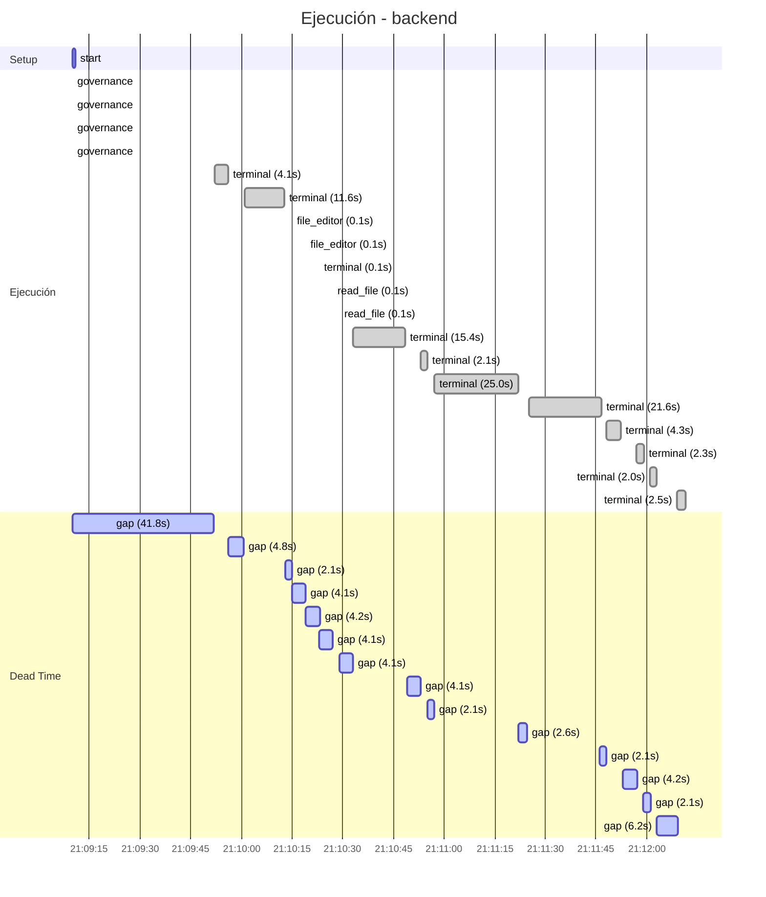

## Turn 1: Analiza los Agentes Hermes Instalados en este contenedor y genera un reporte de sus configuraciones ...[truncated]

- **Circuito**: `backend`
- **Conversación OpenHands**: [`5052e9f2-ef27-44e7-9930-3f8545ae1f36`](http://localhost:3012/conversations/5052e9f2-ef27-44e7-9930-3f8545ae1f36)
- **Workspace**: `/contenedores/conti-backend`
- **Inicio**: 2026-07-05T21:09:10.849622-03:00
- **Fin**: 2026-07-05T21:19:11.408261-03:00
- **Duración**: 600.559s
- **Eventos**: 60

## Timeline (Gantt)



## Tools Ejecutadas

| # | Tool | Inicio | Duración | OK | Args/Result |
|---|------|--------|----------|-----|-------------|
| 1 | `governance:ponytail_rules` | 21:09:10 | 0.0s | ✅ |  |
| 2 | `governance:get_onboarding` | 21:09:10 | 0.0s | ✅ |  |
| 3 | `governance:get_rules` | 21:09:10 | 0.0s | ✅ |  |
| 4 | `governance:get_config` | 21:09:10 | 0.0s | ✅ |  |
| 5 | `terminal` | 21:09:52 | 4.1s | ✅ | `find / -type f -name "*.json" -o -name "*.yaml" -o -name "*....[truncated]` |
| 6 | `terminal` | 21:10:01 | 11.6s | ✅ | `find / -type f -name "*hermes*" -o -name "*agent*" 2>/dev/nu...[truncated]` |
| 7 | `file_editor` | 21:10:15 | 0.0s | ✅ | `view` |
| 8 | `file_editor` | 21:10:19 | 0.0s | ✅ | `view` |
| 9 | `terminal` | 21:10:23 | 0.0s | ✅ | `ls -la /contenedores/conti-backend/app/hermes_profiles/` |
| 10 | `read_file` | 21:10:27 | 0.0s | ✅ | Read file: /contenedores/conti-backend/app/hermes_profiles/c...[truncated] |
| 11 | `read_file` | 21:10:29 | 0.0s | ✅ | Read file: /contenedores/conti-backend/app/hermes_profiles/c...[truncated] |
| 12 | `terminal` | 21:10:33 | 15.4s | ✅ | `find / -type f -name "*.yaml" -o -name "*.yml" -o -name "*.j...[truncated]` |
| 13 | `terminal` | 21:10:53 | 2.1s | ✅ | `which hermes-agent hermes hermes-acp 2>/dev/null || echo "No...[truncated]` |
| 14 | `terminal` | 21:10:57 | 25.0s | ✅ | `hermes-agent --version 2>/dev/null || hermes --version 2>/de...[truncated]` |
| 15 | `terminal` | 21:11:25 | 21.6s | ✅ | `hermes-agent --help 2>&1 | head -50` |
| 16 | `terminal` | 21:11:48 | 4.3s | ✅ | `hermes --help 2>&1 | head -100` |
| 17 | `terminal` | 21:11:57 | 2.3s | ✅ | `hermes profile --help 2>&1 | head -50` |
| 18 | `terminal` | 21:12:01 | 2.0s | ✅ | `hermes profile list 2>&1` |
| 19 | `terminal` | 21:12:09 | 2.5s | ✅ | `hermes profile show default 2>&1` |

## Reasoning del Agente

### 21:09:52 → `terminal`

> Voy a analizar los agentes Hermes instalados en el contenedor. Primero necesito explorar el sistema para entender qué es "Hermes" en este contexto y dónde están configurados los agentes.

### 21:10:01 → `terminal`

> Necesito buscar específicamente archivos relacionados con "Hermes" o agentes. Vamos a explorar el directorio actual y buscar configuraciones de agentes.

### 21:10:15 → `file_editor`

> Veo que hay archivos "hermes-agent", "hermes", "hermes-acp" en el directorio de caché de uv. Parece que hay agentes Hermes instalados. Vamos a explorar más para entender qué son estos agentes y dónde están configurados. Primero, veamos la estructura del directorio actual.

### 21:10:19 → `file_editor`

> Veo que hay un directorio `app/hermes_profiles/` que parece contener configuraciones de agentes Hermes. También veo archivos como `entrypoint_hermes.sh`. Vamos a explorar el directorio de hermes_profiles y buscar información sobre los agentes Hermes.

### 21:10:23 → `terminal`

> Veo que hay un directorio `contihome` dentro de `hermes_profiles`. Parece ser un perfil de Hermes. Vamos a explorar más para ver si hay otros perfiles. También necesito ver el archivo de configuración `config.yaml` y `SOUL.md` para entender las habilidades. Primero, veamos la estructura del director

### 21:10:27 → `read_file`

> Solo hay un perfil llamado `contihome`. Vamos a explorar sus archivos de configuración. Primero, veamos el archivo `config.yaml`.

### 21:10:29 → `read_file`

> Ahora veamos el archivo `SOUL.md` para entender la personalidad y habilidades del agente.

### 21:10:33 → `terminal`

> Ahora necesito ver si hay más perfiles de agentes Hermes en el sistema. También debo buscar en el directorio de caché de uv donde vi los binarios de hermes-agent. Vamos a explorar la estructura de directorios de hermes para ver si hay configuraciones de agentes.

### 21:10:53 → `terminal`

> La búsqueda tardó demasiado. Vamos a buscar de manera más específica. Primero, veamos si hay binarios de hermes-agent instalados y sus configuraciones.

### 21:10:57 → `terminal`

> Genial, hay binarios de hermes instalados. Vamos a ver qué versiones tienen y qué opciones ofrecen.

### 21:11:25 → `terminal`

> El comando `hermes-agent --version` en realidad ejecutó el agente. Necesito usar `--help` para ver las opciones.

### 21:11:48 → `terminal`

> Parece que `hermes-agent` está intentando ejecutar una conversación. Necesito usar `hermes` en su lugar, que probablemente es el CLI. Vamos a ver `hermes --help`.

### 21:11:57 → `terminal`

> Perfecto. Ahora puedo ver que `hermes` es un agente de IA con muchas capacidades. Necesito explorar más para entender qué agentes están instalados. Vamos a usar `hermes profile` para ver los perfiles disponibles.

### 21:12:01 → `terminal`

> Vamos a listar los perfiles disponibles.

### 21:12:09 → `terminal`

> ¡Excelente! Hay múltiples perfiles de Hermes instalados. Vamos a explorar cada uno para entender sus configuraciones y habilidades. Primero, veamos el perfil por defecto.

## Prompt Inyectado (governance + reglas + user)

```text
## Ponytail Rules (Reglas Comunes)


---

# Ponytail, lazy senior dev mode

You are a lazy senior developer. Lazy means efficient, not careless. The best code is the code never written.

Before writing any code, stop at the first rung that holds:

1. Does this need to be built at all? (YAGNI)
2. Does it already exist in this codebase? Reuse the helper, util, or pattern that's already here, don't re-write it.
3. Does the standard library already do this? Use it.
4. Does a native platform feature cover it? Use it.
5. Does an already-installed dependency solve it? Use it.
6. Can this be one line? Make it one line.
7. Only then: write the minimum code that works.

The ladder runs after you understand the problem, not instead of it: read the task and the code it touches, trace the real flow end to end, then climb.

Bug fix = root cause, not symptom: a report names a symptom. Grep every caller of the function you touch and fix the shared function once — one guard there is a smaller diff than one per caller, and patching only the path the ticket names leaves a sibling caller still broken.

Rules:

- No abstractions that weren't explicitly requested.
- No new dependency if it can be avoided.
- No boilerplate nobody asked for.
- Deletion over addition. Boring over clever. Fewest files possible.
- Shortest working diff wins, but only once you understand the problem. The smallest change in the wrong place isn't lazy, it's a second bug.
- Question complex requests: "Do you actually need X, or does Y cover it?"
- Pick the edge-case-correct option when two stdlib approaches are the same size, lazy means less code, not the flimsier algorithm.
- Mark intentional simplifications with a `ponytail:` comment. If the shortcut has a known ceiling (global lock, O(n²) scan, naive heuristic), the comment names the ceiling and the upgrade path.

Not lazy about: understanding the problem (read it fully and trace the real flow before picking a rung, a small diff you don't understand is just laziness dressed up as efficiency), input validation at trust boundaries, error handling that prevents data loss, security, accessibility, the calibration real hardware needs (the platform is never the spec ideal, a clock drifts, a sensor reads off), anything explicitly requested. Lazy code without its check is unfinished: non-trivial logic leaves ONE runnable check behind, the smallest thing that fails if the logic breaks (an assert-based demo/self-check or one small test file; no frameworks, no fixtures). Trivial one-liners need no test.

(Yes, this file also applies to agents working on the ponytail repo itself. Especially to them.)

---

## Reglas (Circuito: backend)

## Reglas Comunes


1. NUNCA ejecutar `git commit`, `git push`, `git merge`, `git reset`,
   `git rebase` directo en el shell del agente.
   Solo usar las tools dedicadas: `run_salvar` (preview), `run_promover`
   (preview), `run_hotfix_sync` (preview). Estas pasan por el Gatekeeper
   (`validate_diff`) antes de aplicar.

2. NUNCA ejecutar `bash /compose/3-despliegue.sh` ni
   `docker compose -f producion.yml up -d`. Solo Luis puede deployar.

3. Toda acción destructiva → preview + confirmación explícita (`confirm=true`).

4. Idioma: siempre Español.

5. `/compose` es RW SOLO para git (commit/push en main, git pull desde
   origin). Cambios de código en producción normalmente van por el flujo
   develop → main. Edición directa en `/compose` solo se permite para
   hotfixes urgentes.

6. Operar DENTRO del contenedor, sin SSH (los bind-mounts ya conectan el
   host con el working dir del agente).

7. Si la tarea accede a algo FUERA de `/desarrollo`, `/compose`,
   `/contenedores/conti-backend`, `/home/nanobot`: pedir credenciales a
   Luis explícitamente antes de proceder.

8. Acción sobre palabras: nada de "¡Gran pregunta!", "¡Excelente!", etc.
   Respuestas técnicas, directas y concisas.

9. Si Luis modificó archivos en `/compose` directamente, avisar del
   riesgo antes de cualquier operación: `3-despliegue.sh` puede hacer
   `git reset --hard` y borrar archivos uncommitted.

10. Usar solo tools registradas por el backend (`get_rules`, `get_config`,
    `get_onboarding` las lista).

11. No inventar nombres de tools ni schemas.

12. Validar argumentos antes de ejecutar mutaciones.

13. Respetar allowlists de paths y visibilidades del circuito activo.


## Reglas para Circuito: backend


16. `circuit: backend` (workspace `/contenedores/conti-backend`, branch
    `main`):
    - `run_salvar` commitea y pushea a main directamente (este repo solo
      tiene main).
    - `run_promover` y `run_hotfix_sync` NO aplican.
    - **Code editing OBLIGATORIO pre-commit**:
      1. `validate_python_syntax(paths=[<archivos>])` → debe pasar.
      2. `run_pytest(circuit="backend", test_path=<módulo_afectado>)` →
         debe pasar.
      3. (Opcional pero recomendado) `run_pytest(circuit="backend")` →
         suite completa verde.
    - Si validate_python_syntax falla → NO commitear, arreglar 
```
