## Turn 1: Analiza los Agentes Hermes Instalados en este contenedor y genera un reporte de sus configuraciones ...[truncated]

- **Circuito**: `backend`
- **Workspace**: `/contenedores/conti-backend`
- **Inicio**: 2026-07-05T21:00:58.186622-03:00
- **Fin**: 2026-07-05T21:03:00.961202-03:00
- **Duración**: 122.775s
- **Eventos**: 9

## Timeline (Gantt)

```mermaid
gantt
    title Ejecución - backend
    dateFormat  HH:mm:ss
    axisFormat  %H:%M:%S

    section Setup
    start           :21:00:58, 1s

    section Ejecución
    governance:ponytail_rules (0.1s)  :done, 21:00:58, 0.1s
    governance:get_onboarding (0.1s)  :done, 21:00:58, 0.1s
    governance:get_rules (0.1s)  :done, 21:00:58, 0.1s
    governance:get_config (0.1s)  :done, 21:00:58, 0.1s

    section Dead Time
```



## Tools Ejecutadas

| # | Tool | Inicio | Duración | OK | Args/Result |
|---|------|--------|----------|-----|-------------|
| 1 | `governance:ponytail_rules` | 21:00:58 | 0.0s | ✅ |  |
| 2 | `governance:get_onboarding` | 21:00:58 | 0.0s | ✅ |  |
| 3 | `governance:get_rules` | 21:00:58 | 0.0s | ✅ |  |
| 4 | `governance:get_config` | 21:00:58 | 0.0s | ✅ |  |

## Reasoning del Agente

## Prompt Completo (input del usuario)

```text
Analiza los Agentes Hermes Instalados en este contenedor y genera un reporte de sus configuraciones y habilidades en un archivo /contenedores/conti-backend/Agentes_hermes_doc.md
```
