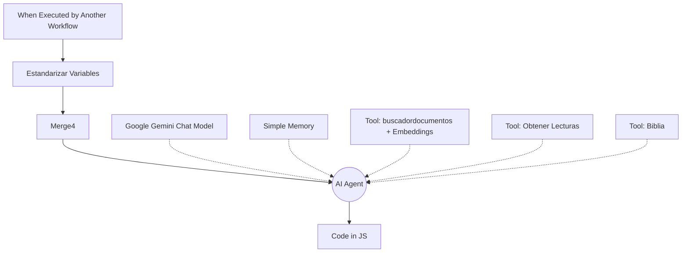
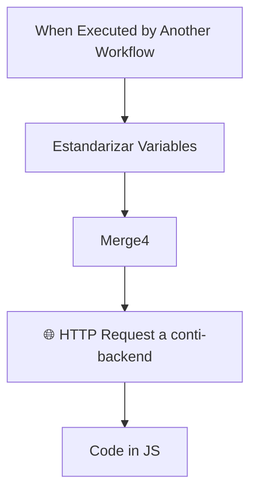

# Arquitectura de Orquestación Centralizada: Migración desde n8n

El análisis profundo de tu flujo actual en n8n revela un patrón clásico y funcional pero difícil de escalar: **el acoplamiento fuerte entre Canales, Estado y Lógica de Inteligencia Artificial**. 

Actualmente, n8n hace de Webhook, gestor de estado (SQL Postgres), y Agente LLM. Esto genera workflows enormes, mezcla respuestas formateadas para WhatsApp dentro del agente, y limita drásticamente la capacidad de ofrecer una interfaz rica y fluida (Streaming, Componentes UI dinámicos) en un canal web moderno como Chainlit.

## Análisis de Alternativas

1. **(Descartada) Chainlit -> Webhook n8n -> Chainlit**: Es un parche. Pierdes la capacidad de *streaming* real de tokens, es difícil inyectar componentes UI dinámicos (carritos visuales, botones), y la latencia aumenta.
2. **(Descartada) LangGraph dentro de Django**: Django actualmente sirve tu aplicación web y Chainlit (vía Daphne). Acoplar el motor de IA (LangGraph), la gestión de memoria y la concurrencia intensa dentro del mismo contenedor que sirve la UI web (Django) creará cuellos de botella de rendimiento y mezclará responsabilidades (Frontend vs AI Engine).
3. **(Propuesta) `conti-backend` como "El Cerebro Omnicanal" (Omni-Channel Brain)**: Extraer la lógica del Agente (LLM + Tools) y el Estado fuera de n8n y alojarla en el `conti-backend`. Los canales (WhatsApp vía n8n, Telegram, Chainlit) se vuelven clientes "tontos" que solo envían y reciben datos estructurados.

---

## Ejemplo Práctico: ¿Cómo cambia el Chat Católico en n8n?

Entiendo tu duda. Cuando digo "reemplazar el AI Agent por un HTTP Request", significa que **TODOS los nodos que cuelgan del AI Agent en n8n desaparecen de n8n y se mudan al código Python del backend**.

Mira la diferencia visual de tu flujo `Chat_prueba2`:

### ANTES (Tu captura actual en n8n)
Tu flujo tiene toda la "inteligencia" armada con bloques visuales:

### DESPUÉS (En el nuevo esquema)
El flujo de n8n se vuelve diminuto y ultra-rápido. Ya no procesa IA localmente.

**¿A dónde se fue todo lo demás?**
Se mudó a `conti-backend/app/mcp/catolico.py` (o similar). 
1. El nodo `HTTP Request` manda esto al backend: `{"tenant": "catolico", "session_id": "123", "message": "Evangelio de hoy"}`
2. **El backend (en Python)** es quien tiene cargadas las *Tools* (Lecturas, Biblia, RAG de Flamehaven).
3. **El backend** es quien revisa su propia Memoria/Base de datos para saber qué hablaron antes.
4. **El backend** usa el modelo LLM para pensar, llama a las tools en Python, y cuando tiene la respuesta lista, se la devuelve al nodo HTTP Request de n8n en milisegundos.

---

## La Arquitectura Propuesta

### 1. Desacoplamiento Total (Cerebro vs. Sentidos)
El `conti-backend` se convierte en la única fuente de verdad para la IA. Expondrá un endpoint `/v1/chat/stream` que aceptará peticiones de cualquier canal.
*   **Input estándar**: `(session_id, tenant_id, user_message, channel_type)`
*   **Output estándar**: Texto (para WPP/Telegram) + Metadatos UI (para Chainlit).

### 2. Gestión de Estado y Memoria
El complejo manejo de SQL (`session_state`) que actualmente tienes en el workflow *Asistente Odoo Demo* se migrará a un **SessionManager en Python** dentro de `conti-backend`.
Al estar en código nativo (Python), el LLM puede actualizar su estado interno de forma mucho más natural (mediante tools de Pydantic o LangGraph/SmolAgents) sin tener que hacer docenas de nodos `IF` y consultas SQL en n8n.

### 3. El Motor de IA: Integración de `nanobot` y MCP
Dentro de `conti-backend`, implementaremos un marco de Agente (puede ser LangGraph puro o un bucle nativo) que utilice tu `nanobot serve` para el razonamiento pesado.
Las herramientas (Tools) actuales de n8n se convertirán en **Herramientas MCP (Model Context Protocol)** servidas por el backend. 

### 4. El Rol de n8n post-migración
n8n NO desaparece, pero cambia su rol. Vuelve a ser puramente un **Enrutador de API y Automatización (ESB)**:
*   Sigue recibiendo los webhooks de WppConnect y Telegram.
*   Sigue actualizando Chatwoot.
*   Pero en lugar de tener un nodo `AI Agent` gigante en n8n, hace un simple `HTTP Request` a `conti-backend`, recibe la respuesta plana, y se la envía a WhatsApp.

---

## Plan de Migración (Fases)

Para no romper lo que ya funciona en producción, la migración debe ser progresiva:

### Fase 1: El Canal Web (Chainlit) como Piloto
1. **MCP Tools en Backend**: Replicar las funcionalidades críticas de Odoo (búsqueda de productos) y RAG (Católico) como herramientas MCP en Python dentro de `conti-backend/app/mcp/`.
2. **Motor de Agente en Backend**: Crear el orquestador en `conti-backend` que usa `nanobot` y puede invocar estas MCP.
3. **Conexión Chainlit**: Conectar Chainlit directamente al `conti-backend`. Probar la experiencia rica de UI web de forma aislada, sin tocar n8n.

### Fase 2: Migración del Estado
1. Trasladar la lógica del carrito de compras y las banderas booleanas (`dni_proporcionado`, `productos_mostrados`) de n8n a la memoria de sesión del `conti-backend` (usando Redis o Postgres nativo con SQLAlchemy).

### Fase 3: Unificación de Canales (Migrar n8n)
1. Modificar los flujos `Chat_prueba2` y `Asistente Odoo Demo` en n8n. Eliminar los nodos `AI Agent`, Memoria, Modelos y Herramientas.
2. Reemplazarlos por un nodo `HTTP Request` que apunte al nuevo endpoint de `conti-backend`.
3. El backend detectará si la llamada viene de WhatsApp (texto plano) o Web (UI rica) y adaptará el formato de la respuesta.
